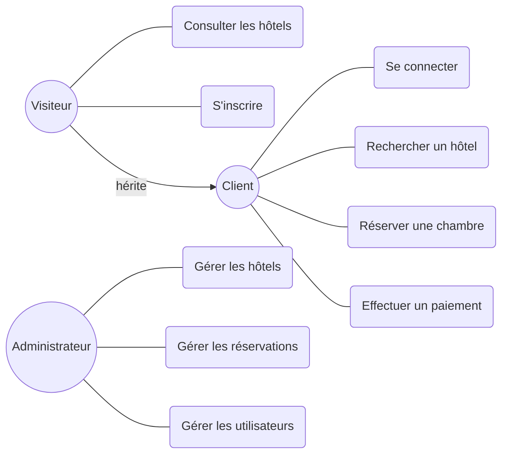
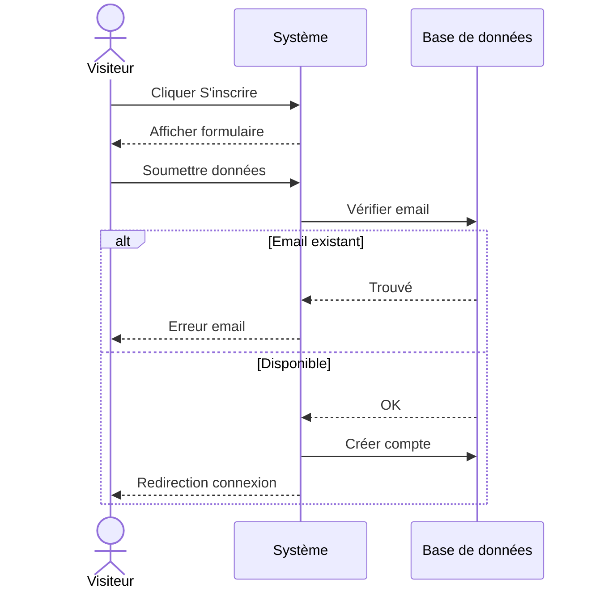
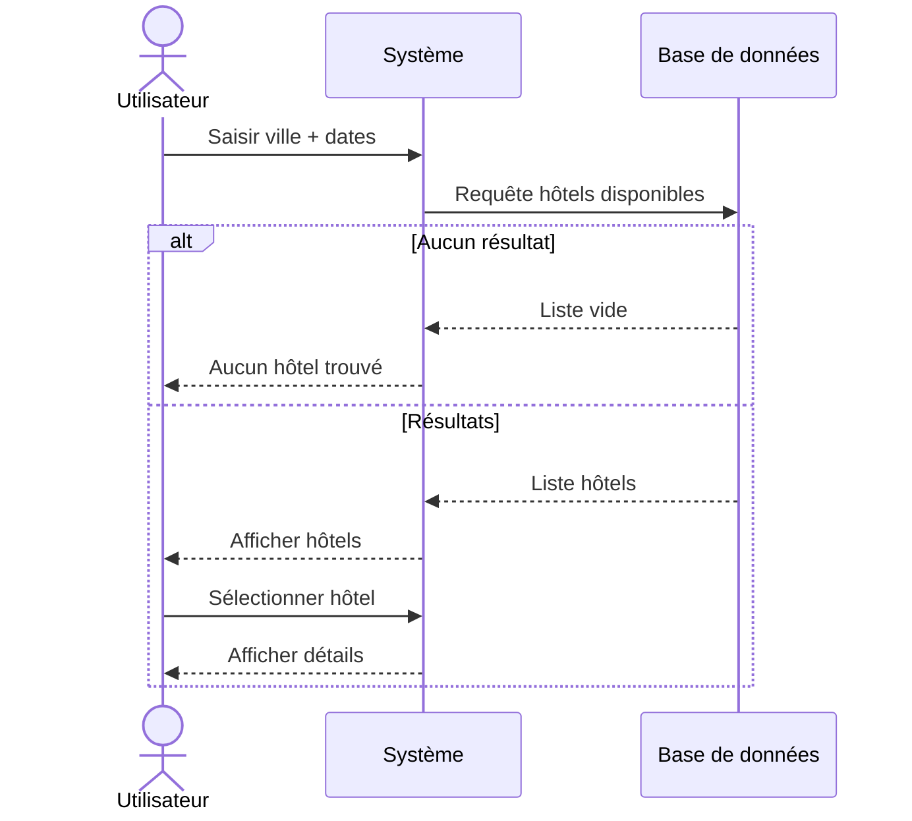
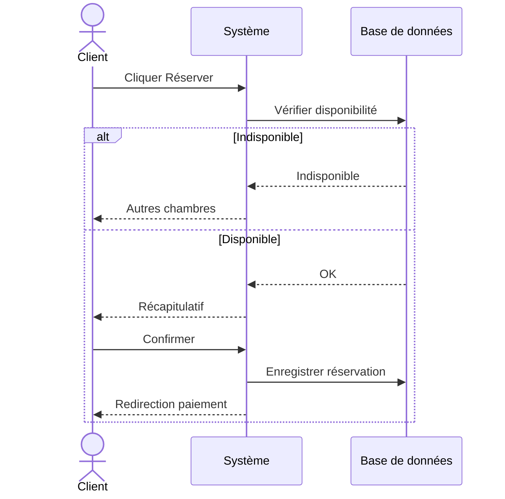
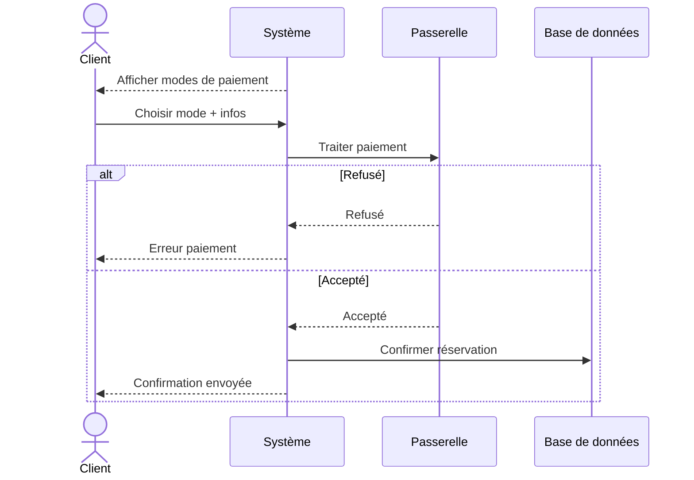
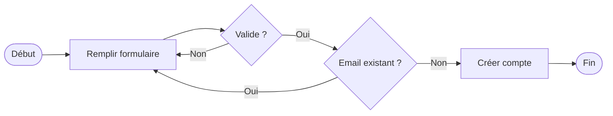
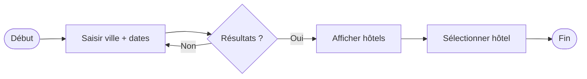
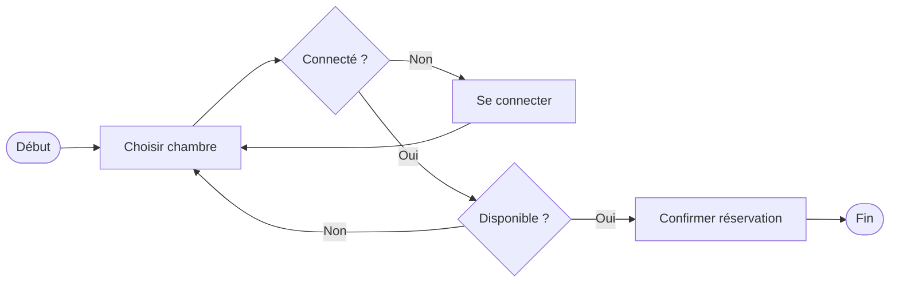
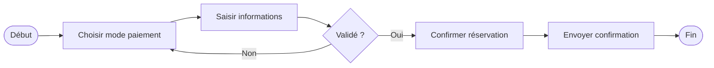
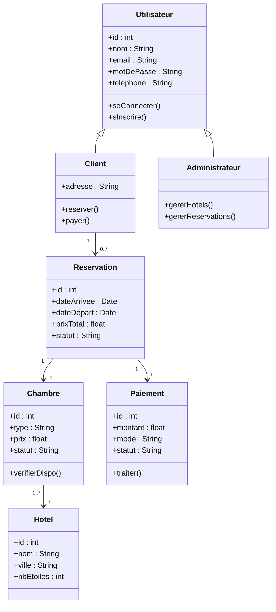

# Analyse UML — Gestion d'Hôtel (Version Simplifiée)

---

## 1. Diagramme de Cas d'Utilisation

| Acteur | Cas d'utilisation |
|--------|------------------|
| **Visiteur** | Consulter les hôtels · Consulter les chambres · Voir les prix · S'inscrire |
| **Client** *(hérite du Visiteur)* | Se connecter · Rechercher un hôtel · Réserver une chambre · Effectuer un paiement · Annuler une réservation |
| **Administrateur** | Gérer les hôtels · Gérer les chambres · Gérer les réservations · Gérer les utilisateurs |

---

## 2. Descriptions Textuelles

### CU1 — S'inscrire
| | |
|---|---|
| **Acteur** | Visiteur |
| **Pré-condition** | Utilisateur non inscrit |
| **Post-condition** | Compte client créé |

1. Cliquer sur « S'inscrire » → formulaire affiché
2. Remplir (nom, email, mot de passe, téléphone)
3. Système vérifie les données → compte créé → redirection connexion

**Alternative :** Email existant → erreur affichée

---

### CU2 — Rechercher un hôtel
| | |
|---|---|
| **Acteur** | Visiteur / Client |
| **Pré-condition** | Hôtels enregistrés dans le système |
| **Post-condition** | Liste d'hôtels affichée |

1. Saisir ville + dates → cliquer « Rechercher »
2. Système retourne la liste des hôtels disponibles
3. Sélectionner un hôtel → voir les détails

**Alternative :** Aucun résultat → message d'erreur

---

### CU3 — Réserver une chambre
| | |
|---|---|
| **Acteur** | Client |
| **Pré-condition** | Client connecté, chambre sélectionnée |
| **Post-condition** | Réservation créée (En attente de paiement) |

1. Cliquer « Réserver » → système vérifie disponibilité
2. Afficher récapitulatif → client confirme
3. Réservation enregistrée → redirection paiement

**Alternative :** Chambre indisponible → autres chambres proposées

---

### CU4 — Effectuer un paiement
| | |
|---|---|
| **Acteur** | Client |
| **Pré-condition** | Réservation en attente de paiement |
| **Post-condition** | Réservation confirmée, client notifié |

1. Choisir mode : Carte bancaire ou Mobile Money
2. Saisir informations → système valide la transaction
3. Réservation → « Confirmée » + envoi confirmation

**Alternative :** Paiement refusé → message d'erreur, réessayer

---

## 3. Diagrammes de Séquences

### DS1 — S'inscrire

### DS2 — Rechercher un hôtel

### DS3 — Réserver une chambre

### DS4 — Effectuer un paiement

---

## 4. Diagrammes d'Activités

### DA1 — S'inscrire

### DA2 — Rechercher un hôtel

### DA3 — Réserver une chambre

### DA4 — Effectuer un paiement

---

## 5. Diagramme de Classes

---

## 6. Dictionnaire de Données

### `utilisateur`
| Champ | Type | Description |
|-------|------|-------------|
| id | INT (PK) | Identifiant unique |
| nom | VARCHAR(50) | Nom |
| email | VARCHAR(100) | Email unique |
| mot_de_passe | VARCHAR(255) | Mot de passe haché |
| telephone | VARCHAR(20) | Téléphone |
| role | ENUM(client, admin) | Rôle |

### `hotel`
| Champ | Type | Description |
|-------|------|-------------|
| id | INT (PK) | Identifiant unique |
| nom | VARCHAR(100) | Nom de l'hôtel |
| ville | VARCHAR(100) | Ville |
| nb_etoiles | TINYINT | Classement 1-5 |

### `chambre`
| Champ | Type | Description |
|-------|------|-------------|
| id | INT (PK) | Identifiant unique |
| id_hotel | INT (FK) | Hôtel parent |
| type | VARCHAR(50) | Simple / Double / Suite |
| prix_par_nuit | DECIMAL | Prix par nuit |
| statut | ENUM | disponible / occupée |

### `reservation`
| Champ | Type | Description |
|-------|------|-------------|
| id | INT (PK) | Identifiant unique |
| id_client | INT (FK) | Client |
| id_chambre | INT (FK) | Chambre réservée |
| date_arrivee | DATE | Arrivée |
| date_depart | DATE | Départ |
| prix_total | DECIMAL | Total |
| statut | ENUM | en_attente / confirmée / annulée |

### `paiement`
| Champ | Type | Description |
|-------|------|-------------|
| id | INT (PK) | Identifiant unique |
| id_reservation | INT (FK) | Réservation |
| montant | DECIMAL | Montant payé |
| mode | ENUM | carte / mobile_money |
| statut | ENUM | en_attente / validé / refusé |
| date_paiement | DATETIME | Date du paiement |
