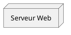
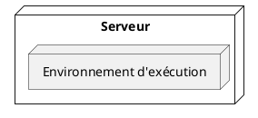
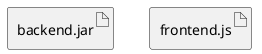
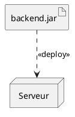
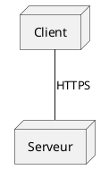
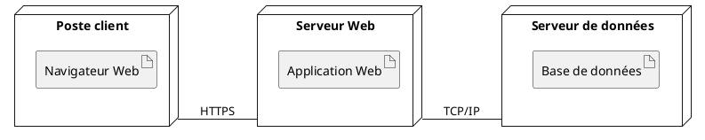

# Diagramme de déploiement

## Définition

Le **diagramme de déploiement** (*Deployment Diagram*) est un diagramme **structurel** d'UML.

Il représente la **répartition physique ou d'exécution d'un système** : quels éléments logiciels sont déployés sur quels éléments matériels ou environnements d'exécution, et comment ces nœuds peuvent communiquer.

Il permet donc de répondre principalement à trois questions :

1. **Où** le système est-il exécuté ?
2. **Quels éléments logiciels** sont déployés sur chaque nœud ?
3. **Comment les nœuds communiquent-ils ?**

Le diagramme de déploiement fait partie des diagrammes structurels d'UML. La spécification UML 2.5.1 définit notamment les concepts de **Node**, **Device**, **ExecutionEnvironment**, **Artifact**, **Deployment** et **CommunicationPath**. citeturn463587search0turn463587search15

---

## Objectif

Le diagramme de déploiement sert à représenter l'architecture **physique et d'exécution** d'une application.

Il peut notamment montrer :

- les machines physiques ou virtuelles ;
- les serveurs ;
- les appareils clients ;
- les environnements d'exécution ;
- les artefacts logiciels déployés ;
- les communications entre les nœuds.

Il est particulièrement utile pour les systèmes distribués, les applications Web, les architectures client/serveur et les systèmes comportant plusieurs services.

---

# Éléments principaux

## 1. Node (Nœud)

Un **Node** représente une ressource de calcul sur laquelle des éléments logiciels peuvent être exécutés ou déployés.

Exemples :

- serveur ;
- machine virtuelle ;
- ordinateur client ;
- smartphone ;
- serveur applicatif.

### Notation

Un nœud est généralement représenté par un **cube en perspective**.

Exemple conceptuel :



---

## 2. Device (Périphérique / dispositif)

Un **Device** est un type de **Node** représentant une ressource matérielle possédant des capacités de traitement.

Exemples :

- serveur physique ;
- ordinateur ;
- smartphone ;
- passerelle matérielle.

On peut donc voir `Device` comme une spécialisation de `Node` orientée vers le matériel.

---

## 3. Execution Environment

Un **ExecutionEnvironment** représente un environnement logiciel dans lequel d'autres éléments peuvent s'exécuter.

Exemples :

- machine virtuelle Java (JVM) ;
- conteneur ;
- serveur d'application ;
- environnement d'exécution d'un langage.

Il peut être contenu dans un `Node`, par exemple une machine physique ou virtuelle.

Exemple :



---

## 4. Artifact (Artefact)

Un **Artifact** représente un élément concret produit ou utilisé lors du développement et du déploiement d'un logiciel.

Exemples :

- fichier `.jar` ;
- fichier `.war` ;
- application compilée ;
- fichier JavaScript/CSS construit ;
- image Docker ;
- paquet logiciel.

Un artefact représente donc quelque chose de **déployable**.

Exemple :



---

## 5. Deployment (Déploiement)

Le **Deployment** représente l'installation ou le déploiement d'un élément logiciel sur une cible de déploiement (`DeploymentTarget`).

Autrement dit :

> **un logiciel est déployé sur un nœud.**

La notation peut être représentée par une flèche en pointillés portant le mot-clé `«deploy»`.

Exemple :



L'UML permet également de représenter directement l'artefact à l'intérieur du nœud pour indiquer qu'il y est déployé. citeturn463587search16

---

## 6. CommunicationPath (Chemin de communication)

Un **CommunicationPath** représente un chemin de communication entre des nœuds.

Il permet de montrer qu'un échange peut avoir lieu entre deux ressources d'exécution.

Exemple :



La spécification UML décrit notamment les chemins de communication entre les nœuds pour représenter une topologie réseau. citeturn463587search16

---

# Relations importantes

## Déploiement

```text
Artifact -- -- -- > Node
       <<deploy>>
```

Il signifie :

> cet artefact est déployé sur ce nœud.

## Communication

```text
Node -------- Node
```

Il signifie :

> ces nœuds peuvent communiquer.

Le protocole ou le moyen de communication peut être indiqué sur la liaison :

- HTTPS ;
- HTTP ;
- TCP/IP ;
- WebSocket ;
- protocole métier, etc.

---

# Nœuds imbriqués

Un nœud peut contenir d'autres nœuds afin de représenter une architecture hiérarchique.

Exemple :

```text
Serveur physique
└── Machine virtuelle
    └── Environnement d'exécution
        └── Application
```

Cela permet de montrer plusieurs niveaux de la plateforme d'exécution.

---

# Exemple simple d'architecture Web



Lecture du diagramme :

- le poste client contient le navigateur ;
- le serveur Web contient l'application ;
- le serveur de données contient la base de données ;
- le client communique avec le serveur Web en HTTPS ;
- le serveur Web communique avec le serveur de données.

---

# Exemple appliqué à JeryMotro

Dans JeryMotro, le diagramme de déploiement permet de représenter la manière dont les services sont installés dans l'infrastructure réelle.

L'architecture actuelle comporte notamment un **serveur principal** regroupant plusieurs services locaux :

- Nginx ;
- Frontend Web ;
- Backend FastAPI ;
- PostgreSQL ;
- Qdrant ;
- n8n ;
- WAHA ;
- SMSGate lorsqu'il est sélectionné.

Des services externes peuvent également être représentés, par exemple :

- NASA FIRMS ;
- Vertex AI ;
- HTTPSMS lorsqu'il est utilisé.

Le diagramme JeryMotro correspondant est :

**[[../UML_JeryMotro/DP01_Deployment]]**

La documentation du projet précise que les principaux services sont actuellement regroupés sur un même serveur et que les communications internes utilisent les ports locaux. fileciteturn382file0L2-L2

---

# Différence avec les autres diagrammes UML

| Diagramme | Question principale |
|---|---|
| Cas d'utilisation | **Que fait le système pour les utilisateurs ?** |
| Activité | **Comment se déroule un processus ?** |
| Séquence | **Qui communique avec qui et dans quel ordre ?** |
| Classes | **De quelles classes/données le système est-il constitué ?** |
| Déploiement | **Où les éléments logiciels sont-ils exécutés ?** |

Le diagramme de déploiement est donc surtout centré sur **l'infrastructure et la répartition des éléments logiciels**.

---

# Ce qu'il faut retenir

### Node
Représente une ressource de calcul.

### Device
Représente un nœud matériel.

### ExecutionEnvironment
Représente un environnement logiciel d'exécution.

### Artifact
Représente un élément logiciel déployable.

### Deployment
Indique qu'un artefact est déployé sur une cible.

### CommunicationPath
Indique qu'un échange est possible entre des nœuds.

---

# Règles pratiques pour construire un diagramme de déploiement

1. Identifier les **machines, serveurs ou environnements d'exécution**.
2. Identifier les **logiciels réellement déployés**.
3. Placer les artefacts sur les nœuds concernés.
4. Représenter les communications importantes entre les nœuds.
5. Indiquer les protocoles ou ports lorsqu'ils sont utiles à la compréhension.
6. Ne pas confondre le diagramme de déploiement avec un diagramme de classes ou de composants.
7. Ne représenter que les éléments utiles au niveau de détail recherché.

---

# Référence UML

Cette leçon est basée sur la spécification **OMG Unified Modeling Language (UML) 2.5.1**, qui définit les concepts nécessaires au diagramme de déploiement, notamment `Node`, `Artifact`, `Deployment`, `Device`, `ExecutionEnvironment` et `CommunicationPath`. citeturn463587search0turn463587search15

Référence officielle :
https://www.omg.org/spec/UML/2.5.1/
