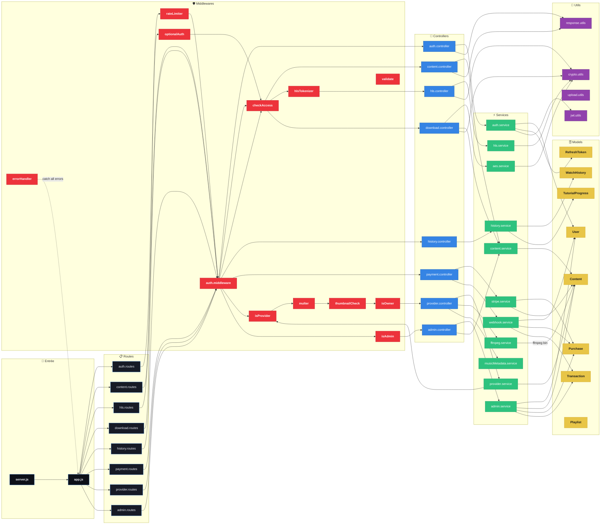
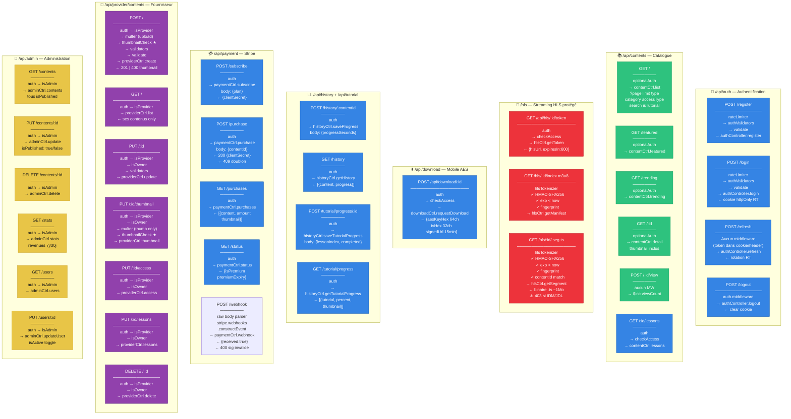
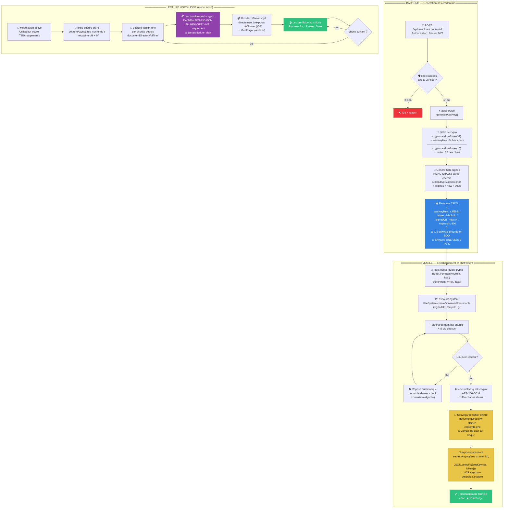
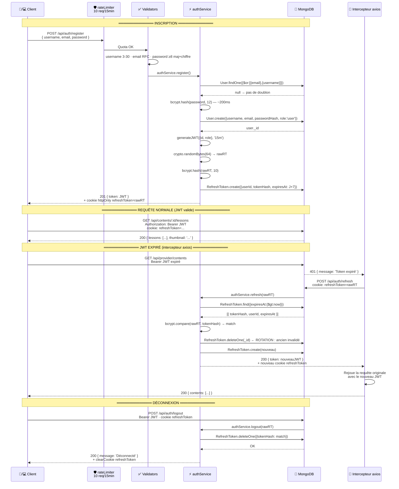
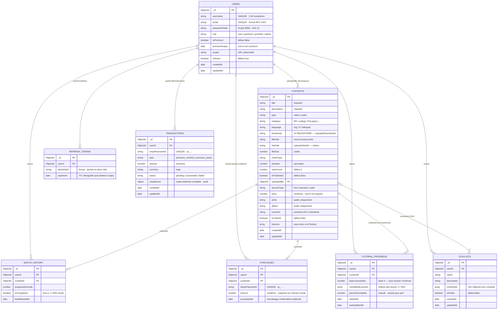

# 🏗️ Conception Détaillée Backend — StreamMG

> **Projet :** StreamMG — Plateforme de streaming audiovisuel et éducatif malagasy
> **Document :** Conception backend complète — structure de dossiers, fichiers, flux
> **Responsable :** Membre 3 — Développeur Backend
> **Stack :** Node.js v20 LTS · Express.js v4 · MongoDB v7 · Mongoose v8
> **Date :** Février 2026

---

## 🗺️ Navigation du document

- [[#1. Vue d'ensemble architecturale]]
- [[#2. Structure complète du dossier]]
- [[#3. Graphe des dépendances inter-couches]]
- [[#4. Couche Routes — détail complet]]
- [[#5. Couche Middlewares — chaînes d'exécution]]
- [[#6. Couche Controllers]]
- [[#7. Couche Services — logique métier]]
- [[#8. Couche Models — schémas Mongoose]]
- [[#9. Couche Utils]]
- [[#10. Pipeline HLS — Protection vidéo web]]
- [[#11. Pipeline AES-256-GCM — Téléchargement mobile]]
- [[#12. Flux d'authentification complet]]
- [[#13. Flux de paiement Stripe complet]]
- [[#14. Diagramme entité-relation MongoDB]]
- [[#15. Variables d'environnement]]
- [[#16. Package.json — dépendances]]
- [[#17. Références bibliographiques]]

---

## 1. Vue d'ensemble architecturale

```mermaid
graph TB

    subgraph CLIENTS["════════════════  CLIENTS EXTERNES  ════════════════"]
        direction LR
        MOB["📱 App Mobile\nReact Native + Expo SDK 52\nMembre 1\n─────────────────\nexpo-av · expo-file-system\nreact-native-quick-crypto\nexpo-secure-store\n@stripe/stripe-react-native"]
        WEB["💻 App Web\nReact.js 18 + Vite 5\nMembre 2\n─────────────────\nhls.js · react-player\nService Worker PWA\n@stripe/react-stripe-js\ncookie httpOnly"]
    end

    subgraph BACKEND["════════════════  BACKEND — Node.js v20 + Express.js v4  ════════════════"]
        direction TB

        subgraph ENTRY["Point d'entrée"]
            SRV["🚀 server.js\nHTTP listen :3001"]
            APP["⚙️ app.js\nHelmet · CORS · Rate-limit\nCookie-parser · Body-parser\nRaw body (webhook)"]
        end

        subgraph ROUTES_BOX["📋 ROUTES  /api/*"]
            direction LR
            R_AUTH["auth\n/register /login\n/refresh /logout"]
            R_CONT["contents\n/list /featured\n/trending /:id\n/lessons"]
            R_HLS["hls\n/:id/token\n/:id/index.m3u8\n/:id/:seg.ts"]
            R_DL["download\n/:id → clé AES"]
            R_HIST["history\n/watchHistory\n/tutorialProgress"]
            R_PAY["payment\n/subscribe /purchase\n/purchases /webhook"]
            R_PROV["provider\n/contents CRUD\n/thumbnail /lessons"]
            R_ADMIN["admin\n/contents /stats\n/users /approve"]
        end

        subgraph MW_BOX["🛡️ MIDDLEWARES"]
            direction LR
            MW_AUTH["auth\njwt.verify\nreq.user inject"]
            MW_OPT["optionalAuth\nJWT facultatif"]
            MW_ACCESS["checkAccess\nfree·premium·paid\n→ 403 + reason"]
            MW_HLS["hlsTokenizer\nHMAC-SHA256\nfingerprint check\n→ 403 si invalide"]
            MW_MULT["multer\nthumbnail OBLIG\nvideo 500Mo\naudio 50Mo"]
            MW_THUMB["thumbnailCheck\nreq.files.thumbnail\n→ 400 si absent"]
            MW_PROV["isProvider\nrole === provider"]
            MW_ADMIN["isAdmin\nrole === admin"]
            MW_OWN["isOwner\nuploadedBy===user.id"]
            MW_VAL["validate\nexpress-validator\nrunner"]
            MW_ERR["errorHandler\nglobal catch\nformat JSON"]
        end

        subgraph CTRL_BOX["🎯 CONTROLLERS"]
            direction LR
            C_AUTH["authController\nregister·login\nrefresh·logout"]
            C_CONT["contentController\nlist·detail·lessons\nfeatured·trending"]
            C_HLS["hlsController\ngetToken\ngetManifest\ngetSegment"]
            C_DL["downloadController\nrequestDownload"]
            C_HIST["historyController\nsaveProgress\ngetHistory\ntutorialProgress"]
            C_PAY["paymentController\nsubscribe·purchase\npurchases·status\nwebhook"]
            C_PROV["providerController\ncreate·list·update\nthumbnail·lessons\ndelete"]
            C_ADM["adminController\ncontents·stats\nusers·approve·reject"]
        end

        subgraph SVC_BOX["⚡ SERVICES"]
            direction LR
            S_AUTH["authService\nbcrypt register\nlogin · refresh\nrotation RT"]
            S_CONT["contentService\nCRUD catalogue\npagination\nrecherche texte"]
            S_HLS["hlsService\ngenerateToken\nverifyToken\nfingerprint"]
            S_AES["aesService\nrandomBytes 32\nIV 16 bytes\nURL signée 15min"]
            S_FF["ffmpegService\nMP4 → HLS\nsegments 10s\nfluent-ffmpeg"]
            S_MM["musicMetadataService\nID3 extraction\nartiste album\ncoverArt durée"]
            S_STR["stripeService\nPaymentIntent\nsubscribe·purchase\nidempotence"]
            S_WH["webhookService\nmetadata.type\nsubscription→User\npurchase→Purchase"]
            S_HIST["historyService\nwatchHistory\ntutorialProgress\npercentComplete"]
            S_ADM["adminService\nstatistiques\nrevenues simulés\ngestion users"]
            S_PROV["providerService\nupload pipeline\nHLS trigger\nleçons CRUD"]
        end

        subgraph MODEL_BOX["🗄️ MODELS MONGOOSE"]
            direction LR
            M_USER["User\nrole·isPremium\npremiumExpiry"]
            M_CONT["Content\nthumbnail OBLIG\naccessType·price\nhlsPath·lessons"]
            M_WH["WatchHistory\nprogressSeconds\nisCompleted"]
            M_PL["Playlist\ncontentIds\nisPublic"]
            M_RT["RefreshToken\ntokenHash bcrypt\nTTL 7j auto"]
            M_TR["Transaction\nplan·amount\nstripeEvent"]
            M_PUR["Purchase\nuserId+contentId\nUNIQUE index"]
            M_TP["TutorialProgress\ncompletedLessons\npercentComplete"]
        end

        subgraph UTILS_BOX["🔧 UTILS"]
            U_CRYPTO["crypto.utils\nSHA-256 fingerprint\nHMAC token HLS\nAES keygen"]
            U_JWT["jwt.utils\ngenerateJWT\nverifyJWT 15min\ngenerateRT"]
            U_UPL["upload.utils\nUUID filename\nchemins upload\nMIME check"]
            U_RESP["response.utils\nsuccess(data)\nerror(msg)\npaginate(...)"]
        end

        ENTRY --> ROUTES_BOX
        ROUTES_BOX --> MW_BOX
        MW_BOX --> CTRL_BOX
        CTRL_BOX --> SVC_BOX
        SVC_BOX --> MODEL_BOX
        CTRL_BOX --> UTILS_BOX
        SVC_BOX --> UTILS_BOX
    end

    subgraph EXTERNAL["════════════════  SERVICES EXTERNES  ════════════════"]
        direction LR
        MONGO[("🍃 MongoDB Atlas\ncluster M0 gratuit\n8 collections\nindex optimisés")]
        STRIPE["💳 Stripe API\nmode test\nPaymentIntent\nWebhook sig vérifiée"]
        FFMPEG["🎬 fluent-ffmpeg\nffmpeg binaire\nH.264 + AAC\nHLS 10s segments"]
    end

    subgraph STORAGE["════════════════  STOCKAGE FICHIERS  ════════════════"]
        direction LR
        ST_TH["📸 /uploads/thumbnails/\nJPEG · PNG\n≤ 5 Mo\n★ OBLIGATOIRE"]
        ST_HLS["🎥 /uploads/hls/\n  └─ contentId/\n       index.m3u8\n       seg001.ts ..."]
        ST_AUD["🎵 /uploads/audio/\n.mp3 · .aac · .wav\n≤ 50 Mo"]
        ST_PRV["🔒 /uploads/private/\nSources brutes\nNon exposées HTTP\nJamais de route directe"]
    end

    MOB -->|"HTTPS · JWT Bearer\nREST JSON"| ENTRY
    WEB -->|"HTTPS · JWT Bearer\ncookie httpOnly"| ENTRY
    MODEL_BOX --> MONGO
    SVC_BOX --> FFMPEG
    SVC_BOX --> STRIPE
    FFMPEG --> ST_HLS
    MW_MULT --> ST_TH
    MW_MULT --> ST_PRV
    MW_MULT --> ST_AUD

    classDef clientStyle fill:#3584e4,stroke:#1a5fb4,color:#ffffff,font-weight:bold
    classDef externalStyle fill:#2ec27e,stroke:#26a269,color:#ffffff,font-weight:bold
    classDef storageStyle fill:#e8c547,stroke:#c9a227,color:#1a1a1a,font-weight:bold
    classDef dangerStyle fill:#ed333b,stroke:#c01c28,color:#ffffff

    class MOB,WEB clientStyle
    class MONGO,STRIPE,FFMPEG externalStyle
    class ST_TH,ST_HLS,ST_AUD,ST_PRV storageStyle
    class MW_ACCESS,MW_HLS dangerStyle
```



---

## 2. Structure complète du dossier

```
streamMG-backend/
│
├── 📄 server.js                          ← Point d'entrée — lance app sur le port
├── 📄 app.js                             ← Config Express : helmet, cors, routes
├── 📄 .env                               ← Variables d'env (JAMAIS commité)
├── 📄 .env.example                       ← Template public (commité)
├── 📄 .gitignore                         ← node_modules · .env · uploads/
├── 📄 package.json
├── 📄 package-lock.json
│
├── 📁 src/
│   │
│   ├── 📁 config/                        ← Connexions et configs externes
│   │   ├── 📄 database.js                ← Connexion MongoDB Atlas (mongoose.connect)
│   │   ├── 📄 stripe.js                  ← Init Stripe SDK avec STRIPE_SECRET_KEY
│   │   └── 📄 cors.js                    ← Origines CORS autorisées (web prod + dev)
│   │
│   ├── 📁 routes/                        ← Définition des routes Express
│   │   ├── 📄 index.js                   ← Agrège et monte tout sur /api
│   │   ├── 📄 auth.routes.js             ← POST /api/auth/*
│   │   ├── 📄 content.routes.js          ← GET  /api/contents/*
│   │   ├── 📄 hls.routes.js              ← GET  /api/hls/* + /hls/* (segments bruts)
│   │   ├── 📄 download.routes.js         ← POST /api/download/:id
│   │   ├── 📄 history.routes.js          ← POST/GET /api/history/* + /tutorial/progress/*
│   │   ├── 📄 payment.routes.js          ← POST/GET /api/payment/*
│   │   ├── 📄 provider.routes.js         ← CRUD /api/provider/contents/*
│   │   └── 📄 admin.routes.js            ← /api/admin/*
│   │
│   ├── 📁 middlewares/                   ← Middlewares Express
│   │   ├── 📄 auth.middleware.js         ← Vérifie JWT → inject req.user
│   │   ├── 📄 optionalAuth.middleware.js ← JWT facultatif (routes publiques)
│   │   ├── 📄 checkAccess.middleware.js  ← ★ Cœur modèle éco : free/premium/paid
│   │   ├── 📄 hlsTokenizer.middleware.js ← ★ Cœur protection HLS : token + fingerprint
│   │   ├── 📄 isProvider.middleware.js   ← role === "provider" → 403 sinon
│   │   ├── 📄 isAdmin.middleware.js      ← role === "admin"    → 403 sinon
│   │   ├── 📄 isOwner.middleware.js      ← content.uploadedBy === req.user.id
│   │   ├── 📄 multer.middleware.js       ← Config Multer MIME + taille + UUID filename
│   │   ├── 📄 thumbnailCheck.middleware.js ← req.files.thumbnail ? next() : 400
│   │   ├── 📄 validate.middleware.js     ← Runner express-validator (validationResult)
│   │   ├── 📄 rateLimiter.middleware.js  ← authLimiter(10/15min) + apiLimiter(200/15min)
│   │   └── 📄 errorHandler.middleware.js ← Global catch-all → JSON { message, status }
│   │
│   ├── 📁 controllers/                   ← Traitement requêtes → délègue aux services
│   │   ├── 📄 auth.controller.js         ← register · login · refresh · logout
│   │   ├── 📄 content.controller.js      ← list · featured · trending · detail · lessons
│   │   ├── 📄 hls.controller.js          ← getToken · getManifest · getSegment
│   │   ├── 📄 download.controller.js     ← requestDownload (clé AES + URL signée)
│   │   ├── 📄 history.controller.js      ← saveProgress · getHistory · tutorialProgress
│   │   ├── 📄 payment.controller.js      ← subscribe · purchase · purchases · webhook
│   │   ├── 📄 provider.controller.js     ← createContent · list · update · delete
│   │   └── 📄 admin.controller.js        ← approve · reject · stats · users
│   │
│   ├── 📁 services/                      ← Logique métier pure, réutilisable
│   │   ├── 📄 auth.service.js            ← bcrypt · JWT · RefreshToken rotation
│   │   ├── 📄 content.service.js         ← CRUD catalogue · pagination · full-text search
│   │   ├── 📄 hls.service.js             ← generateHlsToken · getSignedManifestUrl
│   │   ├── 📄 aes.service.js             ← generateAesKey · signDownloadUrl
│   │   ├── 📄 ffmpeg.service.js          ← transcodeToHLS (MP4 → segments .ts 10s)
│   │   ├── 📄 musicMetadata.service.js   ← extractID3 (titre · artiste · duration · coverArt)
│   │   ├── 📄 stripe.service.js          ← createSubscriptionIntent · createPurchaseIntent
│   │   ├── 📄 webhook.service.js         ← handle(event) → subscription | purchase routing
│   │   ├── 📄 history.service.js         ← upsert watchHistory · upsert tutorialProgress
│   │   ├── 📄 admin.service.js           ← statistiques · revenus simulés · gestion users
│   │   └── 📄 provider.service.js        ← pipeline upload · gestion leçons · stats
│   │
│   ├── 📁 models/                        ← Schémas Mongoose (8 collections)
│   │   ├── 📄 User.model.js
│   │   ├── 📄 Content.model.js           ← thumbnail required:true · hlsPath · lessons[]
│   │   ├── 📄 WatchHistory.model.js
│   │   ├── 📄 Playlist.model.js
│   │   ├── 📄 RefreshToken.model.js      ← TTL index auto-delete J+7
│   │   ├── 📄 Transaction.model.js
│   │   ├── 📄 Purchase.model.js          ← index UNIQUE {userId, contentId}
│   │   └── 📄 TutorialProgress.model.js
│   │
│   ├── 📁 validators/                    ← Règles express-validator par domaine
│   │   ├── 📄 auth.validators.js         ← username 3-30 · email · password regex
│   │   ├── 📄 content.validators.js      ← title · type enum · accessType · price
│   │   ├── 📄 payment.validators.js      ← plan enum · contentId objectId
│   │   └── 📄 provider.validators.js     ← category · language · price conditionnel
│   │
│   └── 📁 utils/                         ← Fonctions pures stateless
│       ├── 📄 crypto.utils.js            ← SHA-256 fingerprint · HMAC HLS · AES keygen
│       ├── 📄 jwt.utils.js               ← generateJWT(payload) · verifyJWT(token)
│       ├── 📄 upload.utils.js            ← uuidFilename() · getUploadPath(fieldname)
│       ├── 📄 pagination.utils.js        ← buildPaginationMeta(total, page, limit)
│       ├── 📄 response.utils.js          ← success(data) · error(msg, code)
│       └── 📄 logger.js                  ← Winston : fichier error.log + console dev
│
└── 📁 uploads/                           ← Fichiers (gitignored — Railway persistent)
    ├── 📁 thumbnails/                    ← ★ Vignettes JPEG/PNG obligatoires
    ├── 📁 hls/                           ← Segments HLS générés par ffmpeg
    │   ├── 📁 <contentId_1>/
    │   │   ├── 📄 index.m3u8
    │   │   ├── 📄 seg001.ts
    │   │   ├── 📄 seg002.ts
    │   │   └── 📄 seg0NN.ts
    │   └── 📁 <contentId_2>/
    │       └── ...
    ├── 📁 audio/                         ← Fichiers .mp3 / .aac (servis authentifiés)
    └── 📁 private/                       ← Sources vidéo brutes (aucune route publique)
```

---

## 3. Graphe des dépendances inter-couches



---

## 4. Couche Routes — détail complet

### Carte de toutes les routes avec middlewares



---

### `src/routes/index.js`

```javascript
// src/routes/index.js
const express = require('express');
const router  = express.Router();

router.use('/auth',              require('./auth.routes'));
router.use('/contents',          require('./content.routes'));
router.use('/hls',               require('./hls.routes'));
router.use('/download',          require('./download.routes'));
router.use('/history',           require('./history.routes'));
router.use('/tutorial/progress', require('./history.routes'));
router.use('/payment',           require('./payment.routes'));
router.use('/provider',          require('./provider.routes'));
router.use('/admin',             require('./admin.routes'));

module.exports = router;
```

---

### `src/routes/provider.routes.js`

```javascript
// src/routes/provider.routes.js
const express      = require('express');
const router       = express.Router();
const ctrl         = require('../controllers/provider.controller');
const authMW       = require('../middlewares/auth.middleware');
const isProviderMW = require('../middlewares/isProvider.middleware');
const isOwnerMW    = require('../middlewares/isOwner.middleware');
const { uploadContent, uploadThumbnail } = require('../middlewares/multer.middleware');
const thumbCheck   = require('../middlewares/thumbnailCheck.middleware');
const validate     = require('../middlewares/validate.middleware');
const { providerValidators } = require('../validators/provider.validators');

// Tous les endpoints = JWT + rôle provider
router.use(authMW, isProviderMW);

// POST /api/provider/contents — upload complet (thumbnail OBLIGATOIRE + media)
router.post('/',
  uploadContent,                // Multer: fields [thumbnail, media]
  thumbCheck,                   // → 400 si thumbnail absent
  providerValidators.create,
  validate,
  ctrl.createContent
);

router.get('/',   ctrl.getMyContents);

router.put('/:id',              isOwnerMW, providerValidators.update, validate, ctrl.updateContent);
router.put('/:id/thumbnail',    isOwnerMW, uploadThumbnail, thumbCheck, ctrl.updateThumbnail);
router.put('/:id/access',       isOwnerMW, providerValidators.updateAccess, validate, ctrl.updateAccess);
router.put('/:id/lessons',      isOwnerMW, ctrl.updateLessons);
router.delete('/:id',           isOwnerMW, ctrl.deleteContent);

module.exports = router;
```

---

### `src/routes/hls.routes.js`

```javascript
// src/routes/hls.routes.js
// ⚠️  Deux préfixes montés dans app.js :
//     /api/hls (pour getToken — protégé JWT + checkAccess)
//     /hls      (pour manifest et segments — protégés par token HLS uniquement)

const express        = require('express');
const router         = express.Router();
const hlsCtrl        = require('../controllers/hls.controller');
const authMW         = require('../middlewares/auth.middleware');
const checkAccessMW  = require('../middlewares/checkAccess.middleware');
const hlsTokenizerMW = require('../middlewares/hlsTokenizer.middleware');

// Génère le token HLS → endpoint API classique (JWT + droits vérifiés)
router.get('/api/:id/token', authMW, checkAccessMW, hlsCtrl.getToken);

// Manifest HLS → token HLS vérifié (pas de JWT Bearer)
router.get('/:id/index.m3u8', hlsTokenizerMW, hlsCtrl.getManifest);

// Segments .ts → token + fingerprint vérifiés à CHAQUE requête
router.get('/:id/:segment',   hlsTokenizerMW, hlsCtrl.getSegment);

module.exports = router;
```

---

## 5. Couche Middlewares — chaînes d'exécution

### `src/middlewares/checkAccess.middleware.js`

```javascript
// src/middlewares/checkAccess.middleware.js
// ★ Cœur du modèle économique StreamMG
// Vérifie les droits d'accès selon accessType du contenu
// Monté sur : /api/hls/:id/token  · /api/download/:id · /api/contents/:id/lessons

const Content  = require('../models/Content.model');
const Purchase = require('../models/Purchase.model');

module.exports = async (req, res, next) => {
  try {
    const contentId = req.params.id || req.params.contentId;
    const content   = await Content.findById(contentId).select('accessType price');

    if (!content)
      return res.status(404).json({ message: 'Contenu introuvable' });

    switch (content.accessType) {

      // ── GRATUIT : tout le monde ──────────────────────────────────────
      case 'free':
        return next();

      // ── PREMIUM : abonnement requis ──────────────────────────────────
      case 'premium':
        if (!req.user)
          return res.status(403).json({ reason: 'login_required' });
        if (req.user.role !== 'premium' && req.user.role !== 'admin')
          return res.status(403).json({ reason: 'subscription_required' });
        return next();

      // ── PAYANT : achat unitaire requis ───────────────────────────────
      // ⚠️ Premium ET Standard doivent avoir acheté. Seul admin passe librement.
      case 'paid':
        if (!req.user)
          return res.status(403).json({ reason: 'login_required' });
        if (req.user.role === 'admin')
          return next();
        const purchase = await Purchase.findOne({
          userId:    req.user.id,
          contentId: content._id,
        });
        if (!purchase)
          return res.status(403).json({
            reason: 'purchase_required',
            price:  content.price,
          });
        return next();

      default:
        return res.status(403).json({ reason: 'access_denied' });
    }
  } catch (err) {
    next(err);
  }
};
```

---

### `src/middlewares/hlsTokenizer.middleware.js`

```javascript
// src/middlewares/hlsTokenizer.middleware.js
// ★ Cœur de la protection anti-téléchargement
// Vérifie le token HMAC-SHA256 ET le fingerprint de session
// → IDM / JDownloader / DevTools copy URL → 403

const { verifyHlsToken, generateFingerprint } = require('../utils/crypto.utils');

module.exports = (req, res, next) => {
  const token = req.query.token;
  if (!token)
    return res.status(403).json({ message: 'Token HLS manquant' });

  // Recalcule le fingerprint depuis la requête actuelle
  const fp = generateFingerprint(
    req.headers['user-agent'],
    req.ip,
    req.cookies?.sessionId
  );

  const payload = verifyHlsToken(token, fp);
  if (!payload)
    return res.status(403).json({ message: 'Token HLS invalide ou expiré' });

  // Vérifie la correspondance contentId URL ↔ token
  if (payload.contentId !== req.params.id)
    return res.status(403).json({ message: 'Token non applicable à ce contenu' });

  req.hlsPayload = payload;
  next();
};
```

---

### `src/middlewares/multer.middleware.js`

```javascript
// src/middlewares/multer.middleware.js
const multer = require('multer');
const path   = require('path');
const { v4: uuidv4 } = require('uuid');

const ALLOWED = {
  thumbnail: ['image/jpeg', 'image/png'],
  video:     ['video/mp4', 'video/quicktime'],
  audio:     ['audio/mpeg', 'audio/aac', 'audio/wav'],
};

const storage = multer.diskStorage({
  destination: (req, file, cb) => {
    if (file.fieldname === 'thumbnail')       cb(null, 'uploads/thumbnails/');
    else if (ALLOWED.video.includes(file.mimetype)) cb(null, 'uploads/private/');
    else                                      cb(null, 'uploads/audio/');
  },
  filename: (req, file, cb) => {
    cb(null, `${uuidv4()}${path.extname(file.originalname).toLowerCase()}`);
  },
});

const fileFilter = (req, file, cb) => {
  const all = [...ALLOWED.thumbnail, ...ALLOWED.video, ...ALLOWED.audio];
  all.includes(file.mimetype)
    ? cb(null, true)
    : cb(new Error(`MIME non autorisé : ${file.mimetype}`), false);
};

// Upload contenu complet : thumbnail ★ OBLIGATOIRE + media
exports.uploadContent = multer({ storage, fileFilter,
  limits: { fileSize: 500 * 1024 * 1024 }
}).fields([
  { name: 'thumbnail', maxCount: 1 },
  { name: 'media',     maxCount: 1 },
]);

// Upload thumbnail seule (remplacement)
exports.uploadThumbnail = multer({ storage, fileFilter,
  limits: { fileSize: 5 * 1024 * 1024 }
}).fields([
  { name: 'thumbnail', maxCount: 1 },
]);
```

---

### `src/middlewares/thumbnailCheck.middleware.js`

```javascript
// src/middlewares/thumbnailCheck.middleware.js
// Placé APRÈS multer — vérifie la présence du fichier thumbnail
module.exports = (req, res, next) => {
  if (!req.files?.thumbnail?.length)
    return res.status(400).json({
      message: 'La vignette est obligatoire.',
      field:   'thumbnail',
    });
  next();
};
```

---

## 6. Couche Controllers

### `src/controllers/auth.controller.js`

```javascript
// src/controllers/auth.controller.js
const authService  = require('../services/auth.service');
const { success }  = require('../utils/response.utils');

const COOKIE_OPTS = {
  httpOnly: true,
  secure:   process.env.NODE_ENV === 'production',
  sameSite: 'strict',
  maxAge:   7 * 24 * 60 * 60 * 1000,
};

exports.register = async (req, res, next) => {
  try {
    const result = await authService.register(req.body);
    res.cookie('refreshToken', result.refreshToken, COOKIE_OPTS);
    res.status(201).json(success({ token: result.token, user: result.user }));
  } catch (err) { next(err); }
};

exports.login = async (req, res, next) => {
  try {
    const result = await authService.login(req.body);
    res.cookie('refreshToken', result.refreshToken, COOKIE_OPTS);
    res.json(success({ token: result.token, user: result.user }));
  } catch (err) { next(err); }
};

exports.refresh = async (req, res, next) => {
  try {
    const raw = req.cookies?.refreshToken || req.headers['x-refresh-token'];
    if (!raw) return res.status(401).json({ message: 'Refresh token manquant' });
    const { token, newRefreshToken } = await authService.refresh(raw);
    if (req.cookies?.refreshToken)
      res.cookie('refreshToken', newRefreshToken, COOKIE_OPTS);
    res.json(success({ token }));
  } catch (err) { next(err); }
};

exports.logout = async (req, res, next) => {
  try {
    const raw = req.cookies?.refreshToken || req.headers['x-refresh-token'];
    if (raw) await authService.logout(raw);
    res.clearCookie('refreshToken');
    res.json(success({ message: 'Déconnecté' }));
  } catch (err) { next(err); }
};
```

---

### `src/controllers/payment.controller.js`

```javascript
// src/controllers/payment.controller.js
const stripeService  = require('../services/stripe.service');
const webhookService = require('../services/webhook.service');
const stripe         = require('../config/stripe');
const { success, error } = require('../utils/response.utils');

exports.subscribe = async (req, res, next) => {
  try {
    const cs = await stripeService.createSubscriptionIntent(req.user.id, req.body.plan);
    res.json(success({ clientSecret: cs }));
  } catch (err) { next(err); }
};

exports.purchase = async (req, res, next) => {
  try {
    const cs = await stripeService.createPurchaseIntent(req.user.id, req.body.contentId);
    res.json(success({ clientSecret: cs }));
  } catch (err) { next(err); }
};

exports.purchases = async (req, res, next) => {
  try {
    const list = await stripeService.getUserPurchases(req.user.id);
    res.json(success({ purchases: list }));
  } catch (err) { next(err); }
};

exports.status = async (req, res, next) => {
  try {
    const s = await stripeService.getPremiumStatus(req.user.id);
    res.json(success(s));
  } catch (err) { next(err); }
};

// ⚠️  raw body OBLIGATOIRE — ne pas utiliser JSON.parse ici
exports.webhook = async (req, res, next) => {
  const sig = req.headers['stripe-signature'];
  try {
    const event = stripe.webhooks.constructEvent(
      req.body,                          // raw Buffer
      sig,
      process.env.STRIPE_WEBHOOK_SECRET
    );
    await webhookService.handle(event);
    res.json({ received: true });
  } catch (err) {
    res.status(400).json(error(`Webhook: ${err.message}`));
  }
};
```

---

## 7. Couche Services — logique métier

### `src/services/ffmpeg.service.js`

```javascript
// src/services/ffmpeg.service.js
const ffmpeg = require('fluent-ffmpeg');
const path   = require('path');
const fs     = require('fs');

/**
 * Transcode un fichier MP4 en segments HLS de 10 secondes.
 * @param {string} inputPath  Chemin source (uploads/private/uuid.mp4)
 * @param {string} contentId  _id MongoDB du contenu
 * @returns {Promise<string>} Chemin du dossier HLS créé
 */
exports.transcodeToHLS = (inputPath, contentId) =>
  new Promise((resolve, reject) => {
    const outDir  = path.join('uploads', 'hls', contentId.toString());
    const m3u8    = path.join(outDir, 'index.m3u8');
    const segPatt = path.join(outDir, 'seg%03d.ts');

    fs.mkdirSync(outDir, { recursive: true });

    ffmpeg(inputPath)
      .outputOptions([
        '-codec:v    libx264',
        '-codec:a    aac',
        '-hls_time          10',
        '-hls_list_size      0',
        '-hls_segment_filename', segPatt,
        '-f    hls',
      ])
      .output(m3u8)
      .on('end',   ()    => resolve(outDir))
      .on('error', (err) => reject(new Error(`ffmpeg error: ${err.message}`)))
      .run();
  });
```

---

### `src/services/stripe.service.js`

```javascript
// src/services/stripe.service.js
const stripe   = require('../config/stripe');
const Purchase = require('../models/Purchase.model');
const Content  = require('../models/Content.model');
const User     = require('../models/User.model');

const PLANS = {
  monthly: { amount: 500000,  label: 'premium_monthly' },
  yearly:  { amount: 5000000, label: 'premium_yearly'  },
};

exports.createSubscriptionIntent = async (userId, plan) => {
  if (!PLANS[plan]) { const e = new Error('Plan invalide'); e.statusCode = 400; throw e; }
  const pi = await stripe.paymentIntents.create({
    amount:   PLANS[plan].amount,
    currency: 'mga',
    metadata: { type: 'subscription', userId: userId.toString(), plan: PLANS[plan].label },
  });
  return pi.client_secret;
};

exports.createPurchaseIntent = async (userId, contentId) => {
  // Idempotence : refus si déjà acheté
  const exists = await Purchase.findOne({ userId, contentId });
  if (exists) {
    const e = new Error('Vous avez déjà acheté ce contenu');
    e.statusCode = 409; throw e;
  }
  const content = await Content.findById(contentId).select('price accessType');
  if (!content || content.accessType !== 'paid') {
    const e = new Error('Contenu introuvable ou non payant'); e.statusCode = 400; throw e;
  }
  const pi = await stripe.paymentIntents.create({
    amount:   content.price,
    currency: 'mga',
    metadata: { type: 'purchase', userId: userId.toString(), contentId: contentId.toString() },
  });
  return pi.client_secret;
};

exports.getUserPurchases = (userId) =>
  Purchase.find({ userId })
    .populate('contentId', 'title thumbnail type category duration accessType')
    .sort({ purchasedAt: -1 });

exports.getPremiumStatus = async (userId) => {
  const user = await User.findById(userId).select('isPremium premiumExpiry');
  return { isPremium: user.isPremium, premiumExpiry: user.premiumExpiry };
};
```

---

### `src/services/webhook.service.js`

```javascript
// src/services/webhook.service.js
const User        = require('../models/User.model');
const Purchase    = require('../models/Purchase.model');
const Transaction = require('../models/Transaction.model');

exports.handle = async (event) => {
  if (event.type !== 'payment_intent.succeeded') return;

  const pi  = event.data.object;
  const { type, userId, contentId, plan } = pi.metadata;

  if (type === 'subscription') {
    const days = plan === 'premium_monthly' ? 30 : 365;
    await User.findByIdAndUpdate(userId, {
      isPremium:     true,
      role:          'premium',
      premiumExpiry: new Date(Date.now() + days * 86400000),
    });
    await Transaction.create({
      userId, stripePaymentId: pi.id, plan,
      amount: pi.amount, currency: pi.currency,
      status: 'succeeded', stripeEvent: event,
    });
  }

  if (type === 'purchase') {
    try {
      await Purchase.create({
        userId, contentId,
        stripePaymentId: pi.id,
        amount: pi.amount,
        purchasedAt: new Date(),
      });
    } catch (err) {
      if (err.code !== 11000) throw err; // 11000 = duplicate key → déjà traité → OK
    }
  }
};
```

---

### `src/services/auth.service.js`

```javascript
// src/services/auth.service.js
const bcrypt       = require('bcryptjs');
const crypto       = require('crypto');
const User         = require('../models/User.model');
const RefreshToken = require('../models/RefreshToken.model');
const { generateJWT } = require('../utils/jwt.utils');

exports.register = async ({ username, email, password }) => {
  const dup = await User.findOne({ $or: [{ email }, { username }] });
  if (dup) {
    const e = new Error(dup.email === email ? 'Email déjà utilisé' : 'Username déjà utilisé');
    e.statusCode = 409; throw e;
  }
  const passwordHash = await bcrypt.hash(password, 12);
  const user = await User.create({ username, email, passwordHash, role: 'user' });
  return _buildResult(user);
};

exports.login = async ({ email, password }) => {
  const user = await User.findOne({ email, isActive: true });
  const ok = user && await bcrypt.compare(password, user.passwordHash);
  if (!ok) {
    const e = new Error('Identifiants incorrects'); e.statusCode = 401; throw e;
  }
  return _buildResult(user);
};

exports.refresh = async (rawToken) => {
  // Cherche parmi les tokens non expirés
  const docs = await RefreshToken.find({ expiresAt: { $gt: new Date() } });
  let found = null;
  for (const doc of docs) {
    if (await bcrypt.compare(rawToken, doc.tokenHash)) { found = doc; break; }
  }
  if (!found) { const e = new Error('Session expirée'); e.statusCode = 401; throw e; }
  await RefreshToken.deleteOne({ _id: found._id }); // Rotation : supprime l'ancien
  const user = await User.findById(found.userId).select('role isPremium');
  return _buildResult(user);
};

exports.logout = async (rawToken) => {
  const docs = await RefreshToken.find({});
  for (const doc of docs) {
    if (await bcrypt.compare(rawToken, doc.tokenHash)) {
      await RefreshToken.deleteOne({ _id: doc._id }); break;
    }
  }
};

async function _buildResult(user) {
  const token = generateJWT({ id: user._id, role: user.role });
  const raw   = crypto.randomBytes(64).toString('hex');
  const hash  = await bcrypt.hash(raw, 10);
  await RefreshToken.create({
    userId:    user._id,
    tokenHash: hash,
    expiresAt: new Date(Date.now() + 7 * 86400000),
  });
  return {
    token,
    refreshToken: raw,
    user: { _id: user._id, username: user.username, role: user.role, isPremium: user.isPremium },
  };
}
```

---

## 8. Couche Models — schémas Mongoose

### `src/models/Content.model.js` (complet)

```javascript
// src/models/Content.model.js
const mongoose = require('mongoose');

// Sous-schéma leçon (embedded dans tutoriels)
const LessonSchema = new mongoose.Schema({
  order:       { type: Number, required: true, min: 1 },
  title:       { type: String, required: true, trim: true },
  description: { type: String, default: '' },
  thumbnail:   { type: String, default: null }, // Optionnelle — fallback: thumbnail parent
  filePath:    { type: String, required: true },
  hlsPath:     { type: String, default: null },  // Dossier HLS si type video
  duration:    { type: Number, required: true },
}, { _id: false });

const ContentSchema = new mongoose.Schema({

  // ────────────────────────────────────────────────────────────
  // Champs communs à TOUS les contenus
  // ────────────────────────────────────────────────────────────
  title:       { type: String, required: true, trim: true },
  description: { type: String, required: true },
  type:        { type: String, required: true, enum: ['video', 'audio'] },
  category:    { type: String, required: true,
                 enum: ['film','salegy','hira-gasy','tsapiky','beko',
                        'documentaire','podcast','tutoriel','musique-contemporaine','autre'] },
  subCategory: { type: String, default: null },
  language:    { type: String, required: true, enum: ['mg', 'fr', 'bilingual'] },

  // ★ VIGNETTE OBLIGATOIRE — chemin /uploads/thumbnails/<uuid>.jpg
  // Affiché partout : catalogue, détail, mini-player, résultats de recherche
  thumbnail:   { type: String, required: true },

  // ────────────────────────────────────────────────────────────
  // Fichiers médias
  // ────────────────────────────────────────────────────────────
  filePath:    { type: String, default: null },  // Source brute privée
  hlsPath:     { type: String, default: null },  // /uploads/hls/<contentId>/ (vidéos)
  fileSize:    { type: Number, default: 0 },
  mimeType:    { type: String, default: null },
  duration:    { type: Number, default: null },  // Secondes

  // ────────────────────────────────────────────────────────────
  // Modèle économique
  // ────────────────────────────────────────────────────────────
  accessType:  { type: String, enum: ['free','premium','paid'], default: 'free' },
  price: {
    type: Number, default: null,
    validate: {
      validator(v) { return this.accessType !== 'paid' || (v !== null && v > 0); },
      message: 'price obligatoire et > 0 pour les contenus payants',
    },
  },

  // ────────────────────────────────────────────────────────────
  // Méta
  // ────────────────────────────────────────────────────────────
  viewCount:   { type: Number, default: 0 },
  isPublished: { type: Boolean, default: false },
  uploadedBy:  { type: mongoose.Schema.Types.ObjectId, ref: 'User', required: true },

  // ────────────────────────────────────────────────────────────
  // Champs spécifiques AUDIO
  // ────────────────────────────────────────────────────────────
  artist:      { type: String, default: null },
  album:       { type: String, default: null },
  coverArt:    { type: String, default: null }, // Pochette ID3 (≠ thumbnail catalogue)
  trackNumber: { type: Number, default: null },

  // ────────────────────────────────────────────────────────────
  // Champs spécifiques VIDÉO
  // ────────────────────────────────────────────────────────────
  resolution:  { type: String, default: null },
  director:    { type: String, default: null },
  cast:        [{ type: String }],
  subtitles:   [{ language: String, filePath: String }],

  // ────────────────────────────────────────────────────────────
  // Tutoriels
  // ────────────────────────────────────────────────────────────
  isTutorial:  { type: Boolean, default: false },
  lessons:     { type: [LessonSchema], default: [] },

}, { timestamps: true });

// Index pour les requêtes fréquentes
ContentSchema.index({ title: 'text', artist: 'text', description: 'text' });
ContentSchema.index({ category: 1 });
ContentSchema.index({ type: 1 });
ContentSchema.index({ accessType: 1 });
ContentSchema.index({ viewCount: -1 }); // Tendances
ContentSchema.index({ uploadedBy: 1 }); // Mes contenus (fournisseur)
ContentSchema.index({ isPublished: 1 });
ContentSchema.index({ isTutorial: 1 });

module.exports = mongoose.model('Content', ContentSchema);
```

---

### `src/models/Purchase.model.js`

```javascript
// src/models/Purchase.model.js
const mongoose = require('mongoose');

const PurchaseSchema = new mongoose.Schema({
  userId:          { type: mongoose.Schema.Types.ObjectId, ref: 'User',    required: true },
  contentId:       { type: mongoose.Schema.Types.ObjectId, ref: 'Content', required: true },
  stripePaymentId: { type: String, required: true },
  amount:          { type: Number, required: true }, // Centimes au moment de l'achat
  purchasedAt:     { type: Date, default: Date.now },
});

// Index UNIQUE — idempotence : impossible d'avoir deux fois le même contenu
PurchaseSchema.index({ userId: 1, contentId: 1 }, { unique: true });
// Index UNIQUE — prévient double traitement webhook
PurchaseSchema.index({ stripePaymentId: 1 },       { unique: true });
PurchaseSchema.index({ userId: 1 });
PurchaseSchema.index({ contentId: 1 });

module.exports = mongoose.model('Purchase', PurchaseSchema);
```

---

### `src/models/RefreshToken.model.js`

```javascript
// src/models/RefreshToken.model.js
const mongoose = require('mongoose');

const RefreshTokenSchema = new mongoose.Schema({
  userId:    { type: mongoose.Schema.Types.ObjectId, ref: 'User', required: true },
  tokenHash: { type: String, required: true }, // bcrypt hash — jamais le token en clair
  expiresAt: { type: Date,   required: true },
});

// TTL index — MongoDB supprime automatiquement les tokens expirés
RefreshTokenSchema.index({ expiresAt: 1 }, { expireAfterSeconds: 0 });
RefreshTokenSchema.index({ tokenHash: 1 }, { unique: true });
RefreshTokenSchema.index({ userId: 1 });

module.exports = mongoose.model('RefreshToken', RefreshTokenSchema);
```

---

## 9. Couche Utils

### `src/utils/crypto.utils.js`

```javascript
// src/utils/crypto.utils.js
// Module natif Node.js — zéro dépendance externe
const crypto = require('crypto');

/**
 * Génère le fingerprint de session pour la protection HLS.
 * Lié à : User-Agent + IP + sessionId cookie.
 * Tout changement de contexte (autre navigateur, IDM, onglet) invalide le fingerprint.
 */
exports.generateFingerprint = (userAgent = '', ip = '', sessionId = '') =>
  crypto.createHash('sha256').update(userAgent + ip + sessionId).digest('hex');

/**
 * Génère un token HLS signé HMAC-SHA256 (durée : 10 minutes).
 * Format : header.payload.signature (base64url — pas un JWT standard)
 */
exports.generateHlsToken = (contentId, userId, fingerprint) => {
  const header  = b64url({ alg: 'HS256', typ: 'HLS' });
  const payload = b64url({
    contentId, userId, fingerprint,
    iat: Math.floor(Date.now() / 1000),
    exp: Math.floor(Date.now() / 1000) + 600,
  });
  const sig = crypto
    .createHmac('sha256', process.env.HLS_TOKEN_SECRET)
    .update(`${header}.${payload}`)
    .digest('base64url');
  return `${header}.${payload}.${sig}`;
};

/**
 * Vérifie un token HLS.
 * Retourne le payload si valide, null sinon.
 * Vérifie : signature HMAC · expiration · fingerprint
 */
exports.verifyHlsToken = (token, currentFingerprint) => {
  try {
    const [h, p, s] = token.split('.');
    if (!h || !p || !s) return null;

    const expected = crypto
      .createHmac('sha256', process.env.HLS_TOKEN_SECRET)
      .update(`${h}.${p}`)
      .digest('base64url');

    if (!crypto.timingSafeEqual(Buffer.from(s), Buffer.from(expected))) return null;

    const payload = JSON.parse(Buffer.from(p, 'base64url').toString());
    if (payload.exp < Math.floor(Date.now() / 1000)) return null;
    if (payload.fingerprint !== currentFingerprint) return null;

    return payload;
  } catch { return null; }
};

/**
 * Génère une clé AES-256 (32 octets) et un IV (16 octets) pour le chiffrement mobile.
 * Jamais stockés en base de données.
 */
exports.generateAesKey = () => ({
  aesKeyHex: crypto.randomBytes(32).toString('hex'),
  ivHex:     crypto.randomBytes(16).toString('hex'),
});

function b64url(obj) {
  return Buffer.from(JSON.stringify(obj)).toString('base64url');
}
```

---

## 10. Pipeline HLS — Protection vidéo web

```mermaid
flowchart TD

    subgraph UPLOAD["═══════════  UPLOAD PAR LE FOURNISSEUR  ═══════════"]
        U1["👤 Fournisseur\nPOST /api/provider/contents\nmultipart/form-data"]
        U2["📁 Multer\nthumbnail ★ JPEG/PNG ≤5Mo\nmedia  ★ MP4 ≤500Mo"]
        U3["✅ thumbnailCheck\nreq.files.thumbnail ?\n──────────────\n❌ 400 si absent"]
        U4["⚡ ffmpegService\ntranscodeToHLS\n(inputPath, contentId)"]
        U5["🎬 fluent-ffmpeg\nffmpeg -i src.mp4\n-codec:v libx264\n-codec:a aac\n-hls_time 10\n-hls_segment_filename\nseg%03d.ts\n-f hls"]
        U6["📂 Génère\n/uploads/hls/contentId/\n  index.m3u8\n  seg001.ts  ~1Mo\n  seg002.ts  ~1Mo\n  ..."]
        U7["🗄️ Content.save\nthumbnail: chemin\nhlsPath: /uploads/hls/id/\nisPublished: false"]
        U8["🔧 Admin approuve\nisPublished: true\n→ visible dans catalogue"]
    end

    subgraph PLAY["═══════════  LECTURE PAR L'UTILISATEUR  ═══════════"]
        P1["👤 Utilisateur\nclique ▶ Lire"]
        P2["GET /api/hls/:id/token\nAuthorization: Bearer JWT"]
        P3{"🛡️ auth.middleware\nJWT valide ?"}
        P4{"🛡️ checkAccess\naccessType = ?"}
        P5["💰 premium\nrole === premium ?\n──────────\n❌ 403 subscription_required"]
        P6["🛒 paid\nPurchase.findOne\nuserId + contentId\n──────────────\n❌ 403 purchase_required\n+ price"]
        P7["✅ Accès autorisé"]
        P8["🔐 hlsService.generateToken\ncontentId · userId\nfingerprint =\nsha256(UA + IP + sessionId)\nexp = now + 600s"]
        P9["📤 Retourne\n{ hlsUrl:\n'/hls/id/index.m3u8\n?token=eyJhb...' }"]
        P10["💻 hls.js charge\nle manifest .m3u8"]
        P11["Pour chaque segment :\nGET /hls/id/seg001.ts\n?token=eyJhb..."]
        P12{"🛡️ hlsTokenizer\nVérifie token"}
        P13{"Fingerprint\nidentique ?"}
        P14["❌ 403 Forbidden\n⟶ IDM télécharge\n1-3 segments\npuis s'arrête"]
        P15["✅ Sert le fichier .ts\n~1 Mo de données\nbinaires"]
        P16["🔄 hls.js joue le segment\n→ demande le suivant\nseg002.ts ..."]
    end

    U1 --> U2 --> U3
    U3 -->|"✅ thumbnail OK"| U4
    U4 --> U5 --> U6 --> U7 --> U8

    P1 --> P2 --> P3
    P3 -->|"❌ 401"| P1
    P3 -->|"✅"| P4
    P4 -->|"free"| P7
    P4 -->|"premium"| P5
    P4 -->|"paid"| P6
    P5 -->|"✅ rôle OK"| P7
    P6 -->|"✅ acheté"| P7
    P7 --> P8 --> P9 --> P10 --> P11 --> P12
    P12 -->|"❌ expiré ou invalide"| P14
    P12 -->|"✅"| P13
    P13 -->|"❌ différent"| P14
    P13 -->|"✅ identique"| P15
    P15 --> P16 --> P11

    style U3 fill:#ed333b,stroke:#c01c28,color:#fff
    style P14 fill:#ed333b,stroke:#c01c28,color:#fff
    style U6 fill:#e8c547,stroke:#c9a227,color:#1a1a1a
    style P15 fill:#2ec27e,stroke:#26a269,color:#fff
    style P7 fill:#2ec27e,stroke:#26a269,color:#fff
    style U8 fill:#3584e4,stroke:#1a5fb4,color:#fff
```



---

## 11. Pipeline AES-256-GCM — Téléchargement mobile



---

## 12. Flux d'authentification complet



---

## 13. Flux de paiement Stripe complet

```mermaid
flowchart LR

    subgraph USER["👤 Utilisateur"]
        U1["Clique\nAcheter — 8 000 Ar\nsur page de détail"]
        U2["Saisit carte de test\n4242 4242 4242 4242\nEXP 12/34 · CVC 123"]
        U3["Voit confirmation\n✅ Accès débloqué\nBouton ▶ Lire actif"]
    end

    subgraph FRONTEND["📱/💻 Frontend"]
        F1["POST /api/payment/purchase\n{ contentId: '65f...' }"]
        F2["Affiche formulaire\nStripe Elements (web)\nou CardField (mobile)"]
        F3["stripe.confirmCardPayment\n(clientSecret, {card})"]
    end

    subgraph BACKEND_PAY["⚙️ Backend — Controllers + Services"]
        BP1{"stripeService\n.createPurchaseIntent\n──────────────\nPurchase.findOne\n{userId, contentId}\ndoublon ?"}
        BP2["❌ 409\nDéjà acheté"]
        BP3["Content.findById\nprice · accessType"]
        BP4["stripe.paymentIntents.create\n{\n  amount: content.price,\n  currency: 'mga',\n  metadata: {\n    type: 'purchase',\n    userId: '...',\n    contentId: '...'\n  }\n}"]
        BP5["200 { clientSecret }"]
        BP6["POST /api/payment/webhook\nheader: stripe-signature"]
        BP7{"stripe.webhooks\n.constructEvent\nSignature valide ?"}
        BP8["❌ 400\nSignature invalide"]
        BP9{"event.type ===\n'payment_intent.succeeded'"}
        BP10{"metadata.type ?"}
        BP11["subscription\n────────────────\nUser.findByIdAndUpdate\nisPremium: true\nrole: 'premium'\npremiumExpiry: +30j/365j\n+\nTransaction.create"]
        BP12["purchase\n────────────────\nPurchase.create\n{ userId, contentId,\n  stripePaymentId,\n  amount, purchasedAt }\n⚠️ code 11000\n→ déjà traité → OK"]
    end

    subgraph STRIPE_API["💳 Stripe API — mode test"]
        S1["PaymentIntent créé\nstatus: requires_payment_method"]
        S2["stripe.confirmCardPayment\n← clientSecret"]
        S3["✅ PaymentIntent\nstatus: succeeded"]
        S4["Webhook envoyé\npayment_intent.succeeded\nvers /api/payment/webhook"]
    end

    U1 --> F1 --> BP1
    BP1 -->|"doublon"| BP2
    BP1 -->|"pas de doublon"| BP3 --> BP4 --> S1
    S1 --> BP5 --> F2 --> U2 --> F3
    F3 --> S2 --> S3 --> S4 --> BP6 --> BP7
    BP7 -->|"❌"| BP8
    BP7 -->|"✅"| BP9
    BP9 -->|"autre event"| BP6
    BP9 -->|"succeeded"| BP10
    BP10 --> BP11
    BP10 --> BP12 --> U3

    style BP2 fill:#ed333b,stroke:#c01c28,color:#fff
    style BP8 fill:#ed333b,stroke:#c01c28,color:#fff
    style BP12 fill:#2ec27e,stroke:#26a269,color:#fff
    style BP11 fill:#2ec27e,stroke:#26a269,color:#fff
    style S3 fill:#e8c547,stroke:#c9a227,color:#1a1a1a
    style U3 fill:#3584e4,stroke:#1a5fb4,color:#fff
```



---

## 14. Diagramme entité-relation MongoDB



---

## 15. Variables d'environnement

### `.env.example`

```bash
# ══════════════════════════════════════════════════════════════
#  StreamMG Backend — Variables d'environnement
#  Copier ce fichier en .env et remplir les valeurs réelles
#  Ne JAMAIS commiter le fichier .env
# ══════════════════════════════════════════════════════════════

# ── Serveur ───────────────────────────────────────────────────
NODE_ENV=development
PORT=3001

# ── Base de données MongoDB Atlas ─────────────────────────────
MONGODB_URI=mongodb+srv://<user>:<password>@cluster0.mongodb.net/streamMG?retryWrites=true&w=majority

# ── JWT — authentification ────────────────────────────────────
JWT_SECRET=chaine_aleatoire_min_64_caracteres_hex_ici
JWT_EXPIRES_IN=15m

# ── Token HLS — protection anti-téléchargement ───────────────
HLS_TOKEN_SECRET=autre_chaine_aleatoire_min_64_caracteres_hex

# ── URL signées — téléchargement mobile AES ───────────────────
SIGNED_URL_SECRET=troisieme_chaine_aleatoire_min_64_caracteres

# ── Stripe — mode test UNIQUEMENT ────────────────────────────
STRIPE_SECRET_KEY=sk_test_...
STRIPE_PUBLISHABLE_KEY=pk_test_...
STRIPE_WEBHOOK_SECRET=whsec_...

# ── CORS — origines autorisées ────────────────────────────────
CORS_ORIGIN_WEB=https://streamMG-web.vercel.app
CORS_ORIGIN_DEV=http://localhost:5173

# ── Stockage ──────────────────────────────────────────────────
UPLOADS_DIR=uploads
MAX_VIDEO_MB=500
MAX_AUDIO_MB=50
MAX_THUMBNAIL_MB=5
```

---

## 16. Package.json — dépendances

```json
{
  "name": "streamMG-backend",
  "version": "1.0.0",
  "description": "API REST StreamMG — Streaming audiovisuel et éducatif malagasy",
  "main": "server.js",
  "engines": { "node": ">=20.0.0" },
  "scripts": {
    "start":   "node server.js",
    "dev":     "nodemon server.js",
    "lint":    "eslint src/",
    "test":    "echo 'Tests via Postman collection — voir /docs'"
  },
  "dependencies": {
    "bcryptjs":           "^2.4.3",
    "cookie-parser":      "^1.4.6",
    "cors":               "^2.8.5",
    "dotenv":             "^16.4.5",
    "express":            "^4.19.2",
    "express-rate-limit": "^7.3.1",
    "express-validator":  "^7.1.0",
    "fluent-ffmpeg":      "^2.1.3",
    "helmet":             "^7.1.0",
    "jsonwebtoken":       "^9.0.2",
    "mongoose":           "^8.4.0",
    "multer":             "^1.4.5-lts.1",
    "music-metadata":     "^10.2.0",
    "stripe":             "^14.25.0",
    "uuid":               "^10.0.0",
    "winston":            "^3.13.0"
  },
  "devDependencies": {
    "nodemon": "^3.1.3"
  }
}
```

---

## 17. Références bibliographiques

Apple Inc. (2019). *HTTP Live Streaming — RFC 8216*. https://datatracker.ietf.org/doc/html/rfc8216

Chodorow, K. (2019). *MongoDB: The Definitive Guide* (3e éd.). O'Reilly Media. ISBN 978-1491954461.

Express.js Team. (2025). *Express 4.x API Reference*. https://expressjs.com/en/4x/api.html

Fielding, R. T. (2000). *Architectural Styles and the Design of Network-based Software Architectures* (Thèse de doctorat). University of California, Irvine.

fluent-ffmpeg. (2024). *fluent-ffmpeg — Node.js wrapper for ffmpeg*. https://github.com/fluent-ffmpeg/node-fluent-ffmpeg

Martin, R. C. (2017). *Clean Architecture: A Craftsman's Guide to Software Structure and Design*. Prentice Hall. ISBN 978-0134494166.

Mongoose. (2025). *Mongoose v8.x — Schema Validation*. https://mongoosejs.com/docs/validation.html

Node.js Foundation. (2025). *Node.js v20 — crypto module documentation*. https://nodejs.org/api/crypto.html

OWASP Foundation. (2023). *OWASP Top Ten 2023*. https://owasp.org/www-project-top-ten/

Stripe Inc. (2026). *Stripe API Reference — PaymentIntents, Webhooks, Testing*. https://stripe.com/docs/api

