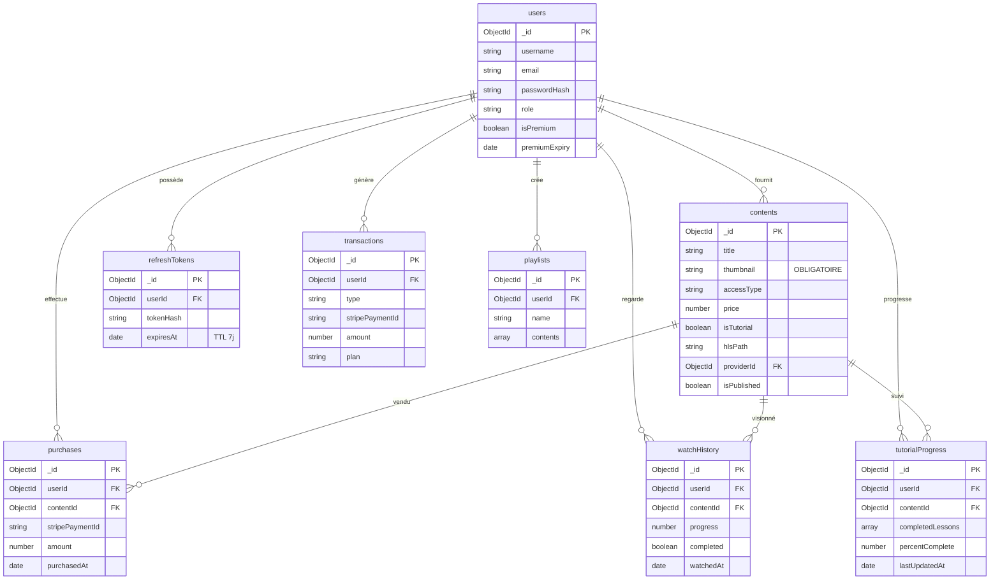

# 🗄️ 02 — Schémas MongoDB

> [!abstract] 8 collections
> `users` · `contents` · `refreshTokens` · `purchases` · `transactions` · `watchHistory` · `tutorialProgress` · `playlists`

---

## Vue d'ensemble des relations



---

## Collection `users`

```javascript
const userSchema = new Schema({
  username:      { type: String, required: true, unique: true,
                   trim: true, minlength: 3, maxlength: 30 },
  email:         { type: String, required: true, unique: true, lowercase: true },
  passwordHash:  { type: String, required: true },   // bcrypt coût 12
  role:          { type: String,
                   enum: ['user', 'premium', 'provider', 'admin'],
                   default: 'user' },
  isPremium:     { type: Boolean, default: false },
  premiumExpiry: { type: Date, default: null },
  isActive:      { type: Boolean, default: true }
}, { timestamps: true });

// Index
userSchema.index({ email: 1 }, { unique: true });
userSchema.index({ role: 1 });
```

> [!note] Rôles possibles
> - `user` — compte standard gratuit
> - `premium` — abonné actif
> - `provider` — fournisseur de contenus
> - `admin` — administrateur plateforme

---

## Collection `contents` ⭐

```javascript
const contentSchema = new Schema({
  title:       { type: String, required: true, trim: true },
  description: { type: String, default: '' },
  type:        { type: String, enum: ['video', 'audio'], required: true },
  category:    { type: String,
                 enum: ['film','serie','documentaire','salegy','hira_gasy',
                        'tsapiky','beko','musique_contemporaine',
                        'podcast','tutoriel','autre'],
                 required: true },
  language:    { type: String, default: 'mg' },

  // ⚠️ VIGNETTE OBLIGATOIRE
  thumbnail:   { type: String, required: true }, // /uploads/thumbnails/<uuid>.jpg

  // Accès et tarification (modèle freemium)
  accessType:  { type: String,
                 enum: ['free', 'premium', 'paid'],
                 required: true },
  price:       { type: Number, default: null },  // en Ariary

  // Tutoriel
  isTutorial:  { type: Boolean, default: false },
  lessons: [{
    index:       { type: Number, required: true },
    title:       { type: String, required: true },
    description: { type: String },
    duration:    { type: Number },
    thumbnail:   { type: String, default: null }, // optionnel par leçon
    hlsPath:     { type: String },
    audioPath:   { type: String }
  }],

  // Fichiers
  hlsPath:     { type: String, default: null },  // /uploads/hls/<id>/index.m3u8
  audioPath:   { type: String, default: null },
  duration:    { type: Number, default: 0 },     // secondes

  // Métadonnées audio ID3 (music-metadata)
  artist:      { type: String, default: null },
  album:       { type: String, default: null },
  coverArt:    { type: String, default: null },  // pochette extraite ID3

  // Gestion
  providerId:  { type: Schema.Types.ObjectId, ref: 'User', required: true },
  isPublished: { type: Boolean, default: false },
  viewCount:   { type: Number, default: 0 },
  featured:    { type: Boolean, default: false }

}, { timestamps: true });

// Index
contentSchema.index({ accessType: 1, isPublished: 1 });
contentSchema.index({ category: 1, isPublished: 1 });
contentSchema.index({ providerId: 1 });
contentSchema.index({ title: 'text', description: 'text' }); // Recherche full-text
```

---

## Collection `refreshTokens`

```javascript
const refreshTokenSchema = new Schema({
  userId:    { type: Schema.Types.ObjectId, ref: 'User', required: true },
  tokenHash: { type: String, required: true }, // bcrypt hash — jamais le raw token
  expiresAt: { type: Date, required: true }    // Date.now() + 7 jours
}, { timestamps: false });

// TTL index → MongoDB supprime automatiquement les tokens expirés
refreshTokenSchema.index({ expiresAt: 1 }, { expireAfterSeconds: 0 });
refreshTokenSchema.index({ userId: 1 });
```

> [!warning] Sécurité
> Le token brut (raw) n'est **jamais** stocké en base. Seul le hash bcrypt est persisté. La comparaison se fait avec `bcrypt.compare(rawToken, tokenHash)`.

---

## Collection `purchases`

```javascript
const purchaseSchema = new Schema({
  userId:          { type: Schema.Types.ObjectId, ref: 'User', required: true },
  contentId:       { type: Schema.Types.ObjectId, ref: 'Content', required: true },
  stripePaymentId: { type: String, required: true },
  amount:          { type: Number, required: true },  // en Ariary
  purchasedAt:     { type: Date, default: Date.now }
}, { timestamps: false });

// ⚠️ Index unique → idempotence garantie, impossible d'acheter deux fois
purchaseSchema.index({ userId: 1, contentId: 1 }, { unique: true });
```

> [!success] Idempotence
> L'index unique `{userId, contentId}` garantit qu'un utilisateur ne peut pas acheter deux fois le même contenu. Si `Purchase.create()` est appelé deux fois, MongoDB lève une erreur `E11000 duplicate key` → backend retourne 409.

---

## Collection `transactions`

```javascript
const transactionSchema = new Schema({
  userId:          { type: Schema.Types.ObjectId, ref: 'User', required: true },
  type:            { type: String, enum: ['subscription', 'purchase'], required: true },
  stripePaymentId: { type: String, required: true, unique: true },
  amount:          { type: Number, required: true },
  plan:            { type: String, enum: ['monthly', 'yearly'], default: null },
  contentId:       { type: Schema.Types.ObjectId, ref: 'Content', default: null },
  status:          { type: String,
                     enum: ['pending', 'succeeded', 'failed'],
                     default: 'succeeded' }
}, { timestamps: true });

transactionSchema.index({ userId: 1, createdAt: -1 });
transactionSchema.index({ stripePaymentId: 1 }, { unique: true }); // anti-replay webhook
```

---

## Collection `watchHistory`

```javascript
const watchHistorySchema = new Schema({
  userId:    { type: Schema.Types.ObjectId, ref: 'User', required: true },
  contentId: { type: Schema.Types.ObjectId, ref: 'Content', required: true },
  watchedAt: { type: Date, default: Date.now },
  progress:  { type: Number, default: 0 },   // secondes visionnées
  completed: { type: Boolean, default: false } // true à 90% de la durée
}, { timestamps: false });

watchHistorySchema.index({ userId: 1, watchedAt: -1 });
watchHistorySchema.index({ userId: 1, contentId: 1 });
```

---

## Collection `tutorialProgress`

```javascript
const tutorialProgressSchema = new Schema({
  userId:           { type: Schema.Types.ObjectId, ref: 'User', required: true },
  contentId:        { type: Schema.Types.ObjectId, ref: 'Content', required: true },
  completedLessons: [{ type: Number }],    // ex: [0, 1, 2]
  lastLessonIndex:  { type: Number, default: 0 },
  percentComplete:  { type: Number, default: 0 }, // calculé = completedLessons.length / totalLessons * 100
  lastUpdatedAt:    { type: Date, default: Date.now }
}, { timestamps: false });

tutorialProgressSchema.index({ userId: 1, contentId: 1 }, { unique: true });
tutorialProgressSchema.index({ userId: 1, lastUpdatedAt: -1 });
```

---

## Collection `playlists`

```javascript
const playlistSchema = new Schema({
  userId:   { type: Schema.Types.ObjectId, ref: 'User', required: true },
  name:     { type: String, required: true, trim: true, maxlength: 100 },
  contents: [{ type: Schema.Types.ObjectId, ref: 'Content' }],
  isPublic: { type: Boolean, default: false }
}, { timestamps: true });

playlistSchema.index({ userId: 1 });
```

---

## Résumé des index critiques

| Collection | Index | Type | Raison |
|---|---|---|---|
| users | email | unique | Login sans collision |
| contents | {accessType, isPublished} | compound | Filtre catalogue |
| contents | {title, description} | text | Recherche full-text |
| refreshTokens | expiresAt | TTL | Auto-suppression expirés |
| purchases | {userId, contentId} | unique | Idempotence achats |
| transactions | stripePaymentId | unique | Anti-replay webhook |
| tutorialProgress | {userId, contentId} | unique | Une progression par user/tuto |

> [!tip] Retour
> ← [[🏠 INDEX — StreamMG Backend]]
