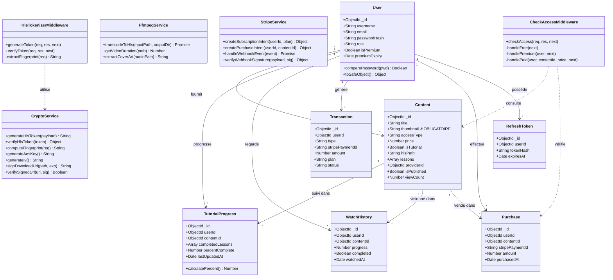
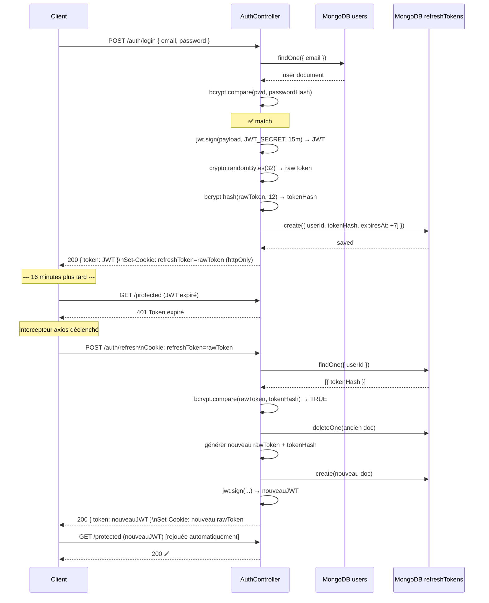
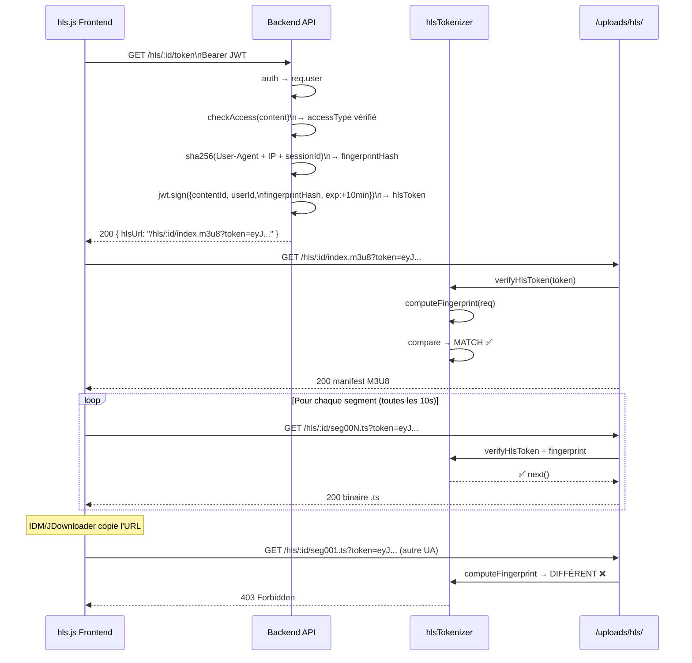
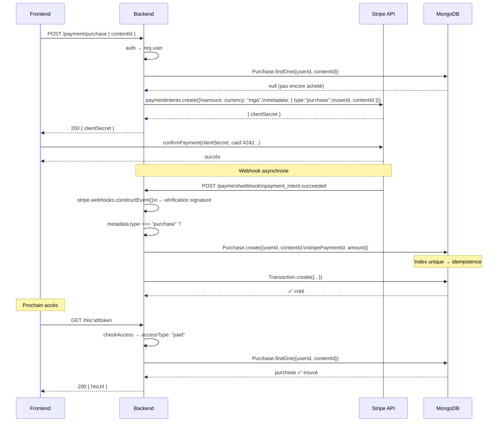
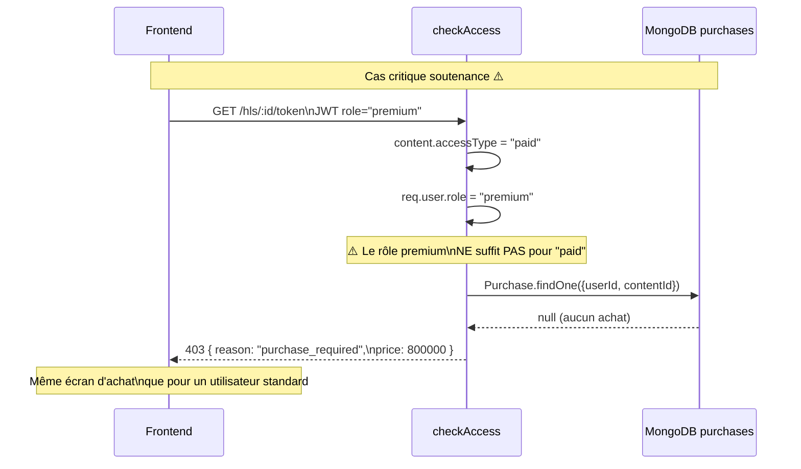
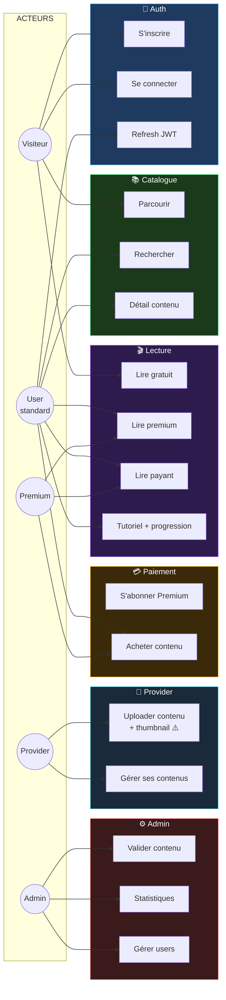

# 📊 03 — Diagrammes UML

---

## Diagramme de classes — Backend

---

## Séquence — Authentification et Refresh Token

---

## Séquence — Lecture HLS protégée (web)

---

## Séquence — Achat unitaire (Stripe)

---

## Séquence — checkAccess (cas Premium sur contenu Payant)

---

## Diagramme de cas d'utilisation

> [!tip] Retour
> ← [[🏠 INDEX — StreamMG Backend]]
