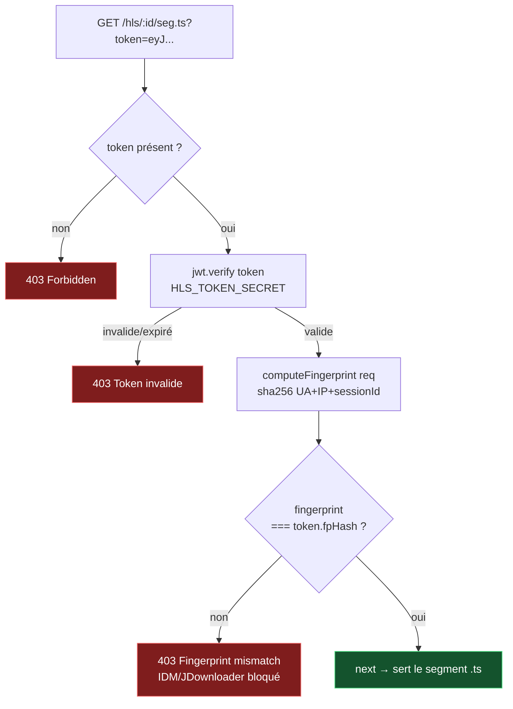

# 🔒 04 — Middlewares

> [!abstract] Les 5 middlewares critiques du backend
> `auth.js` · `checkAccess.js` · `hlsTokenizer.js` · `requireRole.js` · `validateThumbnail.js`

---

## Flux des middlewares

```mermaid
flowchart LR
    REQ([Requête HTTP]) --> H[helmet\nHeaders sécurité]
    H --> C[cors\n2 origines]
    C --> RL[rate-limit\n10/15min auth]
    RL --> AUTH{auth.js\nJWT ?}

    AUTH -->|optionnel| AO[req.user = null\ncontinue]
    AUTH -->|requis| AR{token valide ?}
    AR -->|non| E401[401 Unauthorized]
    AR -->|oui| RU[req.user = payload JWT]

    RU --> CA{checkAccess\nroute protégée ?}
    CA -->|free| NEXT[next()]
    CA -->|premium| RP{role = premium\nou admin ?}
    CA -->|paid| PUR{Purchase\nexiste ?}

    RP -->|non| E403S[403 subscription_required]
    RP -->|oui| NEXT
    PUR -->|non| E403P[403 purchase_required]
    PUR -->|oui| NEXT

    NEXT --> CTRL[Controller]
    CTRL --> RES([Réponse JSON])

    style E401 fill:#7f1d1d,stroke:#f87171,color:#fff
    style E403S fill:#7f1d1d,stroke:#f87171,color:#fff
    style E403P fill:#7f1d1d,stroke:#f87171,color:#fff
    style NEXT fill:#14532d,stroke:#4ade80,color:#fff
    style RES fill:#1e3a5f,stroke:#4a9ede,color:#fff
```

---

## `checkAccess.js` — Logique freemium complète

```javascript
// middlewares/checkAccess.js
const Content  = require('../models/Content');
const Purchase = require('../models/Purchase');

async function checkAccess(req, res, next) {
  // Récupère le contentId depuis les params
  const contentId = req.params.id || req.params.contentId;

  const content = await Content
    .findById(contentId)
    .select('accessType price');

  if (!content) {
    return res.status(404).json({ message: 'Contenu introuvable' });
  }

  switch (content.accessType) {

    // ─── GRATUIT : tout le monde ───────────────────────────────────────
    case 'free':
      return next();

    // ─── PREMIUM : abonnés uniquement ─────────────────────────────────
    case 'premium':
      if (!req.user) {
        return res.status(403).json({ reason: 'login_required' });
      }
      if (req.user.role !== 'premium' && req.user.role !== 'admin') {
        return res.status(403).json({ reason: 'subscription_required' });
      }
      return next();

    // ─── PAYANT : achat unitaire requis ───────────────────────────────
    // ⚠️ L'abonnement Premium NE COUVRE PAS les contenus payants
    case 'paid':
      if (!req.user) {
        return res.status(403).json({ reason: 'login_required' });
      }
      // Admin accède à tout
      if (req.user.role === 'admin') return next();

      // Même un utilisateur Premium doit avoir acheté le contenu
      const purchase = await Purchase.findOne({
        userId:    req.user.id,
        contentId: content._id
      });
      if (!purchase) {
        return res.status(403).json({
          reason: 'purchase_required',
          price:  content.price  // retourné pour afficher le prix dans l'écran
        });
      }
      return next();

    default:
      return res.status(403).json({ reason: 'access_denied' });
  }
}

module.exports = checkAccess;
```

> [!warning] Point critique soutenance
> Le cas **Premium sur contenu Payant** (case `'paid'`) : même si `req.user.role === 'premium'`, le middleware cherche dans `purchases`. Sans achat → **403**. C'est le test **TF-ACC-06**.

---

## `hlsTokenizer.js` — Protection anti-téléchargement



```javascript
// middlewares/hlsTokenizer.js
const jwt    = require('jsonwebtoken');
const crypto = require('crypto');

// Calcule le fingerprint de session
function computeFingerprint(req) {
  const raw = [
    req.headers['user-agent'] || '',
    req.ip || '',
    req.cookies?.sessionId   || ''
  ].join('|');
  return crypto.createHash('sha256').update(raw).digest('hex');
}

// Middleware de génération (appelé dans hlsController)
function generateHlsToken(contentId, userId, req) {
  const payload = {
    contentId,
    userId,
    fpHash: computeFingerprint(req)
  };
  return jwt.sign(payload, process.env.HLS_TOKEN_SECRET, {
    expiresIn: parseInt(process.env.HLS_TOKEN_EXPIRY) // 600s = 10min
  });
}

// Middleware de vérification (sur chaque segment .ts)
function verifyHlsSegment(req, res, next) {
  const token = req.query.token;
  if (!token) return res.status(403).json({ message: 'Token HLS requis' });

  try {
    const decoded = jwt.verify(token, process.env.HLS_TOKEN_SECRET);
    const currentFp = computeFingerprint(req);

    if (decoded.fpHash !== currentFp) {
      return res.status(403).json({ message: 'Session invalide' });
    }
    req.hlsPayload = decoded;
    next();
  } catch (e) {
    return res.status(403).json({ message: 'Token expiré ou invalide' });
  }
}

module.exports = { generateHlsToken, verifyHlsSegment, computeFingerprint };
```

---

## `validateThumbnail.js` — Vignette obligatoire

```javascript
// middlewares/validateThumbnail.js
function validateThumbnail(req, res, next) {
  // Multer a déjà parsé les fichiers dans req.files
  if (!req.files || !req.files.thumbnail || req.files.thumbnail.length === 0) {
    return res.status(400).json({ message: 'La vignette est obligatoire.' });
  }

  const thumb = req.files.thumbnail[0];

  // Vérification MIME (Multer fileFilter devrait déjà filtrer, double check)
  const allowedMimes = ['image/jpeg', 'image/png'];
  if (!allowedMimes.includes(thumb.mimetype)) {
    return res.status(400).json({
      message: 'Format d\'image non accepté (JPEG ou PNG uniquement)'
    });
  }

  // Vérification taille (5 Mo max = 5 * 1024 * 1024)
  if (thumb.size > 5 * 1024 * 1024) {
    return res.status(400).json({ message: 'Fichier image trop volumineux (max 5 Mo)' });
  }

  next();
}

module.exports = validateThumbnail;
```

### Config Multer associée

```javascript
// config/multer.js
const multer  = require('multer');
const path    = require('path');
const { v4: uuidv4 } = require('uuid');

const storage = multer.diskStorage({
  destination: (req, file, cb) => {
    if (file.fieldname === 'thumbnail') {
      cb(null, 'uploads/thumbnails/');
    } else if (file.fieldname === 'media') {
      cb(null, 'uploads/private/'); // stockage temporaire avant transcoding
    }
  },
  filename: (req, file, cb) => {
    const ext = path.extname(file.originalname).toLowerCase();
    cb(null, `${uuidv4()}${ext}`);
  }
});

const fileFilter = (req, file, cb) => {
  if (file.fieldname === 'thumbnail') {
    cb(null, ['image/jpeg', 'image/png'].includes(file.mimetype));
  } else if (file.fieldname === 'media') {
    cb(null, ['video/mp4', 'audio/mpeg', 'audio/aac'].includes(file.mimetype));
  } else {
    cb(new Error('Champ non reconnu'), false);
  }
};

const upload = multer({
  storage,
  fileFilter,
  limits: {
    fileSize: 500 * 1024 * 1024  // 500 Mo max global
  }
});

// Exporté pour les routes provider
module.exports = upload.fields([
  { name: 'thumbnail', maxCount: 1 },  // OBLIGATOIRE
  { name: 'media',     maxCount: 1 }   // OBLIGATOIRE
]);
```

---

## `requireRole.js` — Contrôle de rôle

```javascript
// middlewares/requireRole.js
const requireRole = (...roles) => (req, res, next) => {
  if (!req.user) {
    return res.status(401).json({ message: 'Authentification requise' });
  }
  if (!roles.includes(req.user.role)) {
    return res.status(403).json({ message: 'Rôle insuffisant' });
  }
  next();
};

// Utilisation dans les routes
// router.get('/admin/stats', authRequired, requireRole('admin'), adminController.getStats);
// router.post('/provider/contents', authRequired, requireRole('provider','admin'), upload, validateThumbnail, providerController.create);

module.exports = requireRole;
```

---

## Tableau de synthèse — Middlewares par route

| Route | auth | checkAccess | requireRole | validateThumb |
|---|:---:|:---:|:---:|:---:|
| GET /contents | optionnel | ✗ | ✗ | ✗ |
| GET /hls/:id/token | requis | ✅ | ✗ | ✗ |
| GET /hls/:id/\*.ts | token HLS | ✗ (dans hlsTokenizer) | ✗ | ✗ |
| POST /download/:id | requis | ✅ | ✗ | ✗ |
| POST /auth/login | ✗ | ✗ | ✗ | ✗ |
| POST /payment/purchase | requis | ✗ | ✗ | ✗ |
| POST /payment/webhook | signature Stripe | ✗ | ✗ | ✗ |
| POST /provider/contents | requis | ✗ | provider/admin | ✅ |
| GET /admin/stats | requis | ✗ | admin | ✗ |
| POST /tutorial/progress/:id | requis | ✅ | ✗ | ✗ |

> [!tip] Retour
> ← [[🏠 INDEX — StreamMG Backend]]
