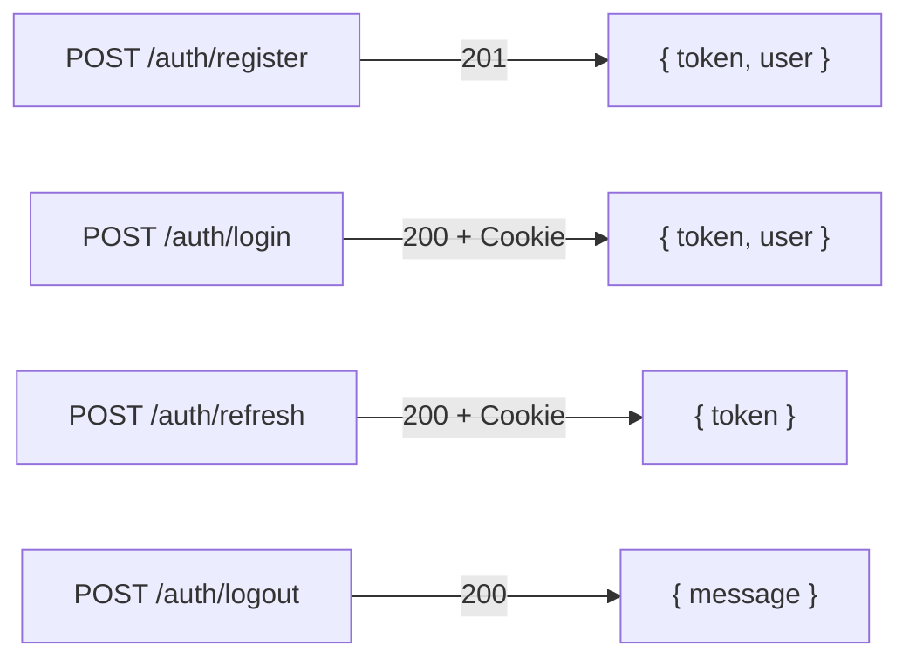

# 📡 05 — Contrat API

> [!info] Base URL
> **Production :** `https://api.streamMG.railway.app/api`
> **Développement :** `http://localhost:3001/api`
> **Format :** JSON exclusivement · **Auth :** `Authorization: Bearer <JWT>`

---

## Codes d'erreur standards

| Code | Signification | Exemple |
|---|---|---|
| `400` | Données invalides | Vignette absente, MIME incorrect |
| `401` | Token absent ou expiré | JWT expiré |
| `403` | Accès refusé | Rôle insuffisant, token HLS invalide |
| `404` | Ressource introuvable | ContentId inexistant |
| `409` | Conflit | Email dupliqué, achat déjà effectué |
| `429` | Rate limit dépassé | > 10 logins / 15 min |
| `500` | Erreur serveur | Exception non gérée |

### Format 403 du checkAccess

```json
{
  "reason": "subscription_required | purchase_required | login_required",
  "price": 800000
}
```

---

## 🔐 Authentification



### POST `/auth/register`
```json
// Requête
{
  "username": "Rabe",
  "email": "rabe@exemple.mg",
  "password": "MotDePasse1"
}

// Réponse 201
{
  "token": "eyJhbGciOiJIUzI1NiIsInR5cCI6IkpXVCJ9...",
  "user": {
    "_id": "65f3a2b4c8e9d1234567890a",
    "username": "Rabe",
    "role": "user",
    "isPremium": false
  }
}

// Erreurs possibles
// 409 : { "message": "Email déjà utilisé" }
// 400 : { "errors": [{ "field": "password", "msg": "Minimum 8 caractères" }] }
```

### POST `/auth/login`
```json
// Requête
{
  "email": "rabe@exemple.mg",
  "password": "MotDePasse1"
}

// Réponse 200 + Set-Cookie: refreshToken=... (httpOnly, secure, sameSite=strict)
{
  "token": "eyJhbGciOiJIUzI1NiIsInR5cCI6IkpXVCJ9...",
  "user": {
    "_id": "65f3a2b4c8e9d1234567890a",
    "username": "Rabe",
    "role": "premium",
    "isPremium": true,
    "premiumExpiry": "2026-04-10T00:00:00.000Z"
  }
}
```

### POST `/auth/refresh`
```json
// Requête : aucun body, le refresh token est dans le cookie httpOnly

// Réponse 200 + Set-Cookie: nouveau refreshToken
{
  "token": "eyJhbGciOiJIUzI1NiIsInR5cCI6IkpXVCJ9..."
}

// Erreur 401 si token expiré ou révoqué
```

---

## 📚 Catalogue

### GET `/contents`

**Paramètres de query :**

| Paramètre | Type | Exemple |
|---|---|---|
| `page` | Number | `?page=2` |
| `limit` | Number | `?limit=20` |
| `type` | String | `?type=video` |
| `category` | String | `?category=salegy` |
| `accessType` | String | `?accessType=free` |
| `isTutorial` | Boolean | `?isTutorial=true` |
| `search` | String | `?search=hira+gasy` |

```json
// Réponse 200
{
  "contents": [
    {
      "_id": "65f3a2b4c8e9d1234567890b",
      "title": "Mora Mora",
      "type": "audio",
      "category": "salegy",
      "thumbnail": "/uploads/thumbnails/mora_mora_e1f4a.jpg",
      "duration": 243,
      "accessType": "free",
      "price": null,
      "isTutorial": false,
      "artist": "Tarika Sammy",
      "viewCount": 1842
    }
  ],
  "total": 148,
  "page": 1,
  "pages": 8
}
```

> [!important] Le champ `thumbnail` est **toujours non-null** dans le catalogue. Tout contenu sans vignette ne peut pas être publié (`isPublished: false`).

---

## 🎬 Streaming HLS

### GET `/hls/:id/token`

```json
// Headers requis : Authorization: Bearer <JWT>
// + checkAccess vérifié

// Réponse 200
{
  "hlsUrl": "/hls/65f3a2b4.../index.m3u8?token=eyJhbGci...",
  "expiresIn": 600
}

// Erreurs
// 401 : pas de JWT
// 403 : { "reason": "subscription_required" | "purchase_required", "price": 800000 }
// 404 : contenu introuvable
```

### GET `/hls/:id/index.m3u8?token=...`

```
→ hlsTokenizer vérifie : token valide + fingerprint correspondant
→ 200 : fichier manifest M3U8
→ 403 : token invalide, expiré ou fingerprint différent
```

### GET `/hls/:id/:segment.ts?token=...`

```
→ hlsTokenizer vérifie à CHAQUE segment
→ 200 : binaire du segment vidéo
→ 403 : TOUT changement de User-Agent ou IP → bloqué (IDM/JDownloader)
```

---

## 📥 Téléchargement mobile AES

### POST `/download/:id`

```json
// Headers : Authorization: Bearer <JWT>
// + checkAccess vérifié

// Réponse 200
{
  "aesKeyHex": "a3f9b2c1d4e5f6a7b8c9d0e1f2a3b4c5d6e7f8a9b0c1d2e3f4a5b6c7d8e9f0a1",
  "ivHex":     "b7c2d3e4f5a6b7c8d9e0f1a2b3c4d5e6",
  "signedUrl": "https://api.streamMG.railway.app/private/video.mp4?expires=...&sig=...",
  "expiresIn": 900
}

// Notes :
// aesKeyHex = 64 chars hex = 32 octets = AES-256
// ivHex     = 32 chars hex = 16 octets
// La clé n'est JAMAIS stockée en DB
// Un deuxième appel pour le même contenu → 403 "Contenu déjà téléchargé"
```

---

## 📈 Historique et progression

### POST `/history/:contentId`
```json
// Requête
{ "progress": 145, "completed": false }

// Réponse 200
{ "message": "Progression enregistrée" }
```

### POST `/tutorial/progress/:contentId`
```json
// Requête
{ "lessonIndex": 2, "completed": true }

// Réponse 200
{
  "completedLessons": [0, 1, 2],
  "lastLessonIndex": 2,
  "percentComplete": 50
}
```

### GET `/tutorial/progress`
```json
// Réponse 200
{
  "inProgress": [
    {
      "contentId": {
        "_id": "...",
        "title": "Apprendre le salegy",
        "thumbnail": "/uploads/thumbnails/tuto_salegy_a3f9b.jpg"
      },
      "lastLessonIndex": 2,
      "percentComplete": 37.5,
      "lastUpdatedAt": "2026-02-20T20:15:00.000Z"
    }
  ]
}
```

---

## 💳 Paiement Stripe

### POST `/payment/subscribe`
```json
// Requête
{ "plan": "monthly" }

// Réponse 200
{ "clientSecret": "pi_3Oq...secret_..." }
```

### POST `/payment/purchase`
```json
// Requête
{ "contentId": "65f3a2b4c8e9d1234567890d" }

// Réponse 200
{ "clientSecret": "pi_3Oq...secret_..." }

// Réponse 409 (doublon)
{ "message": "Vous avez déjà acheté ce contenu" }
```

### GET `/payment/purchases`
```json
// Réponse 200
{
  "purchases": [
    {
      "_id": "...",
      "contentId": {
        "_id": "...",
        "title": "Ny Fitiavana",
        "thumbnail": "/uploads/thumbnails/ny_fitiavana_b7c2d.jpg",
        "type": "video"
      },
      "amount": 800000,
      "purchasedAt": "2026-02-15T16:22:10.000Z"
    }
  ]
}
```

### POST `/payment/webhook` (Stripe)
```javascript
// Logique de traitement
if (event.type === 'payment_intent.succeeded') {
  const { metadata } = event.data.object;

  if (metadata.type === 'subscription') {
    // MAJ users : isPremium: true, role: "premium"
    // premiumExpiry: monthly → +30j, yearly → +365j
    // Crée Transaction { type: "subscription" }

  } else if (metadata.type === 'purchase') {
    // Crée Purchase { userId, contentId, stripePaymentId, amount }
    // Crée Transaction { type: "purchase" }
  }
}
```

---

## 🎥 Espace Fournisseur

### POST `/provider/contents` (multipart)

```
Fields requis :
  thumbnail  : image JPEG ou PNG ≤ 5 Mo   ← OBLIGATOIRE
  media      : vidéo MP4 ou audio MP3/AAC  ← OBLIGATOIRE
  title      : String
  type       : "video" | "audio"
  category   : enum
  accessType : "free" | "premium" | "paid"
  price      : Number (si accessType = "paid")
  isTutorial : Boolean

Réponse 201 :
  { "_id": "...", "title": "...", "thumbnail": "/uploads/thumbnails/uuid.jpg",
    "isPublished": false, "message": "En attente de validation." }

Erreurs :
  400 : "La vignette est obligatoire."
  400 : "Type MIME non autorisé"
  400 : "Fichier image trop volumineux (max 5 Mo)"
```

### PUT `/provider/contents/:id/thumbnail`
```
// Remplacer la vignette d'un contenu existant
thumbnail : image JPEG ou PNG ≤ 5 Mo

Réponse 200 :
  { "thumbnail": "/uploads/thumbnails/<uuid>.jpg" }
```

---

## ⚙️ Administration

### GET `/admin/stats`
```json
{
  "totalUsers": 284,
  "premiumUsers": 47,
  "totalContents": 312,
  "totalViews": 18420,
  "topPurchasedContents": [
    {
      "title": "Ny Fitiavana",
      "thumbnail": "/uploads/thumbnails/ny_fitiavana_b7c2d.jpg",
      "totalSales": 12,
      "totalRevenue": 9600000
    }
  ],
  "recentPurchases30d": 38,
  "revenueSimulated30d": 28500000
}
```

---

## Intercepteur Axios — gestion 401/403 (frontend)

```javascript
// Logique identique mobile et web
axiosInstance.interceptors.response.use(
  response => response,
  async error => {

    // JWT expiré → renouvellement silencieux
    if (error.response?.status === 401) {
      try {
        const { data } = await axiosInstance.post('/auth/refresh');
        tokenStore.setToken(data.token);
        error.config.headers['Authorization'] = `Bearer ${data.token}`;
        return axiosInstance.request(error.config); // rejoue la requête
      } catch {
        tokenStore.logout();
        navigate('/login');
      }
    }

    // Accès refusé → affiche l'écran intermédiaire approprié
    if (error.response?.status === 403) {
      const { reason, price } = error.response.data;
      accessGateStore.show({ reason, price });
      // reason: "subscription_required" → écran abonnement
      // reason: "purchase_required"     → écran achat avec prix
      // reason: "login_required"        → invitation à créer un compte
    }

    return Promise.reject(error);
  }
);
```

> [!tip] Retour
> ← [[🏠 INDEX — StreamMG Backend]]
