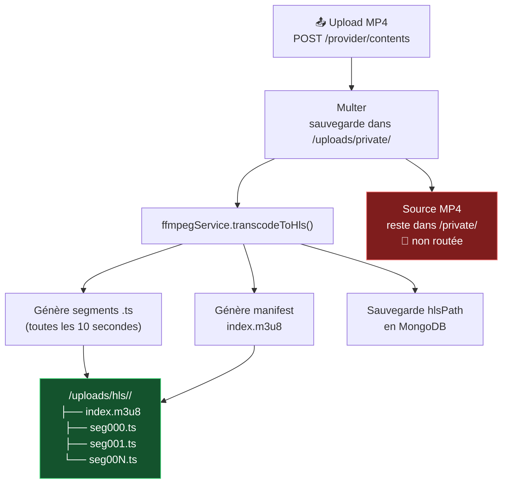
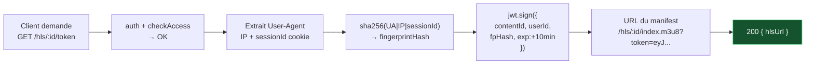
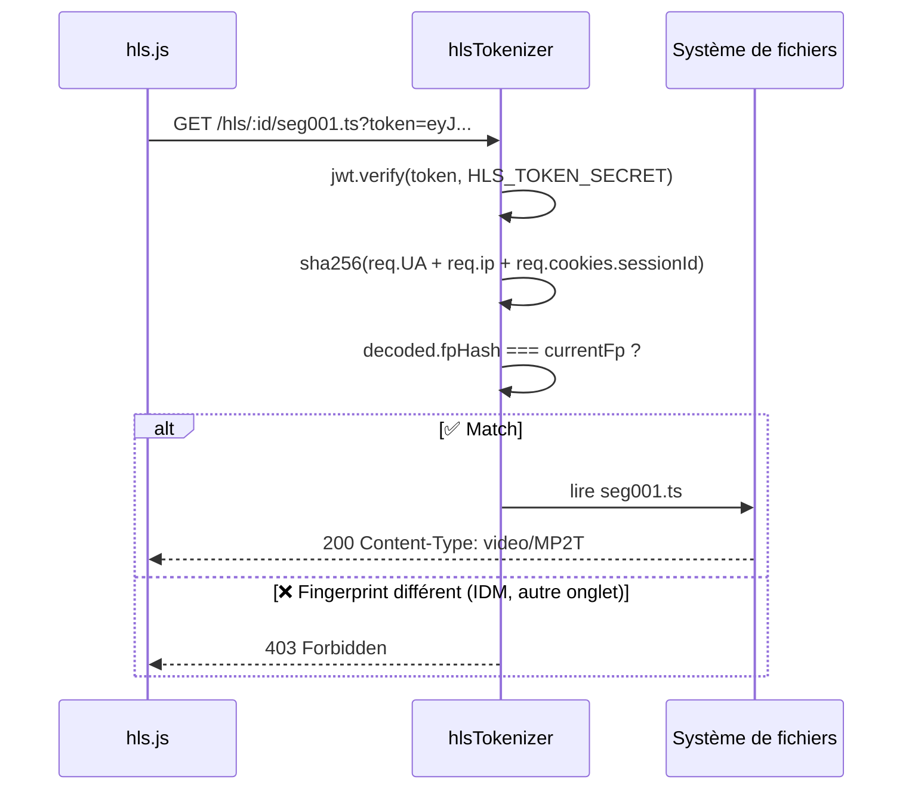
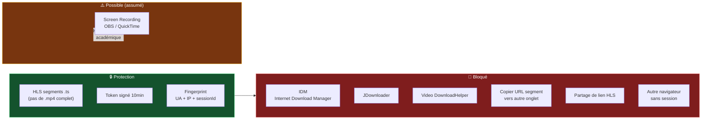

# 🎬 06 — Pipeline HLS

> [!abstract] Objectif
> Servir les vidéos exclusivement en segments HLS de 10 secondes avec token signé et vérification de fingerprint à chaque requête. **Aucun fichier `.mp4` n'est jamais accessible directement.**

---

## Vue d'ensemble du pipeline



---

## Étape 1 — Transcoding ffmpeg

```javascript
// services/ffmpegService.js
const ffmpeg = require('fluent-ffmpeg');
const path   = require('path');
const fs     = require('fs');

/**
 * Transcoде un fichier MP4 en segments HLS
 * @param {string} inputPath  - chemin du fichier source (.mp4)
 * @param {string} contentId  - ID MongoDB du contenu
 * @returns {Promise<{hlsPath, duration}>}
 */
async function transcodeToHls(inputPath, contentId) {
  const outputDir = path.join('uploads', 'hls', contentId);
  fs.mkdirSync(outputDir, { recursive: true });

  const manifestPath = path.join(outputDir, 'index.m3u8');

  return new Promise((resolve, reject) => {
    ffmpeg(inputPath)
      .outputOptions([
        '-codec:v libx264',          // codec vidéo H.264
        '-codec:a aac',              // codec audio AAC
        '-hls_time 10',              // segments de 10 secondes
        '-hls_playlist_type vod',    // VOD (pas de live)
        '-hls_segment_filename',
        path.join(outputDir, 'seg%03d.ts'),
        '-start_number 0'
      ])
      .output(manifestPath)
      .on('end', async () => {
        const duration = await getVideoDuration(inputPath);
        resolve({
          hlsPath: `/hls/${contentId}/index.m3u8`,
          duration
        });
      })
      .on('error', (err) => reject(err))
      .run();
  });
}

/** Extrait la durée d'une vidéo en secondes */
function getVideoDuration(filePath) {
  return new Promise((resolve, reject) => {
    ffmpeg.ffprobe(filePath, (err, metadata) => {
      if (err) return reject(err);
      resolve(Math.round(metadata.format.duration));
    });
  });
}

module.exports = { transcodeToHls, getVideoDuration };
```

---

## Étape 2 — Génération du token HLS signé



```javascript
// controllers/hlsController.js
const { generateHlsToken } = require('../middlewares/hlsTokenizer');

async function getHlsToken(req, res) {
  // auth + checkAccess déjà passés
  const { id: contentId } = req.params;
  const userId = req.user?.id || null;

  const token = generateHlsToken(contentId, userId, req);

  res.json({
    hlsUrl:    `/hls/${contentId}/index.m3u8?token=${token}`,
    expiresIn: 600
  });
}
```

---

## Étape 3 — Service des segments (vérification à chaque requête)



```javascript
// routes/hls.routes.js
const express    = require('express');
const router     = express.Router();
const path       = require('path');
const { verifyHlsSegment } = require('../middlewares/hlsTokenizer');

// Manifest .m3u8
router.get('/:contentId/index.m3u8', verifyHlsSegment, (req, res) => {
  const filePath = path.join('uploads', 'hls', req.params.contentId, 'index.m3u8');
  res.setHeader('Content-Type', 'application/vnd.apple.mpegurl');
  res.sendFile(path.resolve(filePath));
});

// Segments .ts
router.get('/:contentId/:segment', verifyHlsSegment, (req, res) => {
  const { contentId, segment } = req.params;
  // Sécurité : empêche le path traversal
  if (!segment.match(/^seg\d{3}\.ts$/)) {
    return res.status(400).json({ message: 'Segment invalide' });
  }
  const filePath = path.join('uploads', 'hls', contentId, segment);
  res.setHeader('Content-Type', 'video/MP2T');
  res.sendFile(path.resolve(filePath));
});

// AUCUNE route /uploads/private/* → les sources MP4 sont inaccessibles
```

---

## Ce que ça bloque vs ce que ça ne bloque pas



> [!note] Limite académiquement défendable
> Le **screen recording** reste possible. C'est le cas de **toutes** les plateformes sans DRM (Netflix, Spotify utilisent Widevine/FairPlay — hors périmètre d'un projet de Licence). Cette limite est à mentionner explicitement en soutenance.

---

## Renouvellement automatique côté frontend (Membre 2)

```javascript
// Logique hls.js — renouvellement token sur erreur 403
hls.on(Hls.Events.ERROR, async (event, data) => {
  if (data.response?.code === 403 && data.type === Hls.ErrorTypes.NETWORK_ERROR) {
    try {
      const { data: tokenData } = await api.get(`/hls/${contentId}/token`);
      hls.stopLoad();
      hls.loadSource(tokenData.hlsUrl); // recharge avec nouveau token
      hls.startLoad();
    } catch (err) {
      console.error('Impossible de renouveler le token HLS', err);
    }
  }
});
```

> [!tip] Retour
> ← [[🏠 INDEX — StreamMG Backend]]
