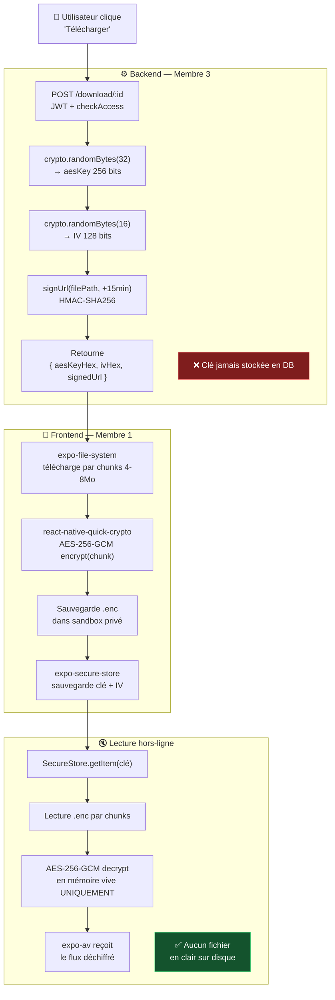
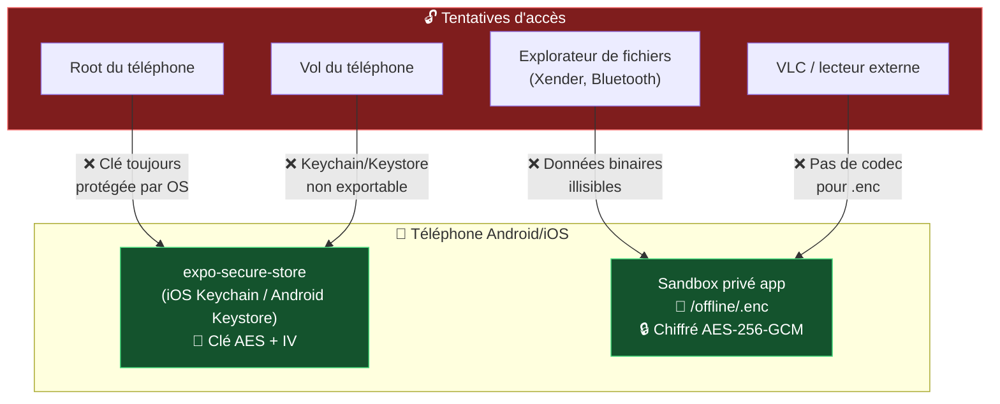

# 📱 07 — Pipeline AES Mobile

> [!abstract] Objectif
> Permettre le téléchargement hors-ligne sur mobile en chiffrant le fichier avec **AES-256-GCM**. Le fichier `.enc` est totalement illisible hors de l'application, même en cas d'accès physique au téléphone.

---

## Vue d'ensemble



---

## Étape 1 — Backend : génération clé + URL signée

```javascript
// controllers/downloadController.js
const crypto = require('crypto');  // Module natif Node.js, pas de dépendance externe
const Content = require('../models/Content');

async function getDownloadCredentials(req, res) {
  // auth + checkAccess déjà passés

  const { id: contentId } = req.params;
  const content = await Content.findById(contentId).select('hlsPath audioPath type');

  if (!content) return res.status(404).json({ message: 'Contenu introuvable' });

  // Générer clé AES-256 (32 octets = 256 bits)
  const aesKey = crypto.randomBytes(32);

  // Générer IV (16 octets = 128 bits)
  const iv = crypto.randomBytes(16);

  // Signer une URL temporaire vers le fichier source (15 min)
  const filePath = content.type === 'video'
    ? content.hlsPath.replace('/hls/', 'uploads/private/') + '.mp4' // source brute
    : content.audioPath;

  const expiry = Math.floor(Date.now() / 1000) + 900; // +15 minutes
  const signature = crypto
    .createHmac('sha256', process.env.SIGNED_URL_SECRET)
    .update(`${filePath}|${expiry}`)
    .digest('hex');

  const signedUrl = `${process.env.API_BASE_URL}/private/${encodeURIComponent(filePath)}`
    + `?expires=${expiry}&sig=${signature}`;

  // ⚠️ La clé n'est JAMAIS stockée en base de données
  res.json({
    aesKeyHex: aesKey.toString('hex'),  // 64 chars hex
    ivHex:     iv.toString('hex'),      // 32 chars hex
    signedUrl,
    expiresIn: 900
  });
}

module.exports = { getDownloadCredentials };
```

---

## Étape 2 — Vérification de l'URL signée

```javascript
// middlewares/verifySignedUrl.js
const crypto = require('crypto');

function verifySignedUrl(req, res, next) {
  const { expires, sig } = req.query;
  const filePath = decodeURIComponent(req.params[0]);

  // URL expirée ?
  if (Date.now() / 1000 > parseInt(expires)) {
    return res.status(403).json({ message: 'URL expirée' });
  }

  // Signature valide ?
  const expected = crypto
    .createHmac('sha256', process.env.SIGNED_URL_SECRET)
    .update(`${filePath}|${expires}`)
    .digest('hex');

  // Comparaison en temps constant (anti-timing attack)
  const sigBuf = Buffer.from(sig, 'hex');
  const expBuf = Buffer.from(expected, 'hex');

  if (sigBuf.length !== expBuf.length || !crypto.timingSafeEqual(sigBuf, expBuf)) {
    return res.status(403).json({ message: 'Signature invalide' });
  }

  next();
}

// Route privée — uniquement accessible via URL signée
// app.get('/private/*', verifySignedUrl, (req, res) => {
//   res.sendFile(path.resolve(req.params[0]));
// });
```

---

## Étape 3 — Frontend mobile (Membre 1) — référence pour coordination

```javascript
// Extrait pour compréhension de l'intégration (code Membre 1)

const { aesKeyHex, ivHex, signedUrl } = await api.post(`/download/${contentId}`);

const key = Buffer.from(aesKeyHex, 'hex');
const iv  = Buffer.from(ivHex, 'hex');
const encUri = `${FileSystem.documentDirectory}offline/${contentId}.enc`;

// Téléchargement par chunks avec reprise sur coupure réseau
const CHUNK_SIZE = 6 * 1024 * 1024; // 6 Mo
// ... (expo-file-system handles chunked download)

// Chiffrement de chaque chunk (react-native-quick-crypto)
// const cipher = Crypto.createCipheriv('aes-256-gcm', key, iv);
// const encryptedChunk = Buffer.concat([cipher.update(chunk), cipher.final()]);

// Stockage sécurisé de la clé
await SecureStore.setItemAsync(
  `aes_${contentId}`,
  JSON.stringify({ aesKeyHex, ivHex })
);

// Enregistrement local (pour l'affichage dans "Téléchargements")
await AsyncStorage.setItem(
  `dl_${contentId}`,
  JSON.stringify({ encUri, thumbnail: content.thumbnail })
);
```

---

## Sécurité du fichier `.enc`



> [!success] Garanties de sécurité
> - **Aucun fichier en clair n'est jamais écrit sur le disque**
> - Le déchiffrement se fait chunk par chunk **en mémoire vive** uniquement
> - La clé AES est protégée par l'OS (**iOS Keychain** / **Android Keystore**)
> - Le fichier `.enc` est totalement illisible par toute autre application

---

## Cas d'erreur à gérer

| Cas | Comportement |
|---|---|
| Coupure réseau à 50% | expo-file-system reprend depuis le dernier chunk |
| Espace disque insuffisant | Message "Espace insuffisant", fichier `.enc` partiellement supprimé |
| Clé supprimée de SecureStore | Message d'erreur + invitation à re-télécharger |
| Fichier `.enc` corrompu | Erreur de déchiffrement, invitation à re-télécharger |
| Droits perdus (achat annulé) | Le fichier reste accessible (achat = accès **permanent**) |

> [!tip] Retour
> ← [[🏠 INDEX — StreamMG Backend]]
