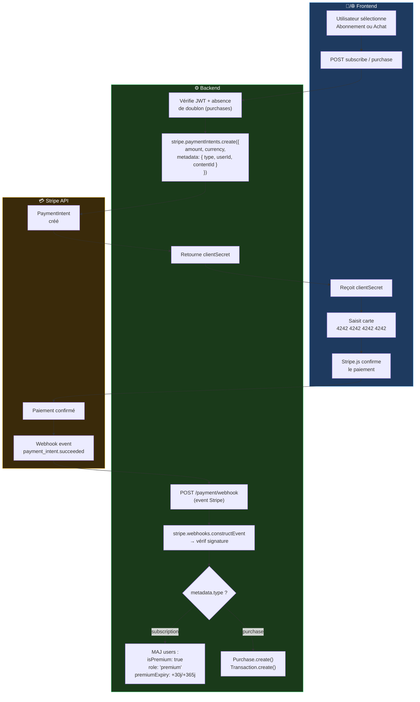
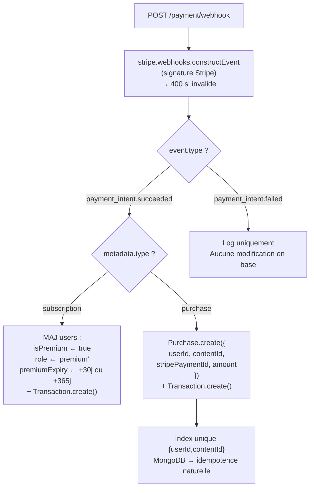

# 💳 08 — Stripe et Paiements

> [!info] Mode test uniquement
> Tous les paiements sont simulés. **Aucune transaction réelle.** Stripe SDK v14.
> Carte succès : `4242 4242 4242 4242` · Carte refus : `4000 0000 0000 9995`

---

## Flux de paiement complet



---

## Abonnement Premium

```javascript
// controllers/paymentController.js — abonnement

async function createSubscription(req, res) {
  const { plan } = req.body; // "monthly" | "yearly"
  const userId = req.user.id;

  const amount = plan === 'yearly' ? 5000000 : 500000; // en centimes d'Ariary

  const paymentIntent = await stripe.paymentIntents.create({
    amount,
    currency: 'mga',
    automatic_payment_methods: { enabled: true },
    metadata: {
      type:   'subscription',
      userId: userId.toString(),
      plan
    }
  });

  res.json({ clientSecret: paymentIntent.client_secret });
}
```

---

## Achat unitaire

```javascript
// controllers/paymentController.js — achat unitaire

async function createPurchase(req, res) {
  const { contentId } = req.body;
  const userId = req.user.id;

  // Vérification idempotence AVANT de créer le PaymentIntent
  const existing = await Purchase.findOne({ userId, contentId });
  if (existing) {
    return res.status(409).json({ message: 'Vous avez déjà acheté ce contenu' });
  }

  const content = await Content.findById(contentId).select('price title');
  if (!content) return res.status(404).json({ message: 'Contenu introuvable' });

  const paymentIntent = await stripe.paymentIntents.create({
    amount:   content.price,  // prix en Ariary
    currency: 'mga',
    automatic_payment_methods: { enabled: true },
    metadata: {
      type:      'purchase',
      userId:    userId.toString(),
      contentId: contentId.toString()
    }
  });

  res.json({ clientSecret: paymentIntent.client_secret });
}
```

---

## Webhook — traitement des événements



```javascript
// controllers/paymentController.js — webhook handler

async function handleWebhook(req, res) {
  const sig = req.headers['stripe-signature'];

  let event;
  try {
    // req.body doit être le raw Buffer (pas parsé par express.json())
    event = stripe.webhooks.constructEvent(
      req.body,
      sig,
      process.env.STRIPE_WEBHOOK_SECRET
    );
  } catch (err) {
    return res.status(400).json({ message: `Webhook Error: ${err.message}` });
  }

  if (event.type === 'payment_intent.succeeded') {
    const { metadata } = event.data.object;

    if (metadata.type === 'subscription') {
      const months = metadata.plan === 'yearly' ? 12 : 1;
      const expiry = new Date();
      expiry.setMonth(expiry.getMonth() + months);

      await User.findByIdAndUpdate(metadata.userId, {
        isPremium:     true,
        role:          'premium',
        premiumExpiry: expiry
      });

      await Transaction.create({
        userId:          metadata.userId,
        type:            'subscription',
        stripePaymentId: event.data.object.id,
        amount:          event.data.object.amount,
        plan:            metadata.plan,
        status:          'succeeded'
      });

    } else if (metadata.type === 'purchase') {
      try {
        await Purchase.create({
          userId:          metadata.userId,
          contentId:       metadata.contentId,
          stripePaymentId: event.data.object.id,
          amount:          event.data.object.amount,
          purchasedAt:     new Date()
        });
      } catch (err) {
        // E11000 duplicate key = déjà inséré (replay webhook)
        if (err.code !== 11000) throw err;
        // Silencieusement ignoré → idempotence garantie par l'index unique
      }

      await Transaction.create({
        userId:          metadata.userId,
        type:            'purchase',
        stripePaymentId: event.data.object.id,
        amount:          event.data.object.amount,
        contentId:       metadata.contentId,
        status:          'succeeded'
      });
    }
  }

  res.json({ received: true });
}
```

> [!warning] Configuration Express pour le webhook
> La route `/payment/webhook` doit recevoir le **body brut (Buffer)**, pas le JSON parsé.
> ```javascript
> // Dans app.js — AVANT express.json()
> app.use('/api/payment/webhook', express.raw({ type: 'application/json' }));
> app.use(express.json()); // pour toutes les autres routes
> ```

---

## Cartes de test Stripe

| Carte | Résultat |
|---|---|
| `4242 4242 4242 4242` | ✅ Succès |
| `4000 0000 0000 9995` | ❌ Fonds insuffisants |
| `4000 0000 0000 0002` | ❌ Carte refusée |
| `4000 0000 0000 3220` | 🔐 3D Secure requis |

> [!note] Date et CVC
> N'importe quelle date future et n'importe quel CVC à 3 chiffres fonctionnent en mode test.

---

## Tableau récapitulatif des flux

| Action | Route | Metadata Stripe | Résultat webhook |
|---|---|---|---|
| Abonnement mensuel | POST /payment/subscribe | `type:"subscription", plan:"monthly"` | `isPremium:true`, expiry +30j |
| Abonnement annuel | POST /payment/subscribe | `type:"subscription", plan:"yearly"` | `isPremium:true`, expiry +365j |
| Achat contenu | POST /payment/purchase | `type:"purchase", contentId:...` | `Purchase` créé en DB |
| Doublon achat | POST /payment/purchase | — | 409 avant PaymentIntent |

> [!tip] Retour
> ← [[🏠 INDEX — StreamMG Backend]]
