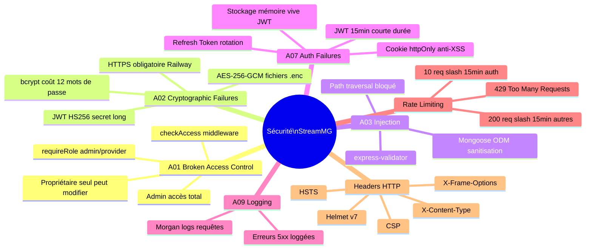

# 🔐 09 — Sécurité OWASP

> [!abstract] Alignement OWASP Top Ten 2023
> Couverture des principales vulnérabilités applicables au backend StreamMG.

---

## Couverture OWASP



---

## Configuration sécurité complète

```javascript
// app.js — Configuration sécurité

const express     = require('express');
const helmet      = require('helmet');
const cors        = require('cors');
const rateLimit   = require('express-rate-limit');

const app = express();

// ── 1. Headers de sécurité ────────────────────────────────────────────────
app.use(helmet({
  contentSecurityPolicy: {
    directives: {
      defaultSrc:  ["'self'"],
      scriptSrc:   ["'self'"],
      styleSrc:    ["'self'", "'unsafe-inline'"],
      imgSrc:      ["'self'", "data:", "https:"],
      connectSrc:  ["'self'"]
    }
  },
  hsts: {
    maxAge:            31536000, // 1 an
    includeSubDomains: true,
    preload:           true
  }
}));

// ── 2. CORS — 2 origines autorisées ──────────────────────────────────────
const allowedOrigins = process.env.ALLOWED_ORIGINS.split(',');
app.use(cors({
  origin: (origin, callback) => {
    if (!origin || allowedOrigins.includes(origin)) {
      callback(null, true);
    } else {
      callback(new Error('CORS non autorisé'));
    }
  },
  credentials: true,  // pour les cookies httpOnly
  methods:     ['GET', 'POST', 'PUT', 'DELETE'],
  allowedHeaders: ['Content-Type', 'Authorization']
}));

// ── 3. Rate limiting ──────────────────────────────────────────────────────
const authLimiter = rateLimit({
  windowMs: 15 * 60 * 1000, // 15 minutes
  max:      10,              // 10 tentatives de login/register
  message:  { message: 'Trop de tentatives. Réessayez dans 15 minutes.' },
  standardHeaders: true,
  legacyHeaders:   false
});

const generalLimiter = rateLimit({
  windowMs: 15 * 60 * 1000,
  max:      200,
  message:  { message: 'Rate limit dépassé.' }
});

app.use('/api/auth', authLimiter);
app.use('/api', generalLimiter);

// ── 4. Body parsing ───────────────────────────────────────────────────────
// IMPORTANT : webhook Stripe AVANT express.json()
app.use('/api/payment/webhook', express.raw({ type: 'application/json' }));
app.use(express.json({ limit: '10kb' }));
app.use(express.urlencoded({ extended: false, limit: '10kb' }));
```

---

## JWT — Bonnes pratiques

| Pratique | Implémentation |
|---|---|
| Algorithme | HS256 (symétrique, secret long 256+ bits) |
| Durée de vie | 15 minutes (short-lived) |
| Stockage frontend | Mémoire vive uniquement (zustand) — **jamais localStorage** |
| Refresh token | Cookie httpOnly (web) / SecureStore (mobile) |
| Rotation | Systématique à chaque renouvellement |
| Révocation | Document supprimé en base à chaque refresh/logout |
| TTL MongoDB | Index TTL sur `expiresAt` (suppression automatique des expirés) |

---

## Protection path traversal (segments HLS)

```javascript
// Dans la route des segments .ts
router.get('/:contentId/:segment', verifyHlsSegment, (req, res) => {
  const { contentId, segment } = req.params;

  // ⚠️ Validation stricte du nom de segment (anti path traversal)
  if (!segment.match(/^seg\d{3}\.ts$/)) {
    return res.status(400).json({ message: 'Segment invalide' });
  }
  // Interdit : "../../../etc/passwd.ts" ou "seg000.ts/../private/video.mp4"

  const filePath = path.join('uploads', 'hls', contentId, segment);
  // path.join normalise et empêche les '..' de remonter l'arborescence
  res.sendFile(path.resolve(filePath));
});
```

---

## Validation des entrées (express-validator)

```javascript
// Exemple : validation inscription
const { body, validationResult } = require('express-validator');

const registerValidation = [
  body('username')
    .trim()
    .isLength({ min: 3, max: 30 })
    .withMessage('Pseudo : 3 à 30 caractères')
    .matches(/^[a-zA-Z0-9_]+$/)
    .withMessage('Caractères alphanumériques et underscore uniquement'),

  body('email')
    .isEmail()
    .normalizeEmail()
    .withMessage('Email invalide'),

  body('password')
    .isLength({ min: 8 })
    .withMessage('Minimum 8 caractères')
    .matches(/\d/)
    .withMessage('Au moins un chiffre requis'),

  // Middleware de vérification
  (req, res, next) => {
    const errors = validationResult(req);
    if (!errors.isEmpty()) {
      return res.status(400).json({ errors: errors.array() });
    }
    next();
  }
];
```

> [!tip] Retour
> ← [[🏠 INDEX — StreamMG Backend]]
