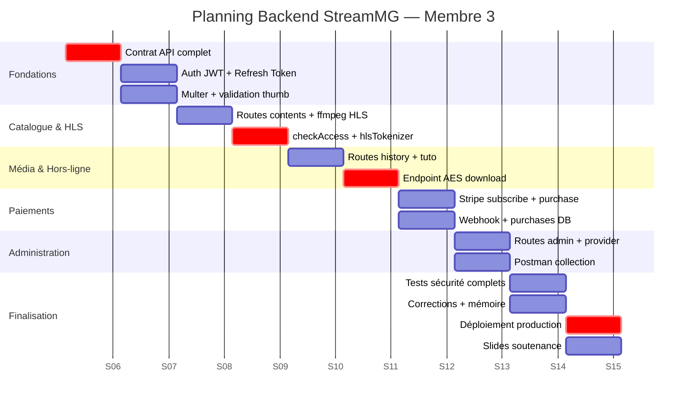
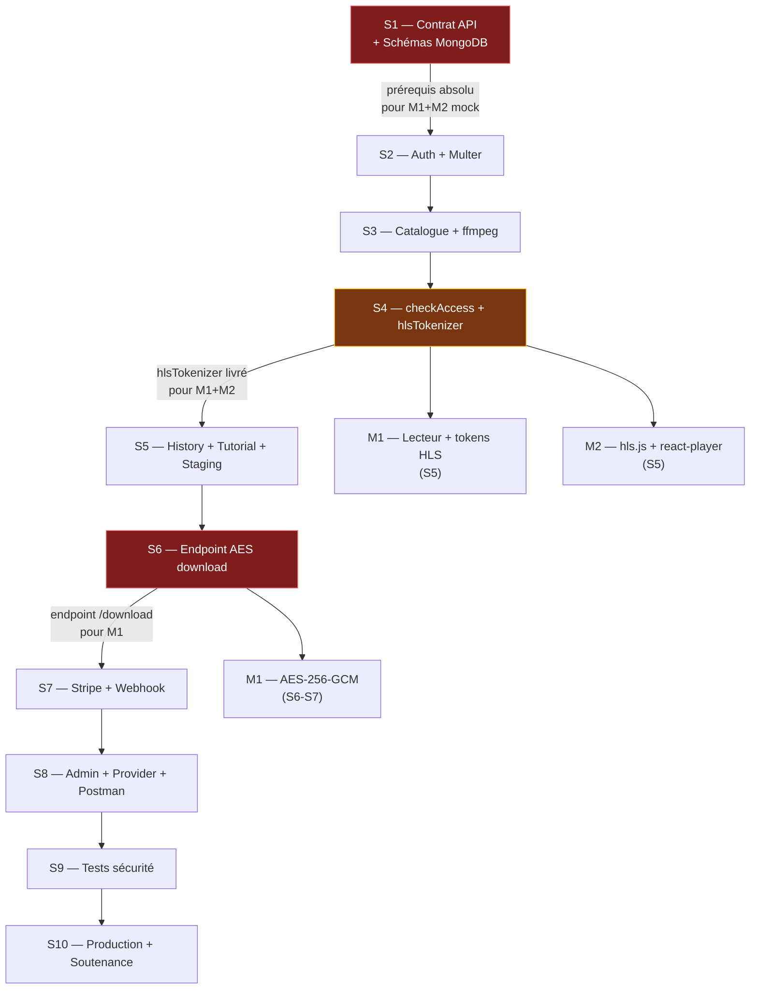

# 📅 10 — Plan 10 Semaines — Membre 3

> [!info] Rôle
> Membre 3 produit en **Semaine 1** le **contrat d'API complet** — prérequis absolu permettant aux Membres 1 et 2 de développer en parallèle avec des réponses mockées dès S2.

---

## Gantt — Vue d'ensemble



---

## Détail semaine par semaine

### Semaine 1 — Contrat d'API + Init ⭐ CRITIQUE

> [!danger] Livrable critique
> Le contrat d'API complet doit être livré en **fin de S1**. C'est le prérequis absolu pour que M1 et M2 puissent mocker les réponses et développer en parallèle.

**Tâches :**
- [ ] Initialiser le projet Express + structure de dossiers complète
- [ ] Configurer `.env` avec toutes les variables
- [ ] Écrire le contrat d'API complet (tous endpoints, formats requête/réponse, codes d'erreur)
- [ ] Définir les 8 schémas Mongoose (`thumbnail: required: true`)
- [ ] Documenter `hlsPath`, `aesKey`, champs AES dans les schémas
- [ ] Partager le contrat avec M1 et M2

```javascript
// Schémas à valider avec M1 et M2 en S1
// Content.thumbnail → obligatoire, impacte l'affichage catalogue
// Content.hlsPath   → format URL retourné par hlsController
// Purchase          → index unique {userId, contentId}
```

---

### Semaine 2 — Auth + Multer

**Tâches :**
- [ ] `POST /auth/register` — bcrypt coût 12, rôle "user"
- [ ] `POST /auth/login` — JWT + refresh token rotation
- [ ] `POST /auth/refresh` — rotation + TTL MongoDB
- [ ] `POST /auth/logout` — suppression doc refreshTokens
- [ ] Config Multer : `upload.fields([thumbnail, media])`
- [ ] Middleware `validateThumbnail` (400 si absent)
- [ ] Validation MIME : image/jpeg, image/png (≤ 5 Mo)
- [ ] Tests Postman : TF-AUTH-01 à 05

---

### Semaine 3 — Catalogue + Pipeline ffmpeg

**Tâches :**
- [ ] `GET /contents` — pagination, filtres, search full-text
- [ ] `GET /contents/:id` — détail avec `thumbnail` non null
- [ ] `POST /contents/:id/view` — incrémenter viewCount
- [ ] Pipeline ffmpeg : `transcodeToHls(inputPath, contentId)`
- [ ] Segments de 10s, manifest `index.m3u8` dans `/uploads/hls/<id>/`
- [ ] Source MP4 déplacée dans `/uploads/private/` (non routée)
- [ ] Extraction métadonnées audio : `music-metadata` (titre, artiste, coverArt)
- [ ] Tests : pipeline HLS complet avec ffprobe

---

### Semaine 4 — checkAccess + hlsTokenizer ⭐

> [!warning] Livrable critique S4
> `hlsTokenizer` est requis par M1 et M2 pour intégrer la lecture vidéo en S5.

**Tâches :**
- [ ] Middleware `checkAccess` — cas free, premium, paid (Premium ≠ couvre paid)
- [ ] `GET /hls/:id/token` — génération token HLS signé + fingerprint SHA-256
- [ ] Routes `/hls/:id/index.m3u8` et `/hls/:id/:seg.ts` avec `verifyHlsSegment`
- [ ] Tests : TF-ACC-01 à 07 (surtout TF-ACC-06 : Premium sur contenu payant)
- [ ] Tests : TF-HLS-01 à 06 (surtout TF-HLS-04 : fingerprint différent → 403)

---

### Semaine 5 — Historique + Tutoriels + Staging

**Tâches :**
- [ ] `POST /history/:contentId` — enregistrement progression
- [ ] `GET /history` — historique utilisateur
- [ ] `POST /tutorial/progress/:id` — mise à jour progression + calcul percentComplete
- [ ] `GET /tutorial/progress` — tutoriels en cours avec `thumbnail`
- [ ] `GET /contents/:id/lessons` — leçons d'un tutoriel (checkAccess requis)
- [ ] Déploiement staging sur Railway + Nginx + SSL Let's Encrypt
- [ ] Tests TF-TUT-01 à 04

---

### Semaine 6 — Endpoint AES Download ⭐ CRITIQUE

> [!danger] Livrable critique S6
> L'endpoint `/download` est requis par M1 pour implémenter le chiffrement AES mobile en S6-S7.

**Tâches :**
- [ ] `POST /download/:id` — `crypto.randomBytes(32)` clé AES + IV
- [ ] Signature HMAC-SHA256 de l'URL (expiry 15 min)
- [ ] Middleware `verifySignedUrl` pour route `/private/*`
- [ ] Protection : 2ème appel pour même contenu → 403
- [ ] Tests : TF-AES-01 — vérifier `aesKeyHex` = 64 chars, `ivHex` = 32 chars

---

### Semaine 7 — Stripe Subscribe + Purchase + Webhook

**Tâches :**
- [ ] `POST /payment/subscribe` — PaymentIntent avec `metadata.type:"subscription"`
- [ ] `POST /payment/purchase` — vérification doublon avant PaymentIntent
- [ ] `POST /payment/webhook` — `express.raw()` + `constructEvent()` + signature
- [ ] Handler webhook : `subscription` → MAJ user, `purchase` → Purchase.create()
- [ ] Idempotence : `E11000 duplicate key` silencieusement ignoré
- [ ] `GET /payment/purchases` — liste avec `thumbnail` du contenu
- [ ] `GET /payment/status` — statut premium + expiry
- [ ] Tests : TF-PUR-01 à 04 (surtout TF-PUR-03 : doublon → 409)

---

### Semaine 8 — Admin + Provider + Postman

**Tâches :**
- [ ] Routes provider CRUD : upload, list, update, delete (owner check)
- [ ] `PUT /provider/contents/:id/thumbnail` — remplacement vignette
- [ ] `PUT /provider/contents/:id/access` — modification niveau + prix (revalidation admin)
- [ ] `GET /admin/contents` — tous les contenus (publiés + non publiés)
- [ ] `PUT /admin/contents/:id` — validation + `isPublished: true`
- [ ] `GET /admin/stats` — stats + revenus simulés
- [ ] `GET /admin/users` + `PUT /admin/users/:id` — activation/désactivation
- [ ] Exporter la collection Postman complète (partagée avec M1 et M2)

---

### Semaine 9 — Tests de sécurité

**Tests à réaliser (Postman) :**

| Test | Objectif |
|---|---|
| TF-SEC-01 | Route protégée sans JWT → 401 |
| TF-SEC-02 | Route admin avec token user → 403 |
| TF-SEC-03 | 11 logins en 15min → 429 |
| TF-SEC-04 | Fournisseur modifie contenu d'un autre → 403 |
| TF-SEC-05 | Webhook signature invalide → 400 |
| TF-ACC-06 | Premium sur payant sans achat → 403 |
| TF-HLS-04 | Fingerprint différent → 403 (simule IDM) |
| TF-HLS-05 | Accès direct MP4 → 404/403 |
| TF-AES-01 | Clé 64 chars, IV 32 chars |

---

### Semaine 10 — Production + Soutenance

**Tâches :**
- [ ] Déploiement production Railway + Nginx
- [ ] Variables d'environnement production configurées
- [ ] MongoDB Atlas indexation vérifiée
- [ ] Rédaction mémoire (sections backend)
- [ ] Préparation slides soutenance
- [ ] Répétition démonstration Postman live

---

## Dépendances critiques



> [!tip] Retour
> ← [[🏠 INDEX — StreamMG Backend]]
