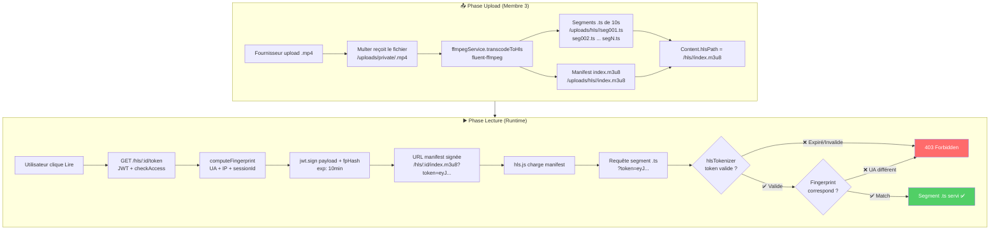
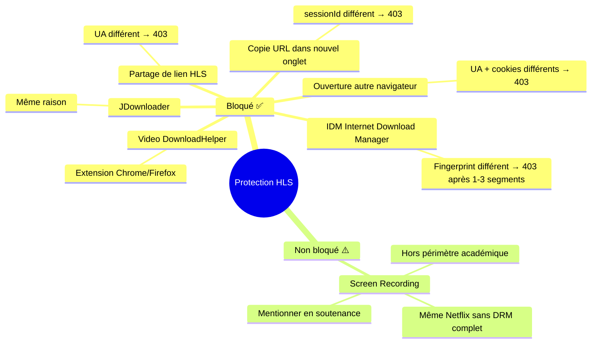

# 🎬 Pipeline HLS — Protection Vidéo Web

> [!abstract] Principe
> Les vidéos ne sont **jamais** servies en `.mp4` complet. Elles sont découpées en segments de **10 secondes** (`.ts`) via ffmpeg. Chaque segment nécessite un **token signé** + **vérification de fingerprint** de session.

---

## 🗺️ Vue d'ensemble du pipeline



---

## ⚙️ `ffmpegService.js` — Transcoding

```js
// services/ffmpegService.js
const ffmpeg = require('fluent-ffmpeg');
const path = require('path');
const fs = require('fs');

const transcodeToHls = (inputPath, contentId) => {
  return new Promise((resolve, reject) => {
    const outputDir = path.join(__dirname, `../uploads/hls/${contentId}`);
    fs.mkdirSync(outputDir, { recursive: true });

    const outputManifest = path.join(outputDir, 'index.m3u8');

    ffmpeg(inputPath)
      .outputOptions([
        '-codec: copy',           // Pas de re-encodage (rapide)
        '-start_number 0',
        '-hls_time 10',           // ← Segments de 10 secondes
        '-hls_list_size 0',       // Tous les segments dans le manifest
        '-f hls'
      ])
      .output(outputManifest)
      .on('end', () => {
        console.log(`✅ HLS transcoding done: ${contentId}`);
        resolve(`/hls/${contentId}/index.m3u8`);
      })
      .on('error', (err) => {
        console.error(`❌ ffmpeg error: ${err.message}`);
        reject(err);
      })
      .run();
  });
};

const getVideoDuration = (inputPath) => {
  return new Promise((resolve, reject) => {
    ffmpeg.ffprobe(inputPath, (err, metadata) => {
      if (err) return reject(err);
      resolve(Math.floor(metadata.format.duration));
    });
  });
};
```

---

## 🔑 `cryptoService.js` — Token HLS + Fingerprint

```js
// services/cryptoService.js
const crypto = require('crypto');
const jwt = require('jsonwebtoken');

// Calcule le fingerprint SHA-256 de la session
const computeFingerprint = (req) => {
  const components = [
    req.headers['user-agent'] || '',
    req.ip || '',
    req.cookies?.sessionId || ''
  ].join('|');
  return crypto.createHash('sha256').update(components).digest('hex');
};

// Génère le token HLS signé (10 min)
const generateHlsToken = (contentId, userId, fingerprint) => {
  return jwt.sign(
    { contentId, userId, fingerprint },
    process.env.HLS_TOKEN_SECRET,
    { expiresIn: parseInt(process.env.HLS_TOKEN_EXPIRY) }
  );
};

// Vérifie le token HLS + fingerprint
const verifyHlsToken = (token, req) => {
  const payload = jwt.verify(token, process.env.HLS_TOKEN_SECRET);
  const currentFingerprint = computeFingerprint(req);
  
  if (payload.fingerprint !== currentFingerprint) {
    const err = new Error('Fingerprint mismatch');
    err.status = 403;
    throw err;
  }
  return payload;
};
```

---

## 🎯 `hlsController.js` — Génération du token

```js
// GET /api/hls/:contentId/token
const getHlsToken = async (req, res) => {
  // checkAccess déjà passé → l'utilisateur a le droit
  const { contentId } = req.params;
  
  const fingerprint = computeFingerprint(req);
  const token = generateHlsToken(
    contentId,
    req.user?.id || 'anonymous',
    fingerprint
  );

  const hlsUrl = `/hls/${contentId}/index.m3u8?token=${token}`;
  
  res.json({ hlsUrl, expiresIn: 600 });
};
```

---

## 🔒 Middleware de vérification — Route segments

```js
// Route : GET /hls/:contentId/:segment  (fichiers .ts et .m3u8)
// middlewares/hlsTokenizer.js

const hlsTokenMiddleware = (req, res, next) => {
  const token = req.query.token;
  
  if (!token) {
    return res.status(403).json({ message: 'Token HLS requis' });
  }

  try {
    const payload = verifyHlsToken(token, req);
    
    // Vérifier que le contentId correspond
    if (payload.contentId !== req.params.contentId) {
      return res.status(403).json({ message: 'Token invalide pour ce contenu' });
    }
    
    req.hlsPayload = payload;
    next();
  } catch (err) {
    return res.status(403).json({
      message: err.message === 'Fingerprint mismatch'
        ? 'Session invalide — copie d\'URL non autorisée'
        : 'Token HLS invalide ou expiré'
    });
  }
};
```

---

## 🔄 Renouvellement automatique côté frontend (Membre 2)

```js
// Logique hls.js error handler (fournie par Membre 3 dans le contrat API)
hls.on(Hls.Events.ERROR, async (event, data) => {
  if (data.response?.code === 403) {
    // Token expiré → redemander
    const { hlsUrl } = await api.get(`/hls/${contentId}/token`);
    hls.loadSource(hlsUrl);
  }
});
```

---

## 🚫 Ce que la protection bloque



> [!note] Limite assumée et défendable
> Le **screen recording** reste possible. C'est le cas de **toutes** les plateformes sans DRM complet (Widevine, FairPlay). L'implémentation d'un DRM est hors périmètre d'un projet de Licence. Cette limite est mentionnée explicitement dans la soutenance.

---

## 📁 Structure des fichiers HLS générés

```
/uploads/
├── private/                          ← ❌ Jamais accessible publiquement
│   └── ny_fitiavana_src_a3b4c.mp4   ← Source brute déplacée ici
│
└── hls/
    └── 65f3a2b4c8e9d1234567890b/    ← contentId
        ├── index.m3u8               ← Manifest (token requis)
        ├── seg000.ts                ← Segment 0-10s (token + fp requis)
        ├── seg001.ts                ← Segment 10-20s
        ├── seg002.ts
        └── ...segN.ts
```

> [!danger] Route /uploads/private INTERDITE
> La route `/uploads/private/` ne doit **jamais** être servie par Express.
> ```js
> // À ne PAS faire :
> app.use('/uploads', express.static('uploads')); // DANGEREUX
> 
> // À faire :
> app.use('/uploads/thumbnails', express.static('uploads/thumbnails'));
> app.use('/uploads/audio', express.static('uploads/audio'));
> app.use('/uploads/hls', hlsTokenMiddleware, express.static('uploads/hls'));
> // /uploads/private → AUCUNE route !
> ```

---

## 🧪 Tests associés

| Test | Description | Résultat attendu |
|---|---|---|
| TF-HLS-01 | Token généré correctement | `{ hlsUrl, expiresIn: 600 }` |
| TF-HLS-02 | Segment .ts avec token valide | 200 + contenu binaire |
| TF-HLS-03 | Token expiré (>10 min) | 403 |
| TF-HLS-04 | Fingerprint différent (IDM simulé) | 403 |
| TF-HLS-05 | Accès direct .mp4 | 404 ou 403 |
| TF-HLS-06 | Manifest sans token | 403 |

---

*Voir aussi : [[🔒 Pipeline AES-256-GCM]] · [[🛡️ Middlewares]] · [[📡 Contrat API — Endpoints]]*
