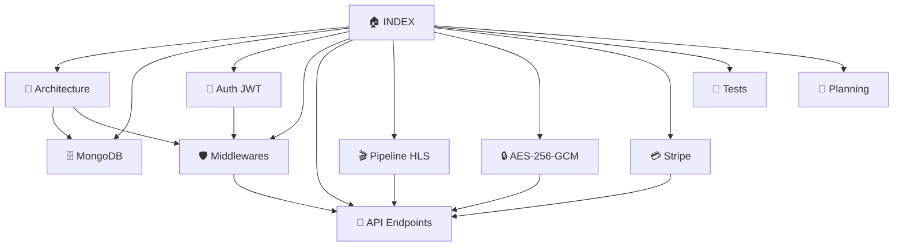

# 🏠 INDEX — Backend StreamMG
> **Membre 3 · Node.js / Express · MongoDB · Sécurité · Infrastructure**

---

## 🗂️ Navigation du vault

| Fichier | Contenu |
|---|---|
| [[📐 Architecture Générale]] | Vue d'ensemble, stack, structure fichiers |
| [[🗄️ Schémas MongoDB]] | 8 collections, schémas Mongoose complets |
| [[🔐 Authentification & JWT]] | JWT, Refresh Token, rotation, bcrypt |
| [[🛡️ Middlewares]] | checkAccess, hlsTokenizer, auth, validateThumbnail |
| [[📡 Contrat API — Endpoints]] | Tous les endpoints, requêtes/réponses |
| [[🎬 Pipeline HLS]] | ffmpeg, tokens signés, fingerprint, protection web |
| [[🔒 Pipeline AES-256-GCM]] | Chiffrement mobile, flux complet |
| [[💳 Paiements Stripe]] | Subscribe, purchase, webhook |
| [[🧪 Plan de Tests Backend]] | TF-AUTH, TF-THUMB, TF-ACC, TF-HLS, TF-AES, TF-PUR |
| [[📅 Planning 10 Semaines]] | Semaine par semaine, dépendances critiques |

---

## ⚡ Résumé rapide

> [!info] Stack Backend
> `Node.js v20` + `Express.js v4` + `MongoDB Atlas` (Mongoose v8)

> [!success] 5 Responsabilités Clés
> 1. **Auth JWT + Refresh Token** → bcryptjs + rotation systématique
> 2. **Protection HLS** → ffmpeg + tokens signés + fingerprint SHA-256
> 3. **Chiffrement mobile** → AES-256-GCM via crypto natif Node.js
> 4. **Middleware checkAccess** → free / premium / paid logic
> 5. **Paiements Stripe** → PaymentIntent + webhook + idempotence

> [!warning] Point Critique — À démontrer en soutenance
> Un utilisateur **Premium** face à un contenu **Payant** reçoit **le même écran d'achat** qu'un Standard. L'abonnement ne couvre **jamais** les contenus de type `paid`.

---

## 🧭 Diagramme de navigation

---

## 📊 Métriques du projet

| Métrique | Valeur |
|---|---|
| Collections MongoDB | **8** |
| Endpoints REST | **~35** |
| Middlewares personnalisés | **5** |
| Semaines de développement | **10** |
| Charge travail Membre 3 | **30 %** du projet |
| Niveau sécurité | OWASP Top Ten 2023 |
