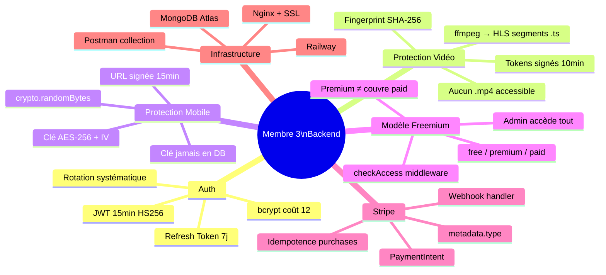

# 🏠 StreamMG Backend — Index Principal

> [!info] Contexte
> **Projet :** StreamMG — Plateforme de streaming audiovisuel et éducatif malagasy
> **Rôle :** Membre 3 — Développeur Backend + Coordination
> **Stack :** Node.js v20 · Express.js v4 · MongoDB v7 · Stripe SDK v14
> **Date :** Mars 2026

---

## 🗺️ Navigation

| Fichier | Contenu |
|---|---|
| [[01 - Architecture Générale]] | Vue d'ensemble, stack, structure de fichiers |
| [[02 - Schémas MongoDB]] | Les 8 collections avec schémas Mongoose complets |
| [[03 - Diagrammes UML]] | Classes, séquences, cas d'utilisation (Mermaid) |
| [[04 - Middlewares]] | checkAccess, hlsTokenizer, auth, Multer |
| [[05 - Contrat API]] | Tous les endpoints, requêtes et réponses |
| [[06 - Pipeline HLS]] | Transcoding ffmpeg + tokens signés + fingerprint |
| [[07 - Pipeline AES Mobile]] | Chiffrement AES-256-GCM pour téléchargements |
| [[08 - Stripe et Paiements]] | Subscribe, purchase, webhook |
| [[09 - Sécurité OWASP]] | JWT, rate-limit, Helmet, CORS |
| [[10 - Plan 10 Semaines]] | Planning détaillé semaine par semaine |

---

## ⚡ Responsabilités Membre 3

---

## 🎯 Points critiques à maîtriser pour la soutenance

> [!warning] Cas fondamental — Premium ≠ Payant
> Un utilisateur **Premium** qui tente d'accéder à un contenu **Payant** reçoit exactement le même écran de refus qu'un utilisateur standard. Le middleware `checkAccess` vérifie la collection `purchases`, jamais le rôle JWT pour les contenus `accessType: "paid"`.

> [!danger] Vignette obligatoire
> Tout contenu **DOIT** avoir une vignette. Triple validation : Multer backend (400 si absent), champ `required: true` Mongoose, et bouton désactivé côté frontend.

> [!success] Protection anti-téléchargement
> Jamais de fichier `.mp4` accessible directement. Les fichiers source sont dans `/uploads/private/` (non routé). Seuls les segments `.ts` HLS sont servis, avec token + fingerprint vérifié à chaque requête.
