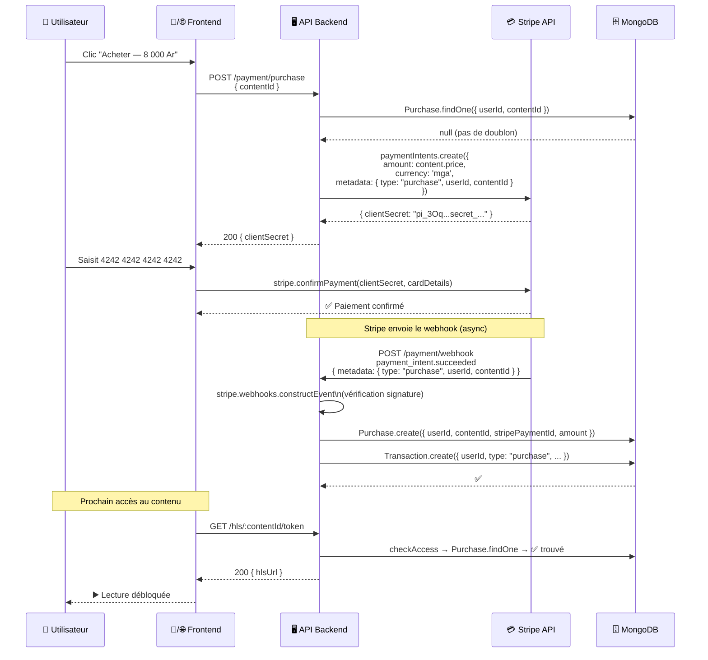
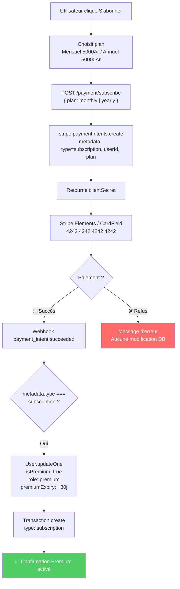

# 💳 Paiements Stripe

> [!abstract] Configuration
> **Stripe SDK v14** — Mode test uniquement. Aucune transaction réelle.
> Cartes test : `4242 4242 4242 4242` (succès) · `4000 0000 0000 9995` (refus)

---

## 🗺️ Flux d'achat unitaire (contenu payant)



---

## 🔄 Flux d'abonnement Premium



---

## 💻 Implémentation `paymentController.js`

```js
// POST /payment/purchase
const createPurchase = async (req, res) => {
  const { contentId } = req.body;
  const userId = req.user.id;

  // Idempotence : vérifier doublon
  const existing = await Purchase.findOne({ userId, contentId });
  if (existing) {
    return res.status(409).json({ message: 'Vous avez déjà acheté ce contenu' });
  }

  const content = await Content.findById(contentId).select('price title accessType');
  if (!content || content.accessType !== 'paid') {
    return res.status(400).json({ message: 'Contenu non achetable' });
  }

  // Créer le PaymentIntent avec metadata
  const paymentIntent = await stripe.paymentIntents.create({
    amount: content.price,
    currency: 'mga',
    metadata: {
      type:      'purchase',
      userId:    userId.toString(),
      contentId: contentId.toString()
    }
  });

  res.json({ clientSecret: paymentIntent.client_secret });
};
```

---

## 🪝 Webhook handler — Logique critique

```js
// POST /payment/webhook
// ⚠️ Route sans bodyParser JSON — utilise express.raw()
const handleWebhook = async (req, res) => {
  const sig = req.headers['stripe-signature'];

  let event;
  try {
    event = stripe.webhooks.constructEvent(
      req.body,
      sig,
      process.env.STRIPE_WEBHOOK_SECRET
    );
  } catch (err) {
    // Signature invalide → TF-SEC-05
    return res.status(400).json({ message: `Webhook error: ${err.message}` });
  }

  if (event.type === 'payment_intent.succeeded') {
    const { metadata, id: stripePaymentId, amount } = event.data.object;

    if (metadata.type === 'subscription') {
      // ── Activation Premium ──
      const premiumExpiry = new Date(Date.now() + 30 * 24 * 60 * 60 * 1000);
      await User.findByIdAndUpdate(metadata.userId, {
        isPremium: true,
        role: 'premium',
        premiumExpiry
      });
      await Transaction.create({
        userId: metadata.userId,
        type: 'subscription',
        stripePaymentId,
        amount,
        plan: metadata.plan,
        status: 'succeeded'
      });

    } else if (metadata.type === 'purchase') {
      // ── Achat unitaire ──
      // Index unique { userId, contentId } → idempotence webhook
      await Purchase.create({
        userId:          metadata.userId,
        contentId:       metadata.contentId,
        stripePaymentId,
        amount,
        purchasedAt:     new Date()
      });
      await Transaction.create({
        userId:    metadata.userId,
        type:      'purchase',
        stripePaymentId,
        amount,
        contentId: metadata.contentId,
        status:    'succeeded'
      });
    }
  }

  res.json({ received: true });
};
```

> [!warning] Configuration express.raw() pour le webhook
> ```js
> // app.js — AVANT express.json()
> app.use('/api/payment/webhook',
>   express.raw({ type: 'application/json' }),
>   paymentRouter
> );
> app.use(express.json()); // Pour les autres routes
> ```

---

## 📊 Distinctions metadata Stripe

| Champ | Abonnement | Achat unitaire |
|---|---|---|
| `metadata.type` | `"subscription"` | `"purchase"` |
| `metadata.userId` | ID utilisateur | ID utilisateur |
| `metadata.plan` | `"monthly"` \| `"yearly"` | `null` |
| `metadata.contentId` | `null` | ID du contenu |
| Action webhook | MAJ `users` (isPremium) | Crée `purchases` |

---

## 💳 Cartes de test Stripe

| Carte | Résultat | Usage |
|---|---|---|
| `4242 4242 4242 4242` | ✅ Succès | Démonstration normale |
| `4000 0000 0000 9995` | ❌ Refus | Test gestion d'erreur |
| Date expiration | N'importe quelle future | Ex: `12/28` |
| CVC | N'importe quel 3 chiffres | Ex: `123` |

---

## 🧪 Tests associés

| Test | Description | Résultat attendu |
|---|---|---|
| TF-PUR-01 | PaymentIntent créé | `{ clientSecret }` + metadata dans Stripe Dashboard |
| TF-PUR-02 | Achat réussi 4242 | Doc `purchases` créé, accès débloqué (200) |
| TF-PUR-03 | Double achat | 409 "Déjà acheté", aucun PaymentIntent Stripe |
| TF-PUR-04 | Carte refusée 9995 | Aucun doc `purchases`, 403 toujours |
| TF-SEC-05 | Webhook signature invalide | 400, aucune modification DB |

---

*Voir aussi : [[🛡️ Middlewares]] · [[🗄️ Schémas MongoDB]] · [[📡 Contrat API — Endpoints]]*
