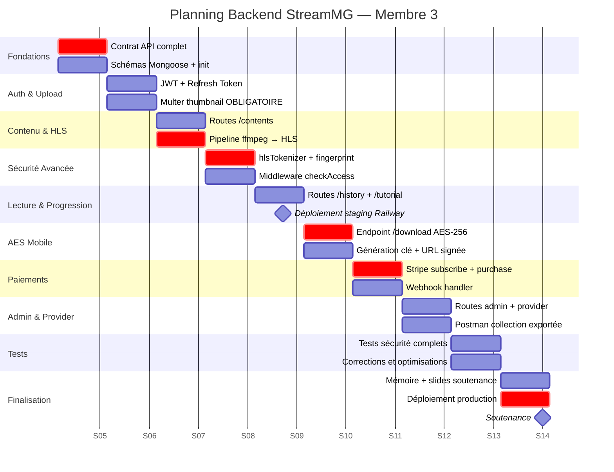
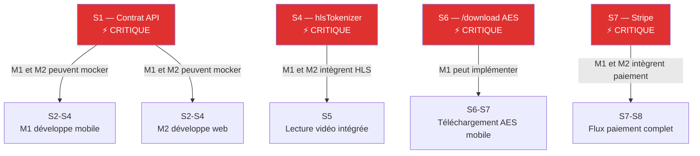

# 📅 Planning 10 Semaines — Membre 3

> [!abstract] Rôle
> **Backend + Coordination** — 30% du projet total
> Producteur du **contrat d'API en S1** : prérequis absolu pour M1 et M2.

---

## 📊 Diagramme de Gantt

---

## 📋 Détail semaine par semaine

### 🗓️ Semaine 1 — Contrat d'API + Fondations

> [!warning] Livrable critique — Prérequis M1 et M2
> Le contrat d'API **complet** doit être livré en fin de S1 pour que M1 et M2 puissent mocker les réponses dès S2.

**Tâches :**
- [ ] Contrat d'API complet (tous endpoints, formats requête/réponse, codes erreur)
- [ ] Schémas Mongoose pour les 8 collections (`thumbnail: required: true` dans Content)
- [ ] Init projet Express avec middleware globaux (Helmet, CORS, rate-limit)
- [ ] Connexion MongoDB Atlas
- [ ] Configuration des variables d'environnement
- [ ] Premier push GitHub + README

**Livrable :** fichier `contrat_api_v1.md` partagé avec M1 et M2

---

### 🗓️ Semaine 2 — Auth JWT + Multer

**Tâches :**
- [ ] `POST /auth/register` — bcrypt coût 12, génération JWT + refresh token
- [ ] `POST /auth/login` / `POST /auth/refresh` (rotation) / `POST /auth/logout`
- [ ] Multer config : `thumbnail` OBLIGATOIRE (JPEG/PNG ≤ 5Mo), `media` (vidéo/audio)
- [ ] Middleware `validateThumbnail.js`
- [ ] Tests Postman TF-AUTH-01 à 05

---

### 🗓️ Semaine 3 — Catalogue + Pipeline HLS

**Tâches :**
- [ ] `GET /contents` avec pagination, filtres, recherche full-text
- [ ] `POST /provider/contents` — upload avec vignette + transcoding
- [ ] `ffmpegService.transcodeToHls()` — MP4 → segments .ts de 10s
- [ ] `music-metadata` — extraction ID3 automatique (artiste, durée, coverArt)
- [ ] Routes /contents complètes (featured, trending, détail, vues)

---

### 🗓️ Semaine 4 — Sécurité HLS + checkAccess

> [!important] Livrable pour M1 et M2 — nécessaire pour S5

**Tâches :**
- [ ] `cryptoService.computeFingerprint()` — SHA-256(UA + IP + sessionId)
- [ ] `cryptoService.generateHlsToken()` — JWT HLS 10 min
- [ ] Middleware `hlsTokenizer.js` — vérification token + fingerprint sur chaque .ts
- [ ] Middleware `checkAccess.js` — logique free/premium/paid complète
- [ ] Tests TF-HLS-01 à 06 et TF-ACC-01 à 07 (dont **TF-ACC-06** ⭐)

---

### 🗓️ Semaine 5 — Historique, Tutoriels, Staging

**Tâches :**
- [ ] `POST /history/:contentId` et `GET /history`
- [ ] `POST /tutorial/progress/:contentId` — upsert + calcul percentComplete
- [ ] `GET /tutorial/progress` — tutoriels en cours
- [ ] Déploiement staging sur **Railway**
- [ ] Nginx + SSL Let's Encrypt
- [ ] Communication URL de staging à M1 et M2

---

### 🗓️ Semaine 6 — Endpoint AES-256-GCM

> [!important] Livrable pour M1 — nécessaire pour téléchargement mobile S6-S7

**Tâches :**
- [ ] `cryptoService.generateAesKey()` — `crypto.randomBytes(32)`
- [ ] `cryptoService.signDownloadUrl()` — HMAC-SHA256 avec expiration 15 min
- [ ] `POST /download/:contentId` — retourne `{ aesKeyHex, ivHex, signedUrl }`
- [ ] Middleware `validateSignedUrl.js` — vérification HMAC + expiration
- [ ] Test TF-AES-01 (Postman)

---

### 🗓️ Semaine 7 — Paiements Stripe

**Tâches :**
- [ ] Config Stripe SDK v14 + variables d'env
- [ ] `POST /payment/subscribe` — PaymentIntent abonnement
- [ ] `POST /payment/purchase` — PaymentIntent achat unitaire avec idempotence
- [ ] `POST /payment/webhook` — handler complet (subscription vs purchase)
- [ ] `GET /payment/purchases` et `GET /payment/status`
- [ ] Tests TF-PUR-01 à 04

---

### 🗓️ Semaine 8 — Admin + Provider + Postman

**Tâches :**
- [ ] Routes admin complètes (`/admin/contents`, `/admin/stats`, `/admin/users`)
- [ ] Routes provider complètes (CRUD contenus + remplacer thumbnail + leçons)
- [ ] **Export collection Postman** complet (partagée avec M1 et M2)
- [ ] Statistiques agrégées MongoDB (topPurchasedContents, revenueSimulated)

---

### 🗓️ Semaine 9 — Tests et corrections

**Tâches :**
- [ ] Tous les tests TF-SEC-01 à 06
- [ ] Re-jouer TF-AUTH, TF-THUMB, TF-ACC, TF-HLS, TF-PUR en intégration
- [ ] Vérifier tous les `thumbnail` non null dans les réponses API
- [ ] Tester avec M1 et M2 sur staging
- [ ] Corrections bugs

---

### 🗓️ Semaine 10 — Finalisation

**Tâches :**
- [ ] Rédaction sections backend du **mémoire**
- [ ] Préparation **slides soutenance** (diagrammes, démo API live)
- [ ] Déploiement **production** final
- [ ] Vérification démo complète (auth → catalogue → HLS → AES → Stripe)

---

## 🔗 Dépendances critiques

---

*Voir aussi : [[📐 Architecture Générale]] · [[📡 Contrat API — Endpoints]] · [[🧪 Plan de Tests Backend]]*
