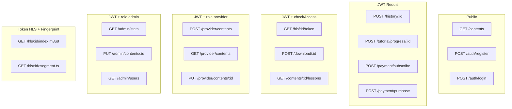

# 📡 Contrat API — Endpoints

> [!abstract] Base URL
> **Production** : `https://api.streamMG.railway.app/api`
> **Développement** : `http://localhost:3001/api`

---

## 🔑 Codes d'erreur standard

| Code | Signification | Exemple |
|---|---|---|
| `200` | Succès | Ressource retournée |
| `201` | Créé | Inscription, upload |
| `400` | Données invalides | Vignette absente, MIME incorrect |
| `401` | Non authentifié | Token absent / expiré |
| `403` | Accès refusé | Contenu protégé, token HLS invalide |
| `404` | Introuvable | Contenu inexistant |
| `409` | Conflit | Email dupliqué, achat doublon |
| `429` | Rate limit | Trop de requêtes |
| `500` | Erreur serveur | Erreur interne |

### Format 403 `checkAccess`
```json
{ "reason": "subscription_required" }
{ "reason": "purchase_required", "price": 800000 }
{ "reason": "login_required" }
```

---

## 🔐 Auth `/auth`

| Méthode | Route | Auth | Description |
|---|---|---|---|
| POST | `/auth/register` | Public | Inscription |
| POST | `/auth/login` | Public | Connexion |
| POST | `/auth/refresh` | Cookie/SecureStore | Renouvellement JWT |
| POST | `/auth/logout` | JWT | Déconnexion |

### POST `/auth/register`
```json
// Requête
{ "username": "Rabe", "email": "rabe@exemple.mg", "password": "MotDePasse1" }

// Réponse 201
{
  "token": "eyJhbGciOiJIUzI1NiIsInR5cCI6IkpXVCJ9...",
  "user": { "_id": "...", "username": "Rabe", "role": "user", "isPremium": false }
}

// Erreur 409
{ "message": "Email déjà utilisé" }
```

### POST `/auth/login`
```json
// Réponse 200 + Set-Cookie: refreshToken=... (httpOnly)
{
  "token": "eyJhbGci...",
  "user": { "_id": "...", "username": "Rabe", "role": "premium", "isPremium": true }
}
```

---

## 🎬 Catalogue `/contents`

| Méthode | Route | Auth | Description |
|---|---|---|---|
| GET | `/contents` | Public | Liste paginée avec filtres |
| GET | `/contents/featured` | Public | Contenus mis en avant |
| GET | `/contents/trending` | Public | Top 10 semaine |
| GET | `/contents/:id` | Public | Détail d'un contenu |
| POST | `/contents/:id/view` | Public | Incrémenter vues |
| GET | `/contents/:id/lessons` | JWT + checkAccess | Leçons tutoriel |

### GET `/contents` — Paramètres de filtrage
```
?page=1&limit=20
?type=video|audio
?category=film|salegy|hira_gasy|tsapiky|beko|documentaire|podcast|tutoriel
?accessType=free|premium|paid
?isTutorial=true|false
?search=salegy
```

### GET `/contents` — Réponse
```json
{
  "contents": [
    {
      "_id": "65f3a2b4c8e9d1234567890b",
      "title": "Mora Mora",
      "type": "audio",
      "category": "salegy",
      "thumbnail": "/uploads/thumbnails/mora_mora_e1f4a.jpg",
      "duration": 243,
      "accessType": "free",
      "price": null,
      "isTutorial": false,
      "artist": "Tarika Sammy",
      "viewCount": 1842
    }
  ],
  "total": 148,
  "page": 1,
  "pages": 8
}
```

> [!important] Règle thumbnail dans la réponse catalogue
> Le champ `thumbnail` est **toujours présent et non null** dans chaque objet. Aucun contenu sans vignette ne peut être publié.

---

## 🎥 Streaming HLS `/hls`

| Méthode | Route | Auth | Description |
|---|---|---|---|
| GET | `/hls/:id/token` | JWT + checkAccess | Token HLS signé + URL manifest |
| GET | `/hls/:id/index.m3u8` | Token HLS | Manifest |
| GET | `/hls/:id/:segment.ts` | Token HLS + fingerprint | Segment vidéo |

### GET `/hls/:id/token` — Réponse
```json
{
  "hlsUrl": "/hls/65f3a2b4.../index.m3u8?token=eyJhbGciOiJIUzI1NiJ9...",
  "expiresIn": 600
}
```

---

## 📥 Téléchargement mobile `/download`

| Méthode | Route | Auth | Description |
|---|---|---|---|
| POST | `/download/:id` | JWT + checkAccess | Clé AES-256 + IV + URL signée |

### POST `/download/:id` — Réponse
```json
{
  "aesKeyHex": "a3f9b2c1d4e5f6a7b8c9d0e1f2a3b4c5d6e7f8a9b0c1d2e3f4a5b6c7d8e9f0a1",
  "ivHex":     "b7c2d3e4f5a6b7c8d9e0f1a2b3c4d5e6",
  "signedUrl": "https://api.streamMG.railway.app/private/65f3a2b4...?expires=...&sig=...",
  "expiresIn": 900
}
```

---

## 📊 Historique `/history`

| Méthode | Route | Auth | Description |
|---|---|---|---|
| POST | `/history/:contentId` | JWT | Enregistrer progression |
| GET | `/history` | JWT | Historique utilisateur |

### POST `/history/:contentId`
```json
{ "progress": 145, "completed": false }
```

---

## 📚 Tutoriels `/tutorial`

| Méthode | Route | Auth | Description |
|---|---|---|---|
| POST | `/tutorial/progress/:contentId` | JWT | MAJ progression leçon |
| GET | `/tutorial/progress` | JWT | Tutoriels en cours |

### POST `/tutorial/progress/:contentId`
```json
// Requête
{ "lessonIndex": 0, "completed": true }

// Réponse 200
{
  "completedLessons": [0],
  "lastLessonIndex": 0,
  "percentComplete": 16.67
}
```

### GET `/tutorial/progress` — Réponse
```json
{
  "inProgress": [
    {
      "contentId": {
        "_id": "...",
        "title": "Apprendre le salegy",
        "thumbnail": "/uploads/thumbnails/tuto_salegy_cover_a3f9b.jpg"
      },
      "lastLessonIndex": 2,
      "percentComplete": 37.5,
      "lastUpdatedAt": "2026-02-20T20:15:00.000Z"
    }
  ]
}
```

---

## 💳 Paiements `/payment`

| Méthode | Route | Auth | Description |
|---|---|---|---|
| POST | `/payment/subscribe` | JWT | Abonnement Premium |
| POST | `/payment/purchase` | JWT | Achat unitaire |
| GET | `/payment/purchases` | JWT | Liste achats |
| GET | `/payment/status` | JWT | Statut Premium |
| POST | `/payment/webhook` | Stripe sig | Événements Stripe |

### POST `/payment/purchase`
```json
// Requête
{ "contentId": "65f3a2b4c8e9d1234567890d" }

// Réponse 200
{ "clientSecret": "pi_3Oq...secret_..." }

// Réponse 409 — doublon
{ "message": "Vous avez déjà acheté ce contenu" }
```

### GET `/payment/purchases` — Réponse
```json
{
  "purchases": [
    {
      "_id": "...",
      "contentId": {
        "_id": "...",
        "title": "Ny Fitiavana",
        "thumbnail": "/uploads/thumbnails/ny_fitiavana_cover_b7c2d.jpg",
        "type": "video"
      },
      "amount": 800000,
      "purchasedAt": "2026-02-15T16:22:10.000Z"
    }
  ]
}
```

---

## 🏪 Fournisseur `/provider`

| Méthode | Route | Auth | Description |
|---|---|---|---|
| POST | `/provider/contents` | JWT + provider | Upload multipart (thumbnail OBLIGATOIRE) |
| GET | `/provider/contents` | JWT + provider | Ses contenus |
| PUT | `/provider/contents/:id` | JWT + provider + owner | Modifier métadonnées |
| PUT | `/provider/contents/:id/thumbnail` | JWT + provider + owner | Remplacer vignette |
| PUT | `/provider/contents/:id/access` | JWT + provider + owner | Modifier accès/prix |
| PUT | `/provider/contents/:id/lessons` | JWT + provider + owner | Réorganiser leçons |
| DELETE | `/provider/contents/:id` | JWT + provider + owner | Supprimer |

### POST `/provider/contents` — Multipart fields
```
thumbnail : JPEG ou PNG, ≤ 5 Mo    ← ⚠️ OBLIGATOIRE
media     : MP4 ou MP3/AAC         ← OBLIGATOIRE
title, description, type, category, language, accessType, price
```

### Erreur 400 — Thumbnail absent
```json
{ "message": "La vignette est obligatoire." }
```

---

## 🔧 Administration `/admin`

| Méthode | Route | Auth | Description |
|---|---|---|---|
| GET | `/admin/contents` | JWT + admin | Tous les contenus |
| PUT | `/admin/contents/:id` | JWT + admin | Modification / publication |
| DELETE | `/admin/contents/:id` | JWT + admin | Suppression |
| GET | `/admin/stats` | JWT + admin | Statistiques |
| GET | `/admin/users` | JWT + admin | Liste utilisateurs |
| PUT | `/admin/users/:id` | JWT + admin | Activer/désactiver |

### GET `/admin/stats` — Réponse
```json
{
  "totalUsers": 284,
  "premiumUsers": 47,
  "totalContents": 312,
  "totalViews": 18420,
  "topPurchasedContents": [
    {
      "title": "Ny Fitiavana",
      "thumbnail": "/uploads/thumbnails/ny_fitiavana_cover_b7c2d.jpg",
      "totalSales": 12,
      "totalRevenue": 9600000
    }
  ],
  "recentPurchases30d": 38,
  "revenueSimulated30d": 28500000
}
```

---

## 🗺️ Diagramme des routes et middlewares



---

*Voir aussi : [[🛡️ Middlewares]] · [[🎬 Pipeline HLS]] · [[💳 Paiements Stripe]]*
