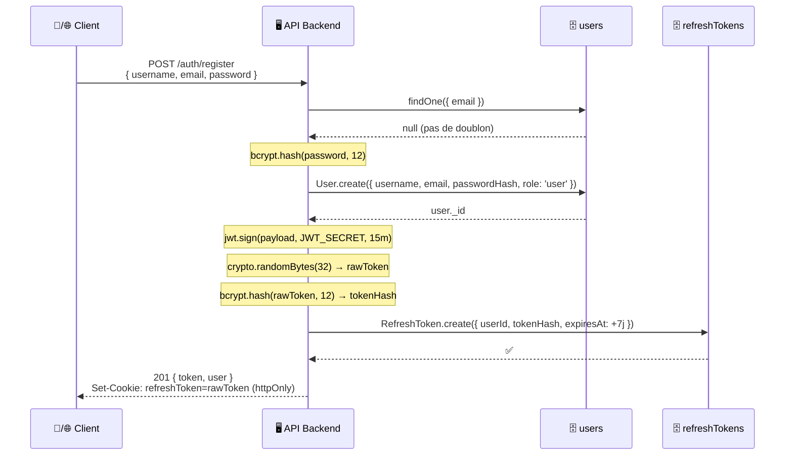
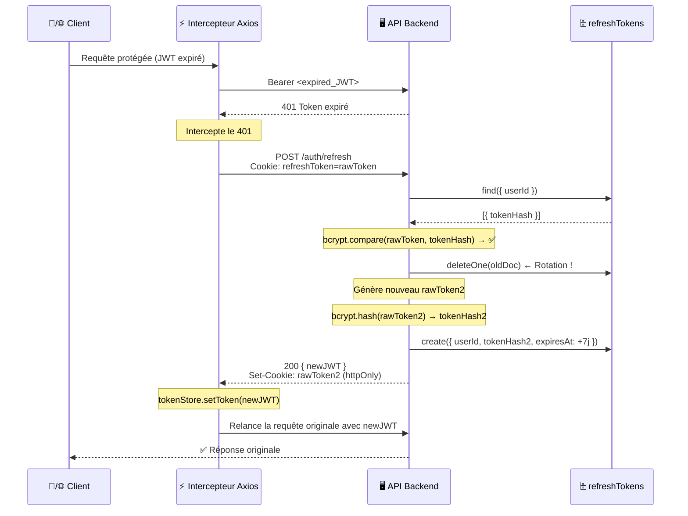

# 🔐 Authentification & JWT

> [!abstract] Mécanisme
> JWT **15 min** (access token) + Refresh Token **7 jours** (rotation systématique). Aligné OWASP Top Ten 2023.

---

## 🔄 Flux d'inscription



---

## 🔄 Flux de rotation du Refresh Token



---

## 💻 Implémentation backend

### `authController.js`

```js
// POST /auth/register
async register(req, res) {
  const { username, email, password } = req.body;

  // Vérif email unique
  const existing = await User.findOne({ email });
  if (existing) return res.status(409).json({ message: 'Email déjà utilisé' });

  // Hash mot de passe
  const passwordHash = await bcrypt.hash(password, 12);
  const user = await User.create({ username, email, passwordHash });

  // Génération JWT
  const token = jwt.sign(
    { id: user._id, role: user.role, isPremium: user.isPremium },
    process.env.JWT_SECRET,
    { expiresIn: '15m' }
  );

  // Génération Refresh Token
  const rawToken = crypto.randomBytes(32).toString('hex');
  const tokenHash = await bcrypt.hash(rawToken, 12);
  await RefreshToken.create({
    userId: user._id,
    tokenHash,
    expiresAt: new Date(Date.now() + 7 * 24 * 60 * 60 * 1000)
  });

  // Cookie httpOnly (web) — Mobile reçoit le rawToken dans le body
  res.cookie('refreshToken', rawToken, {
    httpOnly: true, secure: true, sameSite: 'strict',
    maxAge: 7 * 24 * 60 * 60 * 1000
  });

  res.status(201).json({ token, user: user.toSafeObject() });
}
```

```js
// POST /auth/refresh
async refresh(req, res) {
  const rawToken = req.cookies.refreshToken
    || req.body.refreshToken; // mobile via body

  if (!rawToken) return res.status(401).json({ message: 'Refresh token requis' });

  // Trouver tous les tokens de l'utilisateur et vérifier
  const tokenDocs = await RefreshToken.find({
    expiresAt: { $gt: new Date() }
  });

  let matchedDoc = null;
  for (const doc of tokenDocs) {
    const match = await bcrypt.compare(rawToken, doc.tokenHash);
    if (match) { matchedDoc = doc; break; }
  }

  if (!matchedDoc) return res.status(401).json({ message: 'Refresh token invalide' });

  // Rotation : supprimer l'ancien
  await RefreshToken.deleteOne({ _id: matchedDoc._id });

  // Générer nouveau JWT + nouveau refresh token
  const user = await User.findById(matchedDoc.userId);
  const newJWT = jwt.sign(
    { id: user._id, role: user.role, isPremium: user.isPremium },
    process.env.JWT_SECRET,
    { expiresIn: '15m' }
  );

  const newRawToken = crypto.randomBytes(32).toString('hex');
  const newTokenHash = await bcrypt.hash(newRawToken, 12);
  await RefreshToken.create({
    userId: user._id,
    tokenHash: newTokenHash,
    expiresAt: new Date(Date.now() + 7 * 24 * 60 * 60 * 1000)
  });

  res.cookie('refreshToken', newRawToken, { httpOnly: true, secure: true });
  res.json({ token: newJWT, refreshToken: newRawToken });
}
```

---

## ⚡ Intercepteur Axios — Frontend (Membres 1 & 2)

```js
// Identique sur mobile et web
axiosInstance.interceptors.response.use(
  response => response,
  async error => {
    if (error.response?.status === 401) {
      try {
        const { data } = await axiosInstance.post('/auth/refresh');
        tokenStore.setToken(data.token);
        // Mobile: SecureStore.setItem → data.refreshToken
        error.config.headers['Authorization'] = `Bearer ${data.token}`;
        return axiosInstance.request(error.config); // Relance
      } catch {
        tokenStore.logout();
        navigate('/login');
      }
    }

    if (error.response?.status === 403) {
      const { reason, price } = error.response.data;
      accessGateStore.show({ reason, price }); // Affiche l'écran intermédiaire
    }

    return Promise.reject(error);
  }
);
```

---

## 🔐 Payload JWT

```js
// Contenu du JWT décodé
{
  id:        "65f3a2b4c8e9d1234567890a",  // user._id
  role:      "user" | "premium" | "provider" | "admin",
  isPremium: true | false,
  iat:       1709123456,  // issued at
  exp:       1709124356   // +15 min
}
```

> [!warning] JWT stocké en mémoire uniquement
> - **Web** : zustand store (jamais localStorage — XSS)
> - **Mobile** : zustand store en RAM
> - **Refresh token** : `httpOnly cookie` (web) ou `expo-secure-store` (mobile)

---

## 🧪 Tests associés

| Test | Description | Résultat attendu |
|---|---|---|
| TF-AUTH-01 | Inscription valide | 201, passwordHash `$2b$` en DB |
| TF-AUTH-02 | Email dupliqué | 409 "Email déjà utilisé" |
| TF-AUTH-03 | Connexion valide | 200, JWT + cookie httpOnly |
| TF-AUTH-04 | Rotation refresh token | Nouveau token, ancien supprimé |
| TF-AUTH-05 | Déconnexion | 200, doc supprimé en DB |

---

*Voir aussi : [[🛡️ Middlewares]] · [[📡 Contrat API — Endpoints]] · [[🗄️ Schémas MongoDB]]*
