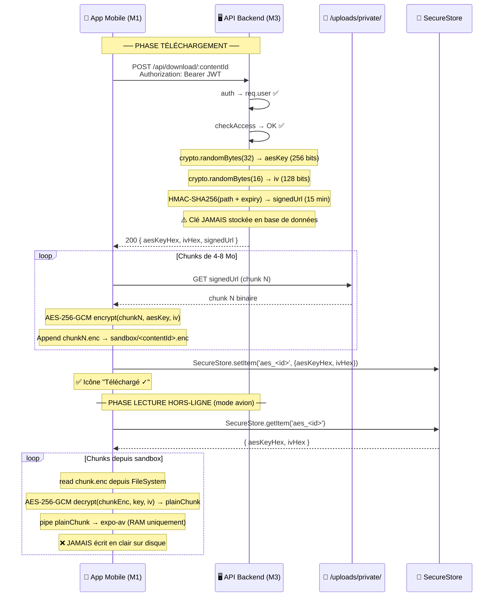
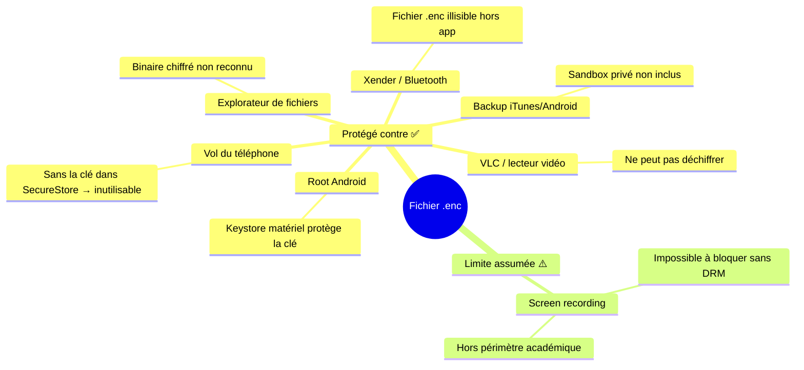

# 🔒 Pipeline AES-256-GCM — Chiffrement Mobile

> [!abstract] Principe
> Sur mobile, le téléchargement hors-ligne est autorisé **mais chiffré**. Aucun fichier vidéo en clair n'est jamais écrit sur le disque. Le fichier `.enc` est illisible hors de l'application, même avec accès physique au téléphone.

---

## 🗺️ Flux complet téléchargement + lecture



---

## ⚙️ `downloadController.js` — Génération clé AES

```js
// POST /api/download/:contentId
const requestDownload = async (req, res) => {
  // checkAccess déjà validé (free/premium/paid)
  const { contentId } = req.params;
  
  const content = await Content.findById(contentId)
    .select('audioPath hlsPath type title');
  
  if (!content) return res.status(404).json({ message: 'Contenu introuvable' });

  // Générer clé AES-256 et IV (crypto natif Node.js)
  const aesKey = crypto.randomBytes(32); // 256 bits
  const iv     = crypto.randomBytes(16); // 128 bits

  // Signer l'URL temporaire (15 min)
  const filePath = content.type === 'audio'
    ? content.audioPath
    : `uploads/private/${contentId}_src.mp4`;
  
  const expiry = Date.now() + parseInt(process.env.SIGNED_URL_EXPIRY) * 1000;
  const signature = crypto
    .createHmac('sha256', process.env.SIGNED_URL_SECRET)
    .update(`${filePath}|${expiry}`)
    .digest('hex');
  
  const signedUrl = `${process.env.BASE_URL}/private/${contentId}?expires=${expiry}&sig=${signature}`;

  // ⚠️ La clé n'est JAMAIS stockée en base de données
  res.json({
    aesKeyHex: aesKey.toString('hex'), // 64 chars hex
    ivHex:     iv.toString('hex'),      // 32 chars hex
    signedUrl,
    expiresIn: parseInt(process.env.SIGNED_URL_EXPIRY)
  });
};
```

---

## 🔍 Middleware URL signée — Validation

```js
// Route : GET /private/:contentId?expires=...&sig=...
const validateSignedUrl = (req, res, next) => {
  const { expires, sig } = req.query;
  const { contentId } = req.params;
  
  // Vérifier expiration
  if (Date.now() > parseInt(expires)) {
    return res.status(403).json({ message: 'URL expirée' });
  }

  // Recalculer la signature
  const filePath = `uploads/private/${contentId}_src.mp4`;
  const expectedSig = crypto
    .createHmac('sha256', process.env.SIGNED_URL_SECRET)
    .update(`${filePath}|${expires}`)
    .digest('hex');

  if (sig !== expectedSig) {
    return res.status(403).json({ message: 'Signature invalide' });
  }

  next();
};
```

---

## 📊 Paramètres cryptographiques

| Paramètre | Valeur | Description |
|---|---|---|
| Algorithme | AES-256-GCM | Chiffrement authentifié |
| Taille clé | 32 octets (256 bits) | `crypto.randomBytes(32)` |
| Taille IV | 16 octets (128 bits) | `crypto.randomBytes(16)` |
| Format stockage | `.enc` | Extension fichier chiffré |
| Localisation | `FileSystem.documentDirectory/offline/` | Sandbox privé app |
| Clé stockée | `expo-secure-store` | iOS Keychain / Android Keystore |
| Chunks download | 4–8 Mo | Supporte reprises réseau |
| URL signée | HMAC-SHA256 | Expiration 15 min |

---

## 🔐 Réponse format exact

```json
{
  "aesKeyHex": "a3f9b2c1d4e5f6a7b8c9d0e1f2a3b4c5d6e7f8a9b0c1d2e3f4a5b6c7d8e9f0a1",
  "ivHex":     "b7c2d3e4f5a6b7c8d9e0f1a2b3c4d5e6",
  "signedUrl": "https://api.streamMG.railway.app/private/65f3a2b...?expires=1709124000&sig=abc123",
  "expiresIn": 900
}
```

> [!info] Vérification des tailles
> - `aesKeyHex` : **64 caractères** hexadécimaux = 32 octets = AES-256
> - `ivHex` : **32 caractères** hexadécimaux = 16 octets

---

## 📱 Code frontend — Référence Membre 1

```js
// Fourni dans le contrat d'API par Membre 3
// À implémenter par Membre 1

const { aesKeyHex, ivHex, signedUrl } = await api.post(`/download/${contentId}`);

const key = Buffer.from(aesKeyHex, 'hex');
const iv  = Buffer.from(ivHex, 'hex');

// Chemin de destination (sandbox privé)
const encUri = `${FileSystem.documentDirectory}offline/${contentId}.enc`;

// Téléchargement par chunks + chiffrement AES-256-GCM
// ... via expo-file-system + react-native-quick-crypto

// Stockage sécurisé de la clé
await SecureStore.setItemAsync(
  `aes_${contentId}`,
  JSON.stringify({ aesKeyHex, ivHex })
);

// Enregistrement local de la référence
await AsyncStorage.setItem(
  `dl_${contentId}`,
  JSON.stringify({ encUri, thumbnail: content.thumbnail })
);
```

---

## 🧱 Résistance aux attaques



---

## 🧪 Tests associés

| Test | Description | Résultat attendu |
|---|---|---|
| TF-AES-01 | Endpoint retourne clé + IV + URL | `aesKeyHex` = 64 chars, `ivHex` = 32 chars |
| TF-AES-02 | Fichier .enc créé dans sandbox | Présent dans `documentDirectory/offline/` |
| TF-AES-03 | Fichier .enc illisible hors app | VLC/PC ne peut pas lire |
| TF-AES-04 | Clé dans SecureStore | `getItemAsync('aes_<id>')` retourne la clé |
| TF-AES-05 | Lecture hors-ligne mode avion | Lecture fluide depuis .enc |
| TF-AES-06 | Reprise sur coupure réseau | Reprend depuis dernier chunk |
| TF-SEC-06 | Clé non retransmise 2ème fois | 403 "Déjà téléchargé" |

---

*Voir aussi : [[🎬 Pipeline HLS]] · [[🛡️ Middlewares]] · [[📡 Contrat API — Endpoints]]*
