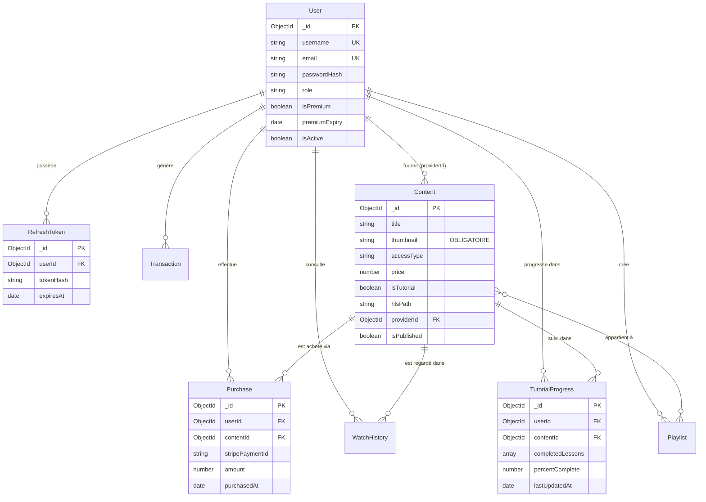

# 🗄️ Schémas MongoDB — 8 Collections

> [!abstract] Base de données
> **MongoDB Atlas** cluster M0 gratuit · Mongoose v8 ODM · 8 collections

---

## 🗺️ Diagramme Entité-Relation



---

## 👤 Collection `users`

```js
{
  _id:          ObjectId,
  username:     String,   // required, unique, minlength: 3
  email:        String,   // required, unique, lowercase
  passwordHash: String,   // bcrypt coût 12 — JAMAIS retourné au client
  role:         String,   // 'user' | 'premium' | 'provider' | 'admin'
  isPremium:    Boolean,  // false par défaut
  premiumExpiry:Date,     // null si non premium
  isActive:     Boolean,  // true par défaut
  createdAt:    Date,
  updatedAt:    Date
}
```

> [!tip] Index
> - `{ email: 1 }` → unique
> - `{ role: 1 }` → pour filtrer les admins / providers

---

## 🎬 Collection `contents`

```js
{
  _id:         ObjectId,
  title:       String,    // required
  description: String,
  type:        String,    // 'video' | 'audio'
  category:    String,    // 'film' | 'salegy' | 'hira_gasy' | 'tsapiky' | ...

  // ⚠️ CHAMP CRITIQUE
  thumbnail:   String,    // required: true — /uploads/thumbnails/<uuid>.jpg

  accessType:  String,    // 'free' | 'premium' | 'paid'
  price:       Number,    // en Ariary (null si gratuit/premium)
  isTutorial:  Boolean,

  // Fichiers média
  hlsPath:     String,    // /uploads/hls/<id>/index.m3u8
  audioPath:   String,    // /uploads/audio/<uuid>.mp3
  duration:    Number,    // secondes

  // Leçons (si isTutorial: true)
  lessons: [{
    index:       Number,  // required
    title:       String,  // required
    description: String,
    duration:    Number,
    thumbnail:   String,  // optionnel par leçon
    hlsPath:     String,
    audioPath:   String
  }],

  // Métadonnées audio (music-metadata)
  artist:   String,
  album:    String,
  coverArt: String,   // extrait de l'ID3 automatiquement

  // Gestion éditoriale
  providerId:  ObjectId,  // ref: 'User', required
  isPublished: Boolean,   // false → en attente validation admin
  viewCount:   Number,
  featured:    Boolean
}
```

> [!warning] Règle thumbnail
> `thumbnail: required: true` dans le schéma Mongoose. Multer rejette tout upload sans fichier image. Le bouton Soumettre côté frontend est désactivé sans image.

> [!tip] Index
> - `{ accessType: 1, isPublished: 1 }`
> - `{ category: 1, isPublished: 1 }`
> - `{ providerId: 1 }`
> - `{ title: 'text', description: 'text' }` → recherche full-text

---

## 🔑 Collection `refreshTokens`

```js
{
  _id:       ObjectId,
  userId:    ObjectId,   // ref: 'User'
  tokenHash: String,     // bcrypt hash — jamais le token brut
  expiresAt: Date,       // Date.now() + 7 jours
  createdAt: Date
}
```

> [!success] TTL Index — Suppression automatique
> ```js
> { expiresAt: 1 }, { expireAfterSeconds: 0 }
> ```
> MongoDB supprime automatiquement les tokens expirés → pas de cron nécessaire.

---

## 🛒 Collection `purchases`

```js
{
  _id:              ObjectId,
  userId:           ObjectId,   // ref: 'User'
  contentId:        ObjectId,   // ref: 'Content'
  stripePaymentId:  String,     // pi_3Oq...
  amount:           Number,     // en Ariary
  purchasedAt:      Date
}
```

> [!important] Index unique — Idempotence
> ```js
> { userId: 1, contentId: 1 }, { unique: true }
> ```
> Empêche tout double achat. POST /payment/purchase retourne **409** si doublon.

---

## 💰 Collection `transactions`

```js
{
  _id:             ObjectId,
  userId:          ObjectId,
  type:            String,    // 'subscription' | 'purchase'
  stripePaymentId: String,    // unique
  amount:          Number,
  plan:            String,    // 'monthly' | 'yearly' | null
  contentId:       ObjectId,  // null si subscription
  status:          String,    // 'succeeded' | 'failed'
  createdAt:       Date
}
```

---

## 📺 Collection `watchHistory`

```js
{
  _id:       ObjectId,
  userId:    ObjectId,
  contentId: ObjectId,
  watchedAt: Date,
  progress:  Number,    // secondes regardées
  completed: Boolean    // true si > 90% de la durée
}
```

> [!tip] Index
> - `{ userId: 1, watchedAt: -1 }` → tri chronologique
> - `{ userId: 1, contentId: 1 }` → mise à jour progression

---

## 📚 Collection `tutorialProgress`

```js
{
  _id:              ObjectId,
  userId:           ObjectId,
  contentId:        ObjectId,
  completedLessons: [Number],   // ex: [0, 1, 3] — indices terminés
  lastLessonIndex:  Number,
  percentComplete:  Number,     // calculé: completedLessons.length / totalLessons * 100
  lastUpdatedAt:    Date
}
```

> [!tip] Index unique
> `{ userId: 1, contentId: 1 }` → upsert sur progression

---

## 🎵 Collection `playlists`

```js
{
  _id:      ObjectId,
  userId:   ObjectId,
  name:     String,
  contents: [ObjectId],   // ref: 'Content'
  isPublic: Boolean
}
```

---

## 📊 Résumé des index critiques

| Collection | Index | Type | But |
|---|---|---|---|
| users | `{ email }` | Unique | Login rapide |
| contents | `{ accessType, isPublished }` | Compound | Filtrage catalogue |
| contents | `{ title, description }` | Text | Recherche full-text |
| refreshTokens | `{ expiresAt }` | TTL | Auto-purge expirés |
| purchases | `{ userId, contentId }` | Unique | Idempotence achat |
| transactions | `{ stripePaymentId }` | Unique | Anti-doublon webhook |
| tutorialProgress | `{ userId, contentId }` | Unique | Upsert progression |

---

*Voir aussi : [[🔐 Authentification & JWT]] · [[🛡️ Middlewares]] · [[📐 Architecture Générale]]*
