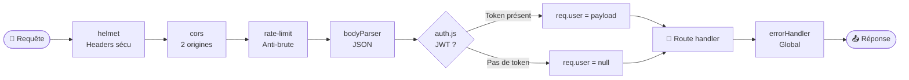
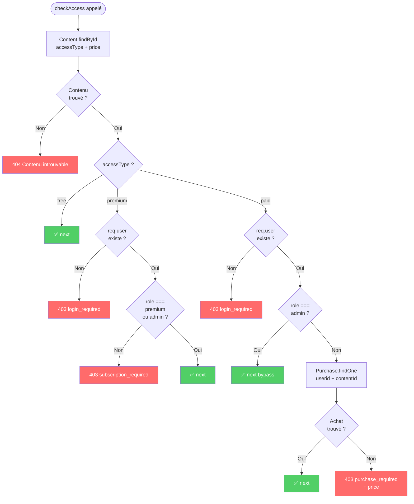
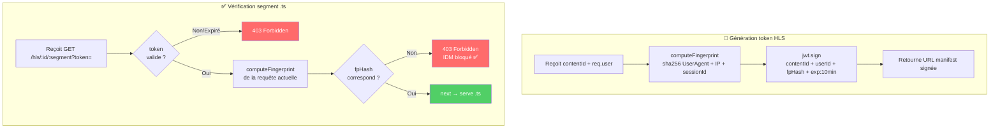

# 🛡️ Middlewares

> [!abstract] Rôle
> Les middlewares Express forment la **chaîne de sécurité** de chaque requête. Ils sont composables et appliqués sélectivement par route.

---

## ⛓️ Chaîne de middlewares globale



---

## 🛡️ `checkAccess.js` — Logique freemium centrale

> [!important] Middleware le plus critique du projet
> Appelé sur **toutes** les routes de lecture de contenu. Vérifie le niveau d'accès **indépendamment** du rôle JWT.



### Implémentation

```js
// middlewares/checkAccess.js
async function checkAccess(req, res, next) {
  const contentId = req.params.id || req.params.contentId;
  const content = await Content.findById(contentId).select('accessType price');
  
  if (!content) return res.status(404).json({ message: 'Contenu introuvable' });

  switch (content.accessType) {
    case 'free':
      return next();

    case 'premium':
      if (!req.user)
        return res.status(403).json({ reason: 'login_required' });
      if (!['premium', 'admin'].includes(req.user.role))
        return res.status(403).json({ reason: 'subscription_required' });
      return next();

    case 'paid':
      if (!req.user)
        return res.status(403).json({ reason: 'login_required' });
      if (req.user.role === 'admin') return next();
      
      const purchase = await Purchase.findOne({
        userId: req.user.id,
        contentId: content._id
      });
      if (!purchase)
        return res.status(403).json({
          reason: 'purchase_required',
          price: content.price
        });
      return next();

    default:
      return res.status(403).json({ reason: 'access_denied' });
  }
}
```

> [!warning] Cas critique Premium + Payant — TF-ACC-06
> Un utilisateur `role: "premium"` sur un contenu `accessType: "paid"` **sans achat** reçoit `403 { reason: "purchase_required" }`.
> L'abonnement Premium **ne couvre jamais** les contenus payants.

---

## 🎬 `hlsTokenizer.js` — Tokens HLS + Fingerprint



```js
// services/cryptoService.js
const computeFingerprint = (req) => {
  const data = req.headers['user-agent'] + req.ip + req.cookies.sessionId;
  return crypto.createHash('sha256').update(data).digest('hex');
};

const generateHlsToken = (contentId, userId, fingerprint) => {
  return jwt.sign(
    { contentId, userId, fingerprint },
    process.env.HLS_TOKEN_SECRET,
    { expiresIn: 600 } // 10 minutes
  );
};
```

---

## 🔑 `auth.js` — Décodage JWT

```js
// Deux variantes selon la route

// authOptional : route publique (catalogue, contenu gratuit)
const authOptional = (req, res, next) => {
  const header = req.headers.authorization;
  if (!header?.startsWith('Bearer ')) { req.user = null; return next(); }
  try {
    req.user = jwt.verify(header.split(' ')[1], process.env.JWT_SECRET);
  } catch { req.user = null; }
  next();
};

// authRequired : route protégée (download, history...)
const authRequired = (req, res, next) => {
  const header = req.headers.authorization;
  if (!header) return res.status(401).json({ message: 'Token requis' });
  try {
    req.user = jwt.verify(header.split(' ')[1], process.env.JWT_SECRET);
    next();
  } catch {
    res.status(401).json({ message: 'Token invalide ou expiré' });
  }
};
```

---

## 👤 `requireRole.js` — Contrôle de rôle

```js
// Usage : router.use(requireRole('admin'))
//         router.use(requireRole('provider'))
const requireRole = (...roles) => (req, res, next) => {
  if (!req.user)
    return res.status(401).json({ message: 'Non authentifié' });
  if (!roles.includes(req.user.role))
    return res.status(403).json({ message: 'Accès refusé' });
  next();
};
```

---

## 🖼️ `validateThumbnail.js` — Vignette obligatoire

```js
const validateThumbnail = (req, res, next) => {
  if (!req.files?.thumbnail || req.files.thumbnail.length === 0) {
    return res.status(400).json({ message: 'La vignette est obligatoire.' });
  }
  next();
};
```

> [!info] Triple validation thumbnail
> 1. **Frontend** : bouton "Soumettre" désactivé sans image (Membres 1 & 2)
> 2. **Multer** : `fileFilter` rejette MIME != image/jpeg|png, taille > 5Mo
> 3. **validateThumbnail** : vérifie `req.files.thumbnail` → 400 si absent
> 4. **Mongoose** : `thumbnail: required: true` → erreur DB si contourné

---

## 🌐 Sécurité globale

```js
// app.js — Configuration complète
app.use(helmet({
  contentSecurityPolicy: { directives: { defaultSrc: ["'self'"] } },
  hsts: { maxAge: 31536000 }
}));

app.use(cors({
  origin: process.env.ALLOWED_ORIGINS.split(','),
  credentials: true
}));

// Rate limiting
const authLimiter = rateLimit({ windowMs: 15*60*1000, max: 10 });
const apiLimiter  = rateLimit({ windowMs: 15*60*1000, max: 200 });

app.use('/api/auth', authLimiter);
app.use('/api', apiLimiter);
```

| Protection | Config | But |
|---|---|---|
| `helmet` | HSTS, CSP, X-Frame | Headers sécurité |
| `cors` | 2 origines autorisées | Anti-CSRF |
| `rateLimit` auth | 10 req / 15 min | Anti-brute force |
| `rateLimit` API | 200 req / 15 min | Anti-scraping |
| `express-validator` | Sur tous les inputs | Sanitisation |

---

*Voir aussi : [[🎬 Pipeline HLS]] · [[🔐 Authentification & JWT]] · [[📡 Contrat API — Endpoints]]*
