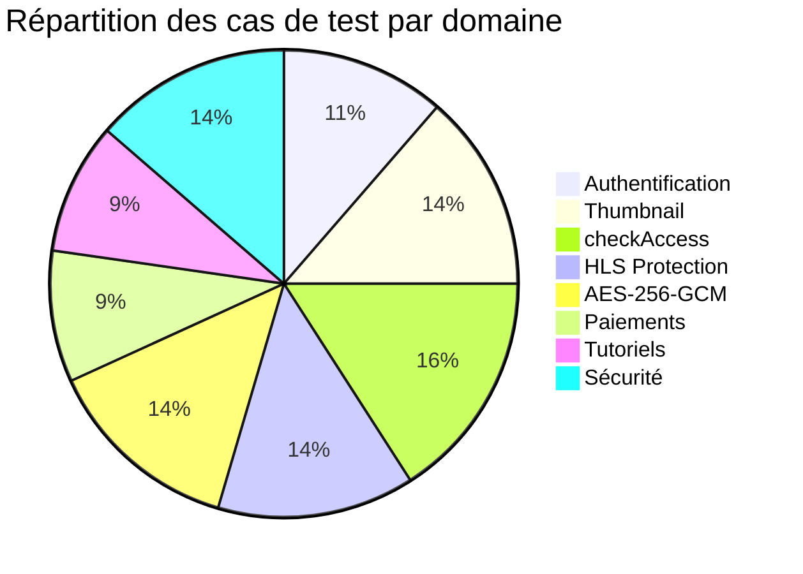
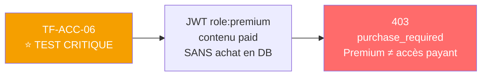
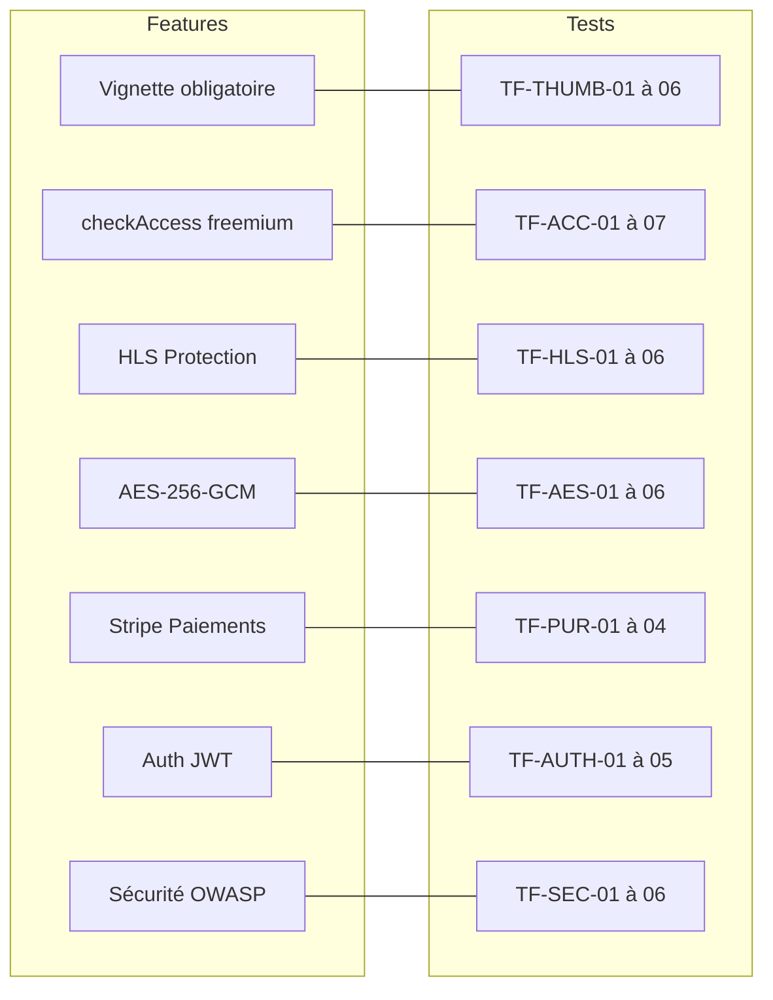

# 🧪 Plan de Tests Backend

> [!abstract] Outils
> **Postman** pour les tests API · Tests sur environnement **staging Railway** · Collection exportée fournie aux Membres 1 & 2

---

## 📊 Tableau de bord des tests

---

## 🔐 TF-AUTH — Authentification

| ID | Description | Méthode/Route | Résultat attendu | Statut |
|---|---|---|---|---|
| TF-AUTH-01 | Inscription valide | POST /auth/register | 201, `$2b$` en DB, role: "user" | ⬜ |
| TF-AUTH-02 | Email dupliqué | POST /auth/register | 409 "Email déjà utilisé" | ⬜ |
| TF-AUTH-03 | Connexion valide | POST /auth/login | 200, JWT + cookie httpOnly | ⬜ |
| TF-AUTH-04 | Rotation refresh token | POST /auth/refresh | Nouveau JWT, ancien supprimé | ⬜ |
| TF-AUTH-05 | Déconnexion | POST /auth/logout | 200, doc RefreshToken supprimé | ⬜ |

---

## 🖼️ TF-THUMB — Vignette obligatoire

> [!important] Ces tests valident la contrainte éditoriale centrale

| ID | Description | Résultat attendu | Statut |
|---|---|---|---|
| TF-THUMB-01 | Upload sans vignette | 400 "La vignette est obligatoire." | ⬜ |
| TF-THUMB-02 | Vignette invalide (PDF) | 400 "Type MIME non autorisé" | ⬜ |
| TF-THUMB-03 | Vignette > 5 Mo | 400 taille dépassée | ⬜ |
| TF-THUMB-04 | Vignette JPEG valide | 201, `thumbnail` renseigné en DB | ⬜ |
| TF-THUMB-05 | Vignette PNG valide | 201, `thumbnail` renseigné en DB | ⬜ |
| TF-THUMB-06 | Catalogue — thumbnail toujours présent | Chaque objet a `thumbnail` non null | ⬜ |

---

## 🛡️ TF-ACC — Middleware checkAccess

> [!warning] TF-ACC-06 est LE test critique à démontrer en soutenance

| ID | Description | JWT | Résultat attendu | Statut |
|---|---|---|---|---|
| TF-ACC-01 | Contenu `free` sans JWT | Aucun | 200, token HLS retourné | ⬜ |
| TF-ACC-02 | Contenu `premium` — user standard | role: "user" | 403 `subscription_required` | ⬜ |
| TF-ACC-03 | Contenu `premium` — user premium | role: "premium" | 200, token HLS | ⬜ |
| TF-ACC-04 | Contenu `paid` — standard sans achat | role: "user" | 403 `purchase_required` + price | ⬜ |
| TF-ACC-05 | Contenu `paid` — après achat | role: "user" + purchase en DB | 200, token HLS | ⬜ |
| **TF-ACC-06** | **Contenu `paid` — PREMIUM sans achat** | **role: "premium"** | **403 `purchase_required`** ⭐ | ⬜ |
| TF-ACC-07 | Contenu `paid` — admin | role: "admin" | 200 bypass | ⬜ |

---

## 🎬 TF-HLS — Protection HLS

| ID | Description | Méthode | Résultat attendu | Statut |
|---|---|---|---|---|
| TF-HLS-01 | Token HLS généré | GET /hls/:id/token | `{ hlsUrl, expiresIn: 600 }` | ⬜ |
| TF-HLS-02 | Segment valide | GET /hls/:id/seg001.ts?token= | 200 binaire .ts | ⬜ |
| TF-HLS-03 | Token expiré (>10 min) | GET segment avec vieux token | 403 | ⬜ |
| TF-HLS-04 | Fingerprint différent | GET segment, User-Agent modifié | 403 — IDM bloqué ✅ | ⬜ |
| TF-HLS-05 | Accès direct .mp4 | GET /uploads/private/... | 404 ou 403 | ⬜ |
| TF-HLS-06 | Manifest sans token | GET /hls/:id/index.m3u8 | 403 | ⬜ |

> [!tip] Comment simuler TF-HLS-04 dans Postman
> 1. Obtenir un token HLS valide
> 2. Copier l'URL du segment
> 3. Dans Postman, modifier le header `User-Agent`
> 4. Envoyer la requête → 403 attendu

---

## 🔒 TF-AES — Chiffrement mobile

| ID | Description | Responsable | Résultat attendu | Statut |
|---|---|---|---|---|
| TF-AES-01 | Endpoint retourne clé + IV + URL | M3 (Postman) | `aesKeyHex` = 64 chars, `ivHex` = 32 chars | ⬜ |
| TF-AES-02 | Fichier .enc créé dans sandbox | M1 (mobile) | Présent dans `offline/<id>.enc` | ⬜ |
| TF-AES-03 | Fichier .enc illisible hors app | M1 (PC) | VLC ne peut pas lire | ⬜ |
| TF-AES-04 | Clé dans SecureStore | M1 (mobile) | `getItemAsync('aes_<id>')` retourne clé | ⬜ |
| TF-AES-05 | Lecture mode avion | M1 (mobile) | Lecture fluide sans réseau | ⬜ |
| TF-AES-06 | Reprise sur coupure réseau | M1 (mobile) | Reprend depuis dernier chunk | ⬜ |

---

## 💳 TF-PUR — Paiements

| ID | Description | Carte test | Résultat attendu | Statut |
|---|---|---|---|---|
| TF-PUR-01 | PaymentIntent créé | — | `{ clientSecret }` + metadata Stripe | ⬜ |
| TF-PUR-02 | Achat réussi | 4242 4242 4242 4242 | Doc `purchases` créé, accès 200 | ⬜ |
| TF-PUR-03 | Double achat | — | 409, aucun PaymentIntent créé | ⬜ |
| TF-PUR-04 | Carte refusée | 4000 0000 0000 9995 | Aucun doc `purchases`, 403 toujours | ⬜ |

---

## 📚 TF-TUT — Tutoriels

| ID | Description | Résultat attendu | Statut |
|---|---|---|---|
| TF-TUT-01 | Enregistrement leçon 0 | `completedLessons: [0]`, percentComplete calculé | ⬜ |
| TF-TUT-02 | Avancement leçon 1 | `completedLessons: [0, 1]` | ⬜ |
| TF-TUT-03 | Tutoriel terminé (dernière leçon) | `percentComplete: 100` | ⬜ |
| TF-TUT-04 | Tutoriels en cours | Tableau trié par `lastUpdatedAt` desc, `thumbnail` présent | ⬜ |

---

## 🔒 TF-SEC — Sécurité

| ID | Description | Résultat attendu | Statut |
|---|---|---|---|
| TF-SEC-01 | Route protégée sans JWT | 401 | ⬜ |
| TF-SEC-02 | Route admin avec JWT user | 403 | ⬜ |
| TF-SEC-03 | Rate limit (11 tentatives login) | 11ème → 429 Too Many Requests | ⬜ |
| TF-SEC-04 | Fournisseur modifie contenu d'un autre | 403 | ⬜ |
| TF-SEC-05 | Webhook signature invalide | 400, aucune modification DB | ⬜ |
| TF-SEC-06 | Clé AES re-demandée (déjà téléchargé) | 403 "Déjà téléchargé" | ⬜ |

---

## 🗺️ Matrice de traçabilité

---

*Voir aussi : [[🛡️ Middlewares]] · [[🎬 Pipeline HLS]] · [[🔒 Pipeline AES-256-GCM]] · [[💳 Paiements Stripe]]*
