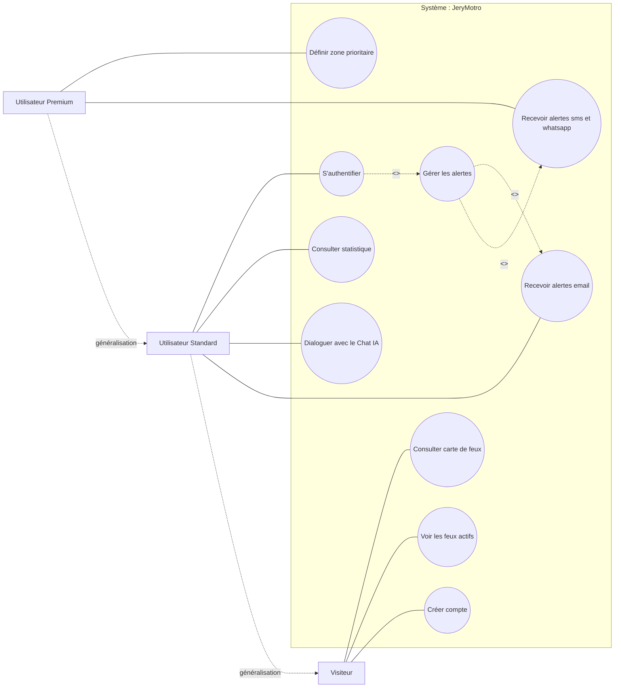

# Diagramme de cas d'utilisation — JeryMotro

> Note : le fichier source est un **diagramme de cas d'utilisation** UML (généré avec Visual Paradigm Community Edition), et non un diagramme d'activité.

## Système

**JeryMotro**

## Acteurs

- **Visiteur**
- **Utilisateur Standard**
- **Utilisateur Premium**

## Généralisation entre acteurs

Les flèches à triangle creux indiquent une relation d'héritage entre acteurs :

- `Utilisateur Standard` **--|>** `Visiteur` _(hérite de)_
- `Utilisateur Premium` **--|>** `Utilisateur Standard` _(hérite de)_

Autrement dit : un Utilisateur Standard peut tout faire ce que peut un Visiteur, et un Utilisateur Premium peut tout faire ce que peut un Utilisateur Standard.

## Cas d'utilisation par acteur

### Visiteur

- Consulter carte de feux
- Voir les feux actifs
- Créer compte

### Utilisateur Standard (+ hérite des cas du Visiteur)

- S'authentifier
- Consulter statistique
- Dialoguer avec le Chat IA
- Recevoir alertes email

### Utilisateur Premium (+ hérite des cas de l'Utilisateur Standard)

- Définir zone prioritaire
- Recevoir alertes sms et whatsapp

## Relations entre cas d'utilisation

|Cas de base|Relation|Cas lié|Détail|
|---|---|---|---|
|S'authentifier|`<<Include>>`|Gérer les alertes|S'authentifier inclut systématiquement Gérer les alertes|
|Gérer les alertes|`<<Extend>>`|Recevoir alertes email|Point d'extension : _Gérer les alertes_|
|Gérer les alertes|`<<Extend>>`|Recevoir alertes sms et whatsapp|Point d'extension : _Gérer les alertes_|

## Représentation schématique (Mermaid)

## Notes

- Les associations "Utilisateur Standard → Recevoir alertes email" et "Utilisateur Premium → Recevoir alertes sms et whatsapp" sont déduites du tracé des lignes coudées reliant les acteurs à ces ellipses ; à vérifier contre le diagramme d'origine si une correction est nécessaire.
- "Utilisateur Stadard" dans le fichier source semble être une coquille pour "Utilisateur Standard".