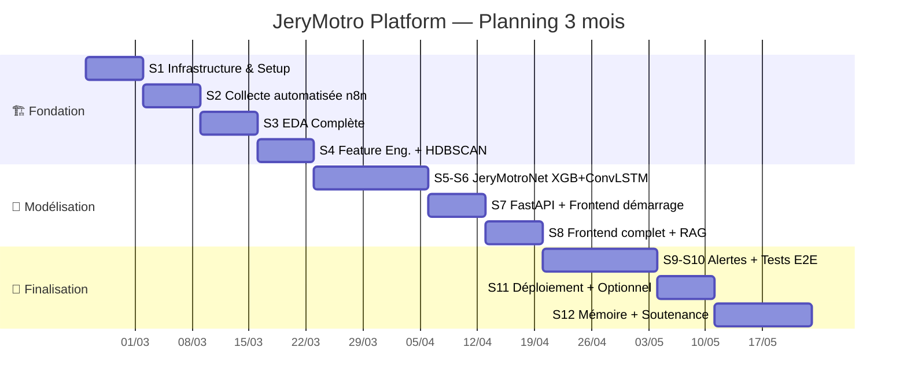
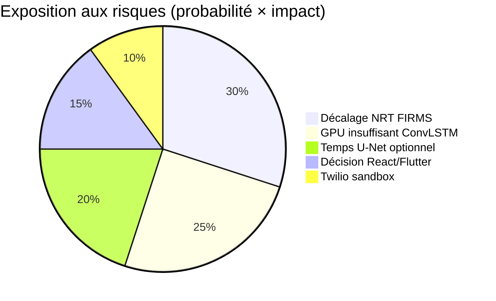
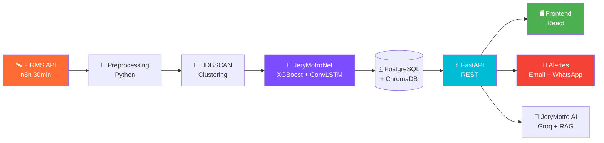

# 🔥 JeryMotro Platform — Dashboard Principal
#JeryMotro #MemoireL3 #Avancement #Milestone
[[Glossaire_Tags]] | [[00_INDEX]]

> **Plateforme intelligente de détection et d'alerte des feux de brousse à Madagascar**
> Mémoire L3 Génie Logiciel | 23/02/2026 → 23/05/2026

---

## 📊 PROGRESSION GLOBALE

| Phase | Semaines | Progression | Statut |
|-------|----------|-------------|--------|
| 🏗️ Fondation | S1–S4 | <progress value="0" max="4"></progress> `0/4 sem` | ⬜ À démarrer |
| 🔬 Modélisation | S5–S8 | <progress value="0" max="4"></progress> `0/4 sem` | ⬜ À venir |
| 🎯 Finalisation | S9–S12 | <progress value="0" max="4"></progress> `0/4 sem` | ⬜ À venir |

**Semaine courante :** `S__ / S12`
**Semaines restantes :** `__ semaines`
**Dernière mise à jour :** `__/__/2026`

---

## 🗓️ GANTT — PLANNING S1→S12

---

## ✅ STATUT PAR COMPOSANT

| Composant | Priorité | Progression | Statut |
|-----------|----------|-------------|--------|
| 🐳 Docker Infrastructure | Must | <progress value="0" max="10"></progress> | ⬜ |
| ⚡ FastAPI Backend | Must | <progress value="0" max="10"></progress> | ⬜ |
| 🤖 JeryMotroNet XGBoost | Must | <progress value="0" max="10"></progress> | ⬜ |
| 🧠 JeryMotroNet ConvLSTM | Must | <progress value="0" max="10"></progress> | ⬜ |
| 🔵 HDBSCAN Clustering | Must | <progress value="0" max="10"></progress> | ⬜ |
| ⚙️ Feature Engineering | Must | <progress value="0" max="10"></progress> | ⬜ |
| 🖥️ Frontend React | Must | <progress value="0" max="10"></progress> | ⬜ |
| ⚙️ n8n Automatisation | Must | <progress value="0" max="10"></progress> | ⬜ |
| 🧠 RAG ChromaDB + Groq | Must | <progress value="0" max="10"></progress> | ⬜ |
| 🔔 Système Alertes | Must | <progress value="0" max="10"></progress> | ⬜ |
| 🧪 Tests E2E | Must | <progress value="0" max="10"></progress> | ⬜ |
| 📄 Mémoire L3 | Must | <progress value="0" max="10"></progress> | ⬜ |

> [!tip] Mettre à jour la valeur `value` (0→10) de chaque barre chaque semaine

---

## 🏆 MÉTRIQUES CIBLES (Must Hit pour la soutenance)

| # | Métrique | Cible | Actuel | Statut |
|---|----------|-------|--------|--------|
| M1 | Recall petits feux XGBoost vs NASA | **+25%** | — | ⬜ |
| M2 | AUC-ROC XGBoost | **≥ 0.88** | — | ⬜ |
| M3 | F1-Score XGBoost | **≥ 0.80** | — | ⬜ |
| M4 | MAE ConvLSTM carte J+1 | **< 0.15** | — | ⬜ |
| M5 | Latence pipeline complet | **< 5 min** | — | ⬜ |
| M6 | Latence alerte post-FIRMS | **< 30 min** | — | ⬜ |
| M7 | Silhouette HDBSCAN | **> 0.50** | — | ⬜ |
| M8 | Coverage tests FastAPI | **≥ 60%** | — | ⬜ |
| M9 | Latence endpoint FastAPI | **< 200ms** | — | ⬜ |

> [!info] Mettre à jour la colonne **Actuel** après chaque mesure (S6, S9, S10)

---

## 📦 LIVRABLES FINAUX — 23/05/2026

- [x] **L1** — Cahier des Charges final (Markdown Obsidian) ✅ 2026-03-11
- [ ] **L2** — Repo GitHub `jery-motro-platform` complet + README
- [ ] **L3** — `docker-compose up` fonctionnel (démontrable live)
- [ ] **L4** — FastAPI déployée + Swagger UI (URL publique Railway/Render)
- [ ] **L5** — Frontend déployé sur Vercel (URL publique)
- [ ] **L6** — Modèle JeryMotroNet + rapport métriques PDF
- [ ] **L7** — Vidéo démo 3 minutes (MP4)
- [ ] **L8** — Mémoire L3 complet (PDF)
- [ ] **L9** — Présentation soutenance (PowerPoint)

<progress value="0" max="9"></progress> **`0 / 9 livrables complétés`**

---

## 🔑 CLÉS API — Statut d'obtention

| Service | Où obtenir | Statut |
|---------|-----------|--------|
| NASA FIRMS MAP_KEY | `firms.modaps.eosdis.nasa.gov` | ⬜ À obtenir (S1) |
| NASA Earthdata Token | `earthdata.nasa.gov` | ⬜ Disponible (vérifier) |
| Groq API `gsk_...` | `console.groq.com` | ✅ Fournie |
| Google Earth Engine | Compte académique gratuit | ⬜ À créer (S4) |
| Twilio Sandbox | `twilio.com` | ⬜ À créer (S9) |

---

## ⚠️ RISQUES ACTIFS

| Risque | Prob. | Impact | Mitigation | Statut |
|--------|-------|--------|------------|--------|
| Décalage NRT 0.5–6h | 🔴 Haute | Moyen | Prédiction ML 48h + collecte 30min | ⬜ Surveiller |
| GPU insuffisant ConvLSTM | 🟠 Moy. | Élevé | Google Colab T4 gratuit | ⬜ Préparer |
| Temps U-Net insuffisant | 🔴 Haute | Faible | Classé Optionnel — ne bloque pas | ✅ Géré |
| n8n cloud limite gratuite | 🟢 Faible | Faible | n8n self-hosted via Docker | ✅ Géré |
| Twilio sandbox expiration | 🟢 Faible | Faible | Email prioritaire absolue | ✅ Géré |

---

## 🧭 PIPELINE — Vue Rapide

---

## 🔗 NAVIGATION RAPIDE

| Document | Description |
|----------|-------------|
| [[01_Cahier_des_Charges]] | 📋 Référence absolue du projet |
| [[02_Architecture_Globale]] | 🏗️ Pipeline + Docker + FastAPI |
| [[03_Plan_Travail_3_Mois]] | 📅 Planning S1→S12 avec tâches cochables |
| [[04_JeryMotroNet]] | 🤖 Modèle ML/DL original |
| [[SUIVI_HEBDOMADAIRE]] | 📊 Suivi hebdomadaire KPIs |
| [[METRIQUES_CIBLES]] | 🎯 Tableau de bord métriques |

---

> [!warning] Règle obligatoire
> Ce dashboard doit être mis à jour **chaque lundi matin** avant de commencer à coder.
> 10 minutes max. C'est votre boussole pour la soutenance.

*Dernière mise à jour : 23/02/2026*
