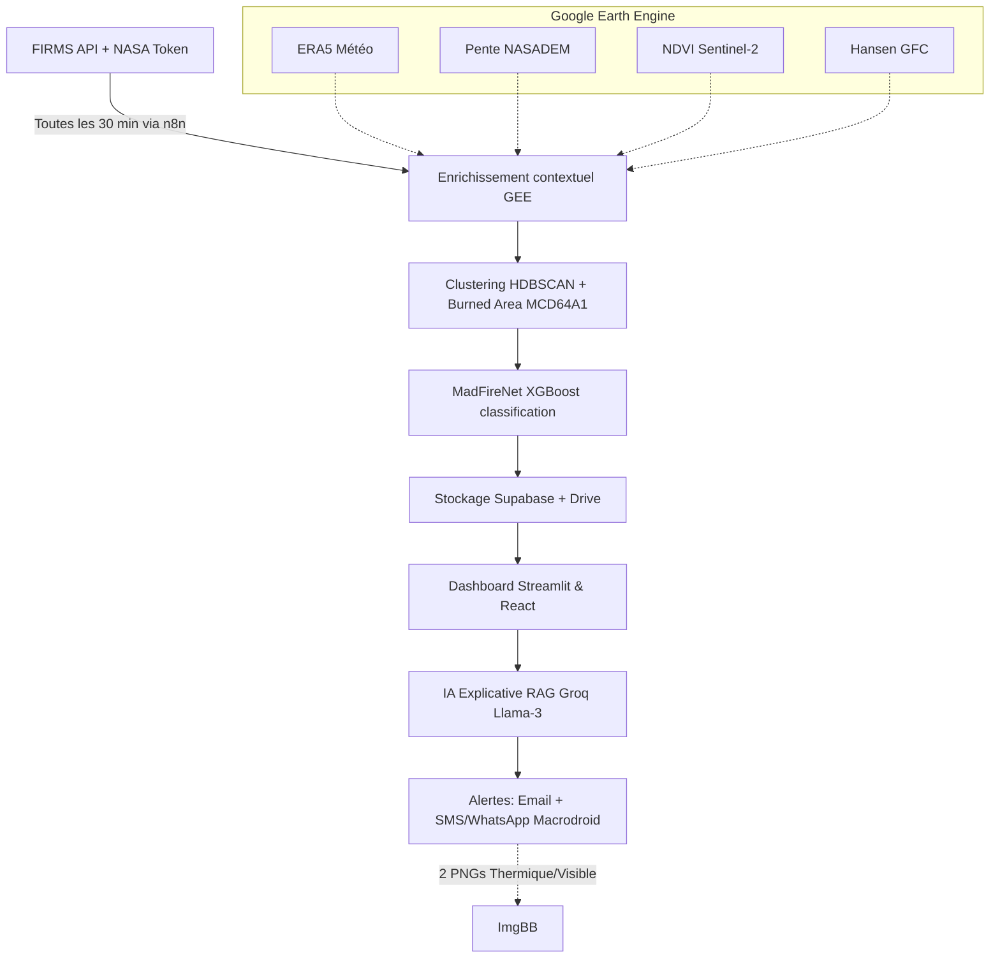

# 🏗️ Architecture Globale — JeryMotro Platform v2.2
#JeryMotro #MemoireL3 #Workflow #Docker #FastAPI #Python
[[Glossaire_Tags]] | [[00_INDEX]] | [[01_Cahier_des_Charges]]

---

## 1. PIPELINE COMPLET (V2)



### Étapes du Pipeline :
1.  **Collecte :** Points FIRMS toutes les 30 min via n8n.
2.  **Enrichissement Contextuel (GEE) :** Température, pente, NDVI, et historique de déforestation ajoutés au point.
3.  **Clustering & Surface :** HDBSCAN identifie les événements feu, surface estimée par MCD64A1/Copernicus (pas d'analyse DL lourde).
4.  **Inférence MadFireNet :** XGBoost classifie le risque (20 features).
5.  **Stockage & Action :** Données poussées vers Supabase. Génération automatique de 2 PNGs (Thermique+Visible) uploadées sur ImgBB par Python. Alertes Macrodroid (SMS) et Email déclenchées.


---

## 2. STRATÉGIE DE DÉPLOIEMENT & TECHNOLOGIES (V3)

La version officielle est pensée pour être "Lean", gratuite (0 Ar), et hautement démonstrable en soutenance sans nécessiter de serveurs GPU.

| Composant | Technologie Choisie | Hébergement Prévu |
|-----------|--------------------|-------------------|
| **Base de Données** | PostgreSQL | **Supabase** (Gratuit, Cloud) |
| **Backend / API** | FastAPI / Python | Render ou Vercel |
| **Interface Principale** | Streamlit | Streamlit Cloud (Déploiement rapide) |
| **Interface Avancée** | React Web | Vercel (Gratuit) |
| **Automatisation** | n8n | Render / Docker local |
| **Stockage Images** | ImgBB | ImgBB API (Liens directs pour alertes) |
| **Stockage Fichiers** | Google Drive | API Google |
| **Moteur RAG** | ChromaDB + Llama-3 | API Groq (très rapide) |
| **Passerelle SMS** | MacroDroid + SIM | Téléphone Android local personnel |

---

## 3. STRUCTURE DES DOSSIERS

```
jery-motro-platform/
│
├── 📁 api/                              # Backend FastAPI → [[09_FastAPI_Backend]]
│   ├── main.py                          # App FastAPI + routers + CORS
│   ├── database.py                      # SQLAlchemy + session
│   ├── requirements.txt
│   ├── Dockerfile
│   ├── routers/
│   │   ├── detections.py                # GET /detections?date&min_risk
│   │   ├── predictions.py               # GET /predictions
│   │   ├── clusters.py                  # GET /clusters
│   │   ├── alerts.py                    # GET /alerts
│   │   └── chat.py                      # POST /chat  (JeryMotro AI RAG)
│   ├── models/                          # SQLAlchemy ORM
│   │   ├── detection.py
│   │   ├── prediction.py
│   │   └── alert.py
│   ├── schemas/                         # Pydantic validation
│   │   ├── detection.py
│   │   └── prediction.py
│   └── services/
│       ├── madfirenet_service.py        # ★ Inférence XGBoost V2 + ConvLSTM
│       ├── rag_service.py               # ★ Groq llama3 + ChromaDB → [[07_MadFire_AI_RAG]]
│       └── alert_service.py             # Email SMTP + Twilio WhatsApp → [[12_Systeme_Alertes]]
│
├── 📁 frontend/                         # React 18 + TypeScript + Leaflet → [[10_Frontend_Decision]]
│   ├── src/
│   │   ├── components/
│   │   │   ├── MapView.jsx              # Carte Leaflet (feux + couleur risque)
│   │   │   ├── Dashboard.jsx            # Graphiques Recharts (stats saisonnières)
│   │   │   ├── ChatPanel.jsx            # Interface JeryMotro AI (RAG)
│   │   │   ├── AlertPanel.jsx           # Historique alertes temps réel
│   │   │   ├── RiskMap.jsx              # Heatmap ConvLSTM J+1
│   │   │   └── StatsBar.jsx             # Métriques du jour
│   │   ├── services/
│   │   │   └── api.js                   # Instance Axios → FastAPI
│   │   └── App.jsx
│   ├── package.json
│   └── Dockerfile
│
├── 📁 ml/                               # Machine Learning → [[04_MadFireNet]]
│   ├── preprocessing/
│   │   ├── fetch_firms.py               # Collecte FIRMS API → [[13_Dataset_FIRMS_MODIS]]
│   │   ├── clean_firms.py               # Nettoyage + filtre (confidence, frp≥1)
│   │   ├── feature_engineering.py       # ★ 18+ features V2 → [[06_Feature_Engineering]]
│   │   └── gee_enrichment.py            # ★ (V2) Landcover+Slope+NDVI batch → [[15_Dataset_ERA5_GEE]]
│   ├── clustering/
│   │   └── hdbscan_cluster.py           # Rayon 750m, 48h, min_size=3 → [[05_HDBSCAN_Clustering]]
│   ├── models/
│   │   ├── xgboost_classifier.py        # ★ JeryMotroXGB V2
│   │   ├── convlstm_predictor.py        # ★ JeryMotroConvLSTM (grille 64×64)
│   │   └── rf_regression.py             # (Should Have) durée feu
│   ├── inference/
│   │   └── run_madfirenet.py            # Pipeline inférence unifié XGB + ConvLSTM
│   └── notebooks/
│       ├── 01_EDA_FIRMS.ipynb           # Exploration données 2021-2024
│       ├── 02_Feature_Engineering.ipynb # Features V2 + GEE
│       ├── 03_XGBoost_Training.ipynb    # ★ Entraînement + métriques vs NASA
│       └── 04_ConvLSTM_Training.ipynb   # ★ Colab GPU T4
│
├── 📁 n8n/                              # Automatisation → [[11_Automatisation_n8n]]
│   └── workflows/
│       ├── daily_collection.json        # ★ CRON */30 → collecte+inférence+stockage
│       ├── alert_trigger.json           # IF score>0.7 OU FRP>50MW → alertes
│       └── weekly_report.json           # Rapport email hebdomadaire
│
├── 📁 data/
│   ├── raw/firms/                       # CSV MODIS + VIIRS NRT bruts
│   ├── processed/                       # DataFrame enrichi + features V2
│   └── models_saved/                    # xgb_v2.pkl · convlstm_v1.pth
│
├── docker-compose.yml                   # 5 services → [[08_Docker_Infrastructure]]
├── .env.example                         # Toutes les clés requises (ne jamais committer .env)
├── .gitignore                           # .env · data/raw · models_saved/
└── README.md                            # Guide démarrage + badges + screenshots
```

> [!tip] Correspondance Documentation ↔ Code
> Chaque composant `★` est documenté dans un fichier Obsidian dédié.
> Voir [[00_INDEX]] pour la navigation complète.

---

## 4. FLUX DE DONNÉES DÉTAILLÉ

### 4.1 Collecte → Stockage (toutes les 30 min)

```python
# Flux n8n → Python → PostgreSQL
1. n8n CRON déclenche GET /api/area/csv/{KEY}/VIIRS_SNPP_NRT/-25.5,43,-11.5,50/1
2. fetch_firms.py reçoit CSV brut
3. clean_firms.py : filtre confidence >= 'nominal', frp >= 1.0
4. feature_engineering.py : calcule diff_brightness, frp_log, etc.
5. hdbscan_cluster.py : groupe les points en clusters
6. run_madfirenet.py : inférence XGBoost + ConvLSTM
7. INSERT INTO detections, predictions, clusters (PostgreSQL)
8. ChromaDB.add() : embed résultats pour RAG
9. IF score > 0.7 OU frp > 50 → alert_service.py
```

### 4.2 Frontend → FastAPI → BDD

```
Utilisateur → React/Flutter
    → GET /api/detections?date=today&min_risk=0.5
    → FastAPI route → SQLAlchemy query → PostgreSQL
    → Retour JSON → Leaflet affiche les points
```

### 4.3 Chat JeryMotro AI (Groq Llama-3)

```
Utilisateur → "Quelle zone est la plus touchée cette semaine ?"
    → POST /api/chat {message: "..."}
    → RAG Service : query ChromaDB → top 5 contextes pertinents
    → Groq API (Llama-3) : prompt = contexte + question
    → Réponse limitée aux données du projet (pas de généralités)
    → Retour JSON → Streamlit/React affiche la réponse
```

---

## 5. STRATÉGIE DE DONNÉES (2020 - 2026)

Pour garantir la performance du modèle L3 :
- **Entraînement :** 2021 – 2024 (Maximisation VIIRS 375m).
- **Validation :** Année 2025 complète (Test de robustesse saisonnière).
- **Démonstration :** Données 2026 en temps réel.

## 6. MÉTRIQUES DE SUCCÈS (MAJ V2)

| Composant | Métrique | Seuil Cible |
|-----------|----------|-------------|
| **XGBoost** | Recall (petits feux vs NASA) | +25% |
| **XGBoost** | Précision (Landcover-filtered) | > 80% |
| **ConvLSTM** | MAE risque J+1 | < 0.15 |
| **Pipeline** | Temps Collecte → Alerte | < 15 min |

---

*Conception mise à jour pour le projet JeryMotro — Mars 2026.*
*Fichier parent : [[00_INDEX]]*
