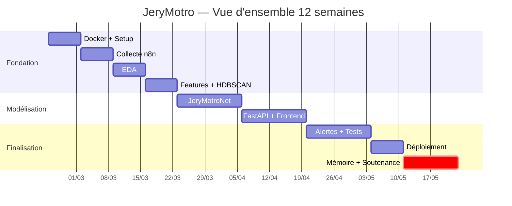

# 📅 Plan de Travail — 3 Mois (S1→S12)
#JeryMotro #MemoireL3 #Avancement #Milestone
[[Glossaire_Tags]] | [[00_INDEX]] | [[01_Cahier_des_Charges]] | [[00_DASHBOARD]]

> **Durée : 23/02/2026 → 23/05/2026**
> **Jalon hebdomadaire obligatoire :** 1 commit GitHub + [[DailyNote_Template]] + test pipeline

> [!tip] Comment utiliser ce fichier
> - Cochez `- [x]` dès qu'une tâche est terminée
> - Mettez à jour le statut du livrable de fin de semaine
> - Mettez à jour [[00_DASHBOARD]] chaque lundi

---

## 📊 RÉCAPITULATIF GLOBAL

---

## 📦 MOIS 1 — FONDATION (S1–S4)

> **Objectif :** Infrastructure opérationnelle + données prêtes + EDA + Clustering

---

### 🗓️ S1 — Infrastructure & Mise en place
**`23/02/2026 → 01/03/2026`**

> [!danger] Décision obligatoire cette semaine
> **React vs Flutter** → documenter dans [[10_Frontend_Decision]] avant le 01/03/2026

- [ ] Créer repo GitHub `jery-motro-platform` + structure dossiers
- [ ] Installer Docker Desktop + tester `docker run hello-world`
- [ ] Écrire `docker-compose.yml` minimal (API + DB + ChromaDB)
- [ ] Créer `Dockerfile` FastAPI (`python:3.11-slim`)
- [ ] Obtenir MAP_KEY NASA FIRMS (inscription gratuite)
- [ ] Premier appel API FIRMS → vérifier CSV Madagascar
- [ ] Créer `.env.example` + `.gitignore`
- [ ] Installer Obsidian + importer ce vault
- [ ] **⭐ Décision React vs Flutter** → [[10_Frontend_Decision]]

**Livrable S1 :**
- [ ] ✅ `docker-compose up` lance API + DB + ChromaDB
- [ ] ✅ Premier CSV FIRMS Madagascar téléchargé

---

### 🗓️ S2 — Collecte Automatisée + n8n
**`02/03/2026 → 08/03/2026`**

> [!info] Objectif
> Pipeline collecte FIRMS → PostgreSQL automatisé toutes les 30 minutes

- [ ] Écrire `fetch_firms.py` (3 sources : MODIS + VIIRS SNPP + VIIRS NOAA21)
- [ ] Écrire `clean_firms.py` (filtres confidence, frp ≥ 1.0, doublons)
- [ ] Créer modèle SQLAlchemy `Detection` + migration Alembic
- [ ] Créer endpoint FastAPI `GET /detections` (basique)
- [ ] Installer n8n Docker + créer workflow `daily_collection` (CRON `*/30 * * * *`)
- [ ] Configurer `Dockerfile` Frontend (selon décision S1)
- [ ] Tester pipeline collecte bout-en-bout

**Livrable S2 :**
- [ ] ✅ Données FIRMS dans PostgreSQL toutes les 30 min
- [ ] ✅ Endpoint `/detections` retourne JSON valide

---

### 🗓️ S3 — EDA Complète
**`09/03/2026 → 15/03/2026`**

> [!info] Objectif
> Comprendre parfaitement les données Madagascar 2020–2025

- [ ] Télécharger archives FIRMS 2020–2025 Madagascar (loop mensuel)
- [ ] `01_EDA_FIRMS.ipynb` : stats descriptives complètes
- [ ] Visualisation temporelle : feux par mois/année/heure
- [ ] Visualisation spatiale : carte densité feux avec Folium
- [ ] Comparaison MODIS vs VIIRS (différences de détection)
- [ ] Identifier top 5 régions les plus touchées
- [ ] Documenter → [[13_Dataset_FIRMS_MODIS]] + [[14_Dataset_FIRMS_VIIRS]]

**Livrable S3 :**
- [ ] ✅ Notebook EDA complet avec visualisations
- [ ] ✅ Carte feux 2020–2025 Madagascar
- [ ] ✅ Rapport comparaison MODIS/VIIRS

---

### 🗓️ S4 — Feature Engineering + HDBSCAN Clustering
**`16/03/2026 → 22/03/2026`**

> [!warning] Semaine charnière
> Le Feature Engineering et HDBSCAN sont la base de tout JeryMotroNet. Ne pas bâcler.

- [ ] `feature_engineering.py` : `diff_brightness`, `frp_log`, `local_hour`, `is_dry_season`
- [ ] Configurer Google Earth Engine API (compte académique) + tester accès ERA5
- [ ] `hdbscan_cluster.py` : rayon 750m, fenêtre 48h, `min_cluster_size=3`
- [ ] Évaluer qualité clusters (silhouette score, visualisation sur carte)
- [ ] Ajouter `cluster_features` dans schéma PostgreSQL + migration Alembic
- [ ] Endpoint FastAPI `GET /clusters`
- [ ] Documenter → [[05_HDBSCAN_Clustering]] + [[06_Feature_Engineering]]

**Livrable S4 :**
- [ ] ✅ Dataset enrichi avec toutes les features calculées
- [ ] ✅ HDBSCAN silhouette > 0.50 (validé)
- [ ] ✅ Endpoint `/clusters` fonctionnel

---

## 🔬 MOIS 2 — MODÉLISATION & INTERFACE (S5–S8)

> **Objectif :** JeryMotroNet + FastAPI complète + Frontend fonctionnel

---

### 🗓️ S5–S6 — JeryMotroNet : XGBoost + ConvLSTM
**`23/03/2026 → 05/04/2026`**

> [!danger] Cœur académique du mémoire
> JeryMotroNet est la **contribution originale**. Métriques obligatoires : Recall +25%, AUC ≥ 0.88

**XGBoost (S5) :**
- [ ] `02_Feature_Engineering.ipynb` : pipeline features complet avec ERA5
- [ ] `03_XGBoost_Training.ipynb` : entraîner, cross-valider, early stopping
- [ ] `xgboost_classifier.py` : classe `JeryMotroXGB` réutilisable
- [ ] Mesurer recall petits feux vs NASA brut (tableau comparatif)
- [ ] Sauvegarder `xgb_jerymotrnet_v1.pkl`

**ConvLSTM (S6) :**
- [ ] Construire grille 375m Madagascar (patches 64×64)
- [ ] `04_ConvLSTM_Training.ipynb` : entraînement Colab GPU T4
- [ ] `convlstm_predictor.py` : classe `JeryMotroConvLSTM`
- [ ] `run_madfirenet.py` : pipeline inférence unifié
- [ ] Endpoints FastAPI : `GET /predictions` + `GET /risk-map`
- [ ] Tableau métriques comparatif vs NASA brut

**Livrable S5–S6 :**
- [ ] ✅ Recall petits feux +25% vs NASA brut
- [ ] ✅ AUC-ROC ≥ 0.88
- [ ] ✅ MAE ConvLSTM < 0.15
- [ ] ✅ Endpoints `/predictions` et `/risk-map` fonctionnels

---

### 🗓️ S7 — FastAPI Complète + Frontend Démarrage
**`06/04/2026 → 12/04/2026`**

**FastAPI :**
- [ ] Compléter tous les endpoints avec schemas Pydantic complets
- [ ] Ajouter CORS, gestion erreurs, logs structurés
- [ ] Tests unitaires : `pytest` + `httpx` → couverture ≥ 60%
- [ ] Vérifier Swagger UI `/docs` complet

**Frontend :**
- [ ] Scaffold React + configurer Dockerfile
- [ ] Composant `MapView.jsx` : Leaflet + CircleMarker (couleur = risk_score)
- [ ] Composant `Dashboard.jsx` : graphiques saisonniers Recharts
- [ ] Service `api.js` : instance Axios

**Livrable S7 :**
- [ ] ✅ FastAPI Swagger UI 100% documentée
- [ ] ✅ Tests unitaires ≥ 60% coverage
- [ ] ✅ Carte Leaflet avec feux réels + code couleur risque

---

### 🗓️ S8 — Frontend Complet + JeryMotro AI
**`13/04/2026 → 19/04/2026`**

**Frontend :**
- [ ] Composant `ChatPanel.jsx` : interface chat JeryMotro AI
- [ ] Composant `AlertPanel.jsx` : historique alertes temps réel
- [ ] Composant `StatsBar.jsx` : métriques du jour
- [ ] Intégrer heatmap ConvLSTM J+1 (`RiskMap.jsx`)

**RAG :**
- [ ] `rag_service.py` : ChromaDB + Groq `llama3-8b-8192` + prompt engineering
- [ ] Endpoint `POST /chat` complet
- [ ] Tester 5 questions types → réponses limitées aux données projet

**Intégration :**
- [ ] Finaliser `docker-compose.yml` (5 services complets)
- [ ] Test bout-en-bout complet

**Livrable S8 :**
- [ ] ✅ Frontend complet (carte + dashboard + chat + alertes)
- [ ] ✅ JeryMotro AI répond sur données projet uniquement
- [ ] ✅ `docker-compose up` lance toute la stack

---

## 🎯 MOIS 3 — FINALISATION (S9–S12)

> **Objectif :** Alertes + Tests + Optionnel + Mémoire + Soutenance

---

### 🗓️ S9–S10 — Alertes + Tests End-to-End
**`20/04/2026 → 03/05/2026`**

> [!warning] Mesurer TOUTES les métriques cette semaine
> Dernière chance avant rédaction. Capturer recall, AUC, latence, silhouette.

**Alertes :**
- [ ] `alert_service.py` : email SMTP Gmail + WhatsApp Twilio Sandbox
- [ ] Créer compte Twilio + activer Sandbox + tester envoi
- [ ] Workflow n8n `alert_trigger` (IF score > 0.7 OU FRP > 50 MW)
- [ ] Tester alertes simulées

**Tests :**
- [ ] Tests end-to-end pipeline complet (collecte → alerte)
- [ ] Mesurer latence pipeline (cible < 5 min)
- [ ] Mesurer latence alerte post-FIRMS (cible < 30 min)
- [ ] Mesurer toutes métriques ML → [[METRIQUES_CIBLES]]

**Should Have :**
- [ ] 🟠 Random Forest régression (durée/intensité cluster)
- [ ] 🟠 Export PDF rapport quotidien

**Livrable S9–S10 :**
- [ ] ✅ Alertes Email + WhatsApp opérationnelles
- [ ] ✅ Toutes métriques mesurées et documentées
- [ ] ✅ Rapport de tests complet

---

### 🗓️ S11 — Optionnel + Déploiement Public
**`04/05/2026 → 10/05/2026`**

> [!tip] Priorité déploiement
> N'attaquez le U-Net **que si** tous les Must Have sont 100% terminés.

- [ ] Déployer FastAPI sur Railway/Render (gratuit)
- [ ] Déployer Frontend sur Vercel (gratuit)
- [ ] Vérifier URLs publiques fonctionnelles
- [ ] `README.md` complet (badges, screenshots, instructions)
- [ ] Exporter workflows n8n JSON
- [ ] Tag Git `v1.0.0`
- [ ] 🟡 (Optionnel) GEE → patches 128×128 → U-Net simple
- [ ] 🟡 (Optionnel) Carte risque hebdomadaire animée

**Livrable S11 :**
- [ ] ✅ URL publique FastAPI
- [ ] ✅ URL publique Frontend
- [ ] ✅ README complet sur GitHub

---

### 🗓️ S12 — Mémoire + Soutenance
**`11/05/2026 → 23/05/2026`**

> [!danger] Sprint final — Stop coding, focus rédaction

**Mémoire L3 :**
- [ ] Introduction (contexte, problématique, objectifs)
- [ ] État de l'art (FIRMS, HDBSCAN, XGBoost, ConvLSTM, RAG)
- [ ] Méthodologie (architecture, JeryMotroNet, pipeline)
- [ ] Résultats et évaluation (métriques, comparaisons, visualisations)
- [ ] Discussion et perspectives (limites, travaux futurs)
- [ ] Conclusion + Bibliographie

**Soutenance :**
- [ ] Présentation PowerPoint 15–20 slides
- [ ] Enregistrer vidéo démo 3 minutes (MP4)
- [ ] Répétition à voix haute × 3 minimum
- [ ] Préparer réponses questions jury

**Finalisation :**
- [ ] Vault Obsidian à jour (toutes les notes)
- [ ] Dernier commit GitHub + tag `v1.0.0`
- [ ] Vérifier tous les livrables L1→L9 dans [[00_DASHBOARD]]

**Livrable S12 :**
- [ ] ✅ Mémoire PDF soumis
- [ ] ✅ Présentation PowerPoint prête
- [ ] ✅ Vidéo démo MP4
- [ ] ✅ Soutenance réussie 🎓

---

## 📊 RÉCAPITULATIF DES LIVRABLES

| Semaine | Livrable principal | Statut |
|---------|-------------------|--------|
| S1 | `docker-compose up` + CSV FIRMS | ⬜ |
| S2 | Pipeline collecte automatisée 30min | ⬜ |
| S3 | Notebook EDA complet 2020–2025 | ⬜ |
| S4 | HDBSCAN + features + `/clusters` | ⬜ |
| S5–S6 | JeryMotroNet entraîné (XGB + ConvLSTM) | ⬜ |
| S7 | FastAPI Swagger + carte Leaflet | ⬜ |
| S8 | Frontend complet + JeryMotro AI | ⬜ |
| S9–S10 | Alertes + toutes métriques mesurées | ⬜ |
| S11 | URLs publiques + README | ⬜ |
| S12 | Mémoire + soutenance 🎓 | ⬜ |

<progress value="0" max="10"></progress> **`0 / 10 jalons`**

---

## ⚡ RÈGLES DU PROJET

> [!warning] Règles non négociables
> 1. **Chaque jour** → remplir [[DailyNote_Template]] (10 min max)
> 2. **Chaque semaine** → 1 commit GitHub + maj [[00_DASHBOARD]]
> 3. **Décision React/Flutter** → avant fin S1
> 4. **Si retard** → sacrifier S11, **jamais** S4 ni S5-S6
> 5. **Clés API** → `.env` uniquement, jamais dans le code

---

*Cahier des charges → [[01_Cahier_des_Charges]]*
*Architecture → [[02_Architecture_Globale]]*
*Dashboard → [[00_DASHBOARD]]*
