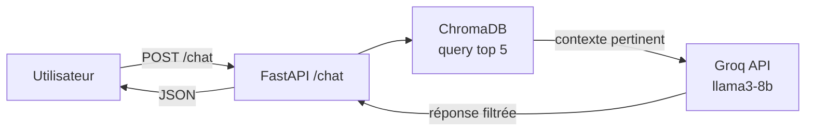

# 🧠 JeryMotro AI — Système RAG (Retrieval-Augmented Generation)
#JeryMotro #MemoireL3 #API #RAG #DecisionSupport #Groq #ChromaDB
[[Glossaire_Tags]] | [[00_INDEX]] | [[09_FastAPI_Backend]] | [[07_MadFire_AI_RAG]]

---

> **JeryMotro AI** est l'assistant intelligent intégré à la plateforme.
> Il répond **uniquement** aux questions basées sur les données réelles du projet.
> Ce n'est **pas** un LLM généraliste — c'est un expert des données JeryMotro Madagascar.

---

## 1. PRINCIPE RAG

```
Question utilisateur
    → 1. ChromaDB : recherche sémantique → top 5 documents pertinents
    → 2. Groq API : LLM + contexte récupéré + system prompt contraignant
    → 3. Réponse précise, citée, limitée aux données du projet
```

> [!warning] Règle absolue
> JeryMotro AI ne répond **jamais** à des questions hors données du projet.
> Si la question dépasse le contexte disponible, la réponse est toujours :
> *"Je suis limité aux données JeryMotro. Consultez les sources NASA directement."*

---

## 2. ARCHITECTURE TECHNIQUE



---

## 3. CE QUI EST STOCKÉ DANS CHROMADB

Après chaque run du pipeline, les éléments suivants sont indexés :

```python
# Résumé journalier
"2026-03-30 : 52 détections. FRP max 187MW (Menabe). 4 clusters actifs."

# Métriques modèle
"JeryMotroNet XGBoost V2 : Recall=0.87, AUC=0.91. +31% vs NASA brut."

# Clusters actifs
"Cluster 3 (30/03/2026) : 9 points, FRP total 643MW, lat=-20.1/lon=44.3, risque=0.89"

# Alertes émises
"Alerte émise 14:32 UTC : Menabe, score=0.92, FRP=187MW → Email+WhatsApp envoyés"

# Tendances hebdomadaires
"Semaine 13/2026 : 287 feux, +12% vs sem. précédente. Menabe 38%, Boeny 19%."
```

---

## 4. SYSTEM PROMPT

```python
SYSTEM_PROMPT = """
Tu es JeryMotro AI, assistant spécialisé de la plateforme JeryMotro Platform (Madagascar).

RÈGLES ABSOLUES :
1. Tu réponds UNIQUEMENT sur les données du projet (détections FIRMS, clusters HDBSCAN,
   prédictions JeryMotroNet, métriques, historique Madagascar).
2. Si la question dépasse les données disponibles → réponds EXACTEMENT :
   "Je suis limité aux données JeryMotro. Consultez les sources NASA directement."
3. Cite toujours les données concrètes (dates, FRP MW, régions, scores de risque).
4. Réponds en français. Sois précis et concis (max 200 mots).
5. Ne génère JAMAIS d'informations absentes du contexte fourni.
6. Si score > 0.7 ou FRP > 50MW → signaler comme zone à surveiller activement.
"""
```

---

## 5. MODÈLES GROQ DISPONIBLES

| Modèle | Vitesse | Qualité | Usage recommandé |
|--------|---------|---------|--------------------|
| `llama3-8b-8192` | ⚡ Très rapide | Bonne | Requêtes simples (stats, chiffres) |
| `llama3-70b-8192` | 🐢 Lent | Excellente | Analyses complexes, tendances |
| `mixtral-8x7b-32768` | ⚡ Moyen | Très bonne | Requêtes longues / contexte étendu |

**Par défaut :** `llama3-8b-8192` (quota généreux, latence < 1s)

---

## 6. ENDPOINT FASTAPI

```python
# api/routers/chat.py
@router.post("/chat")
async def chat(request: ChatRequest) -> ChatResponse:
    """
    POST /api/chat
    Body: { "message": "Quelle région est la plus touchée ?" }
    Returns: { "response": "...", "sources": [...] }
    """
```

Voir implémentation complète → [[09_FastAPI_Backend]]

---

## 7. EXEMPLES D'UTILISATION

| Question utilisateur | Réponse attendue |
|----------------------|-----------------|
| "Combien de détections aujourd'hui ?" | "52 détections VIIRS ce 30/03/2026, FRP max 187MW." |
| "Quelle est la zone la plus à risque ?" | "Menabe, cluster 3 : risque=0.89, FRP=643MW." |
| "Quel est le recall du modèle ?" | "XGBoost V2 : Recall=0.87 (+31% vs NASA brut)." |
| "Quand va éclater la prochaine guerre ?" | "Je suis limité aux données JeryMotro. Consultez..." |

---

*Endpoint FastAPI → [[09_FastAPI_Backend]]*
*Référence fichier → [[07_MadFire_AI_RAG]]*
*Dernière mise à jour : Mars 2026*
