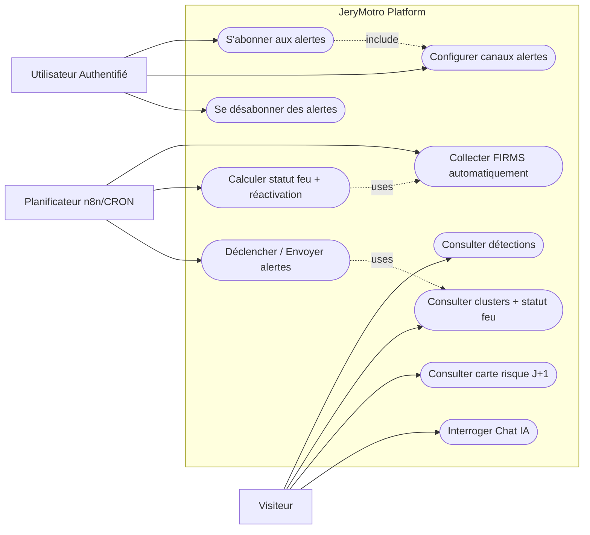
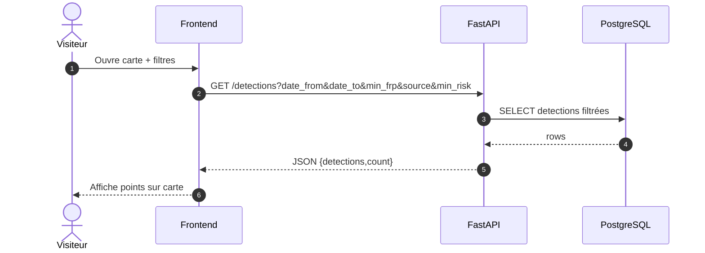
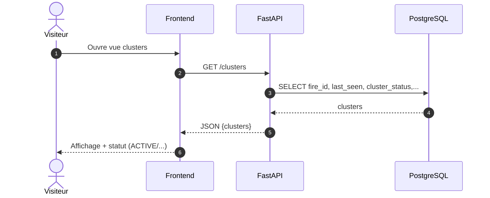
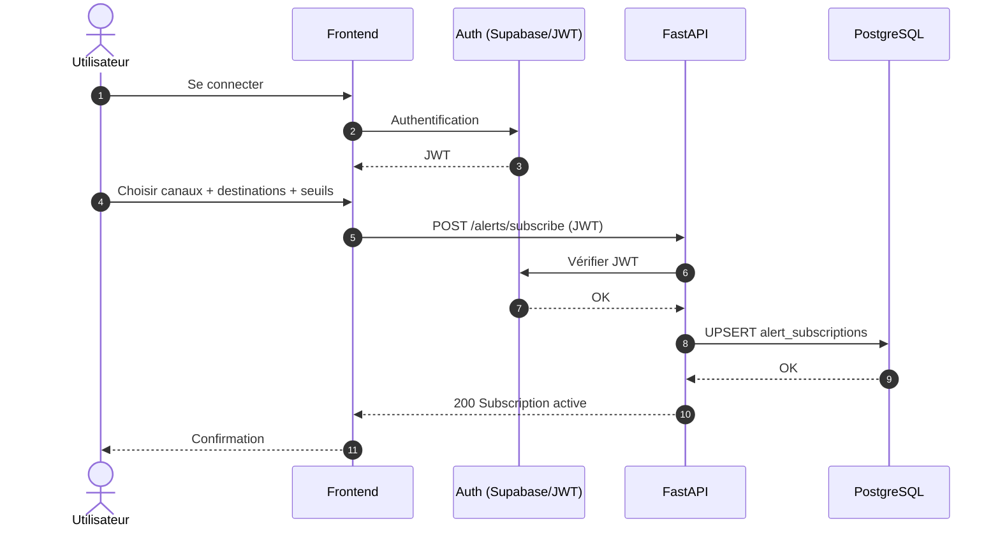
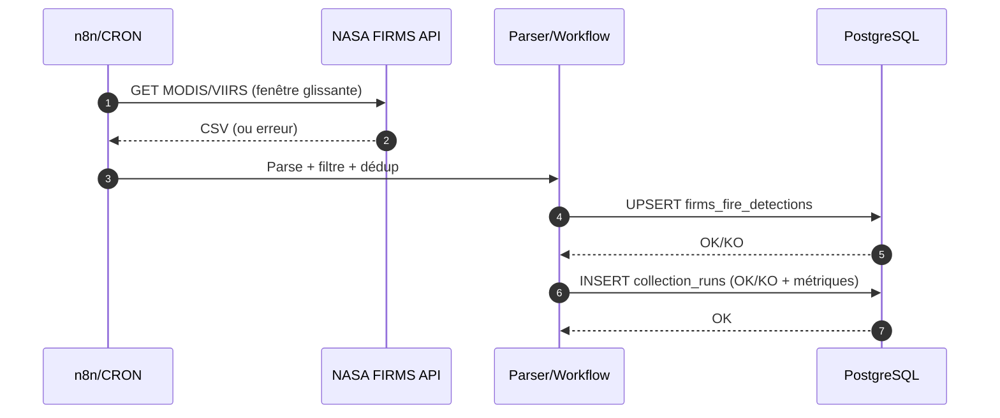
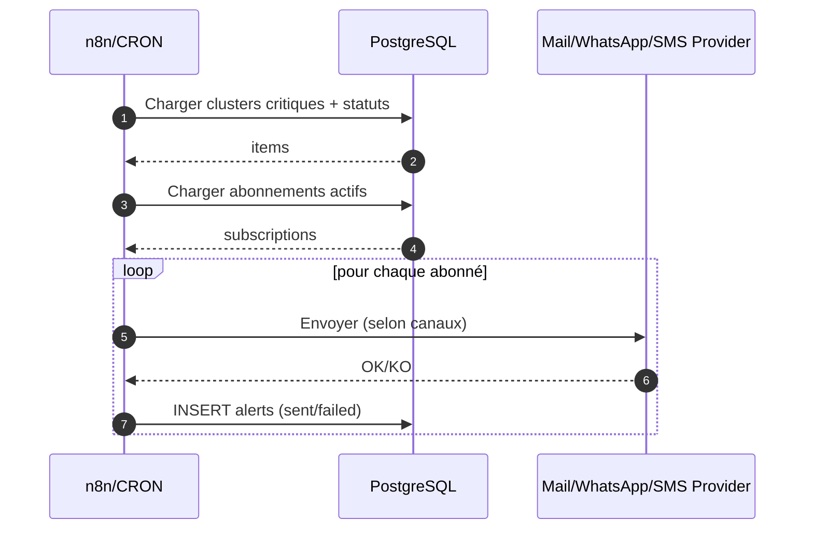
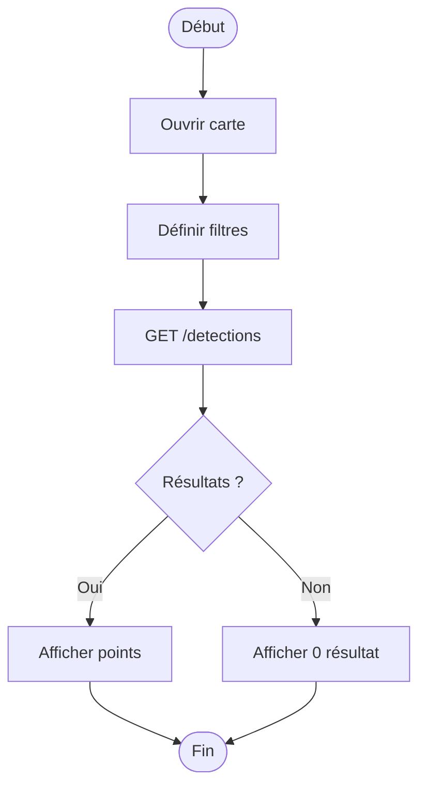
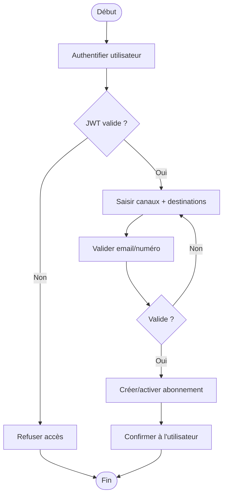
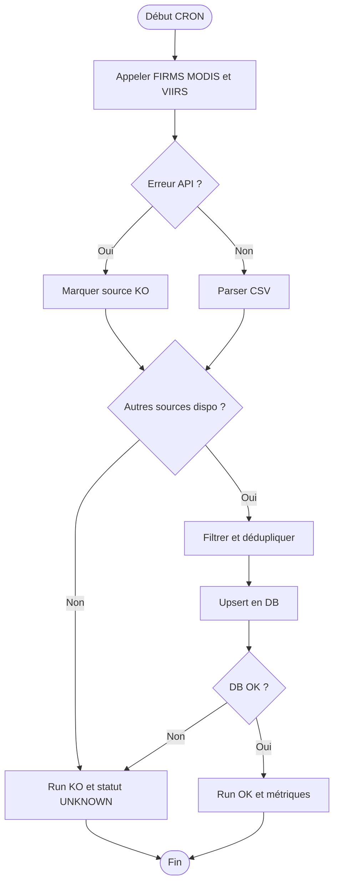
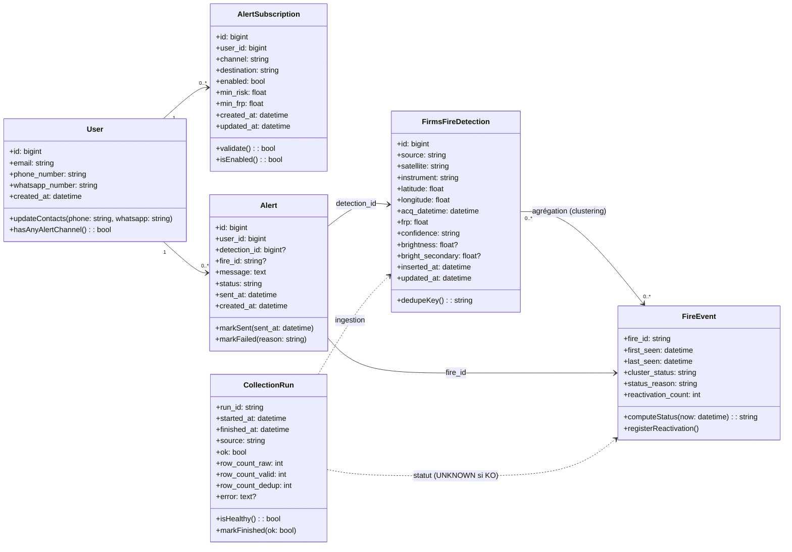

# 🧩 UML — JeryMotro Platform (Use Cases, Séquences, Activités, Classes)
#JeryMotro #MemoireL3 #UML #Specification
[[Glossaire_Tags]] | [[00_INDEX]] | [[02_Architecture_Globale]] | [[19_Acces_Sans_Inscription_Auth_Alertes]]

> Hypothèse : **toutes les fonctionnalités sont publiques** (sans inscription), sauf **Alertes** (auth obligatoire) : Mail / WhatsApp / SMS.

---

## 1) Diagramme de cas d’utilisation (Système : JeryMotro Platform)

---

## 2) Descriptions textuelles des cas d’utilisation

### UC1 — Consulter détections
- **Acteur** : Visiteur
- **But** : afficher les points FIRMS (filtrés) sur carte + liste.
- **Préconditions** : API disponible ; données présentes en base.
- **Postconditions** : aucune (lecture seule).
- **Scénario nominal** :
  1. Le visiteur ouvre la carte.
  2. Il choisit filtres (dates, min FRP, source, min risque).
  3. Le système retourne les détections.
  4. La carte affiche les points.
- **Extensions** :
  - 3a. Aucun résultat → afficher “0 détection”.
  - 3b. API indisponible → message d’erreur + retry.

### UC2 — Consulter clusters + statut feu
- **Acteur** : Visiteur
- **But** : visualiser les événements (clusters) et leur statut (*ACTIVE/COOLING/LIKELY_OUT/UNKNOWN*).
- **Préconditions** : clusters/statuts calculés ou calculables ; observation saine (sinon `UNKNOWN`).
- **Postconditions** : aucune.
- **Scénario nominal** :
  1. Le visiteur ouvre la vue clusters.
  2. Le système récupère clusters + `fire_id` + `last_seen` + `cluster_status`.
  3. Le système affiche les clusters avec leur statut et “time since last seen”.
- **Extensions** :
  - 2a. Données “stale” (collecte KO) → statuts `UNKNOWN`.
  - 2b. Réactivation détectée → marquer “REACTIVATED”.

### UC3 — Consulter carte risque J+1
- **Acteur** : Visiteur
- **But** : afficher la heatmap (ou grille) de risque J+1.
- **Préconditions** : modèle DL disponible ; carte risque calculée pour une date.
- **Postconditions** : aucune.
- **Scénario nominal** :
  1. Le visiteur sélectionne une date.
  2. Le système charge la carte risque (GeoJSON/JSON).
  3. Le frontend affiche la heatmap.
- **Extensions** :
  - 2a. Carte indisponible → afficher “modèle non déployé / pas de données”.

### UC4 — Interroger Chat IA
- **Acteur** : Visiteur
- **But** : poser une question et obtenir une réponse limitée aux données JeryMotro.
- **Préconditions** : service RAG disponible ; base vecteur (ChromaDB) accessible.
- **Postconditions** : journalisation optionnelle.
- **Scénario nominal** :
  1. L’utilisateur saisit une question.
  2. Le système récupère du contexte (RAG).
  3. Le LLM génère la réponse en français.
  4. Le système renvoie la réponse (+ sources).
- **Extensions** :
  - 2a. Pas de contexte → répondre “limité aux données JeryMotro”.
  - 3a. Timeout LLM → message d’erreur.

### UC5 — S’abonner aux alertes (auth obligatoire)
- **Acteur** : Utilisateur Authentifié
- **But** : activer les alertes pour recevoir Mail/WhatsApp/SMS.
- **Préconditions** : utilisateur authentifié ; email valide ; numéro téléphone et WhatsApp valides (si canaux activés).
- **Postconditions** : abonnement enregistré.
- **Scénario nominal** :
  1. L’utilisateur s’authentifie.
  2. Il renseigne ses contacts (`phone_number`, `whatsapp_number`) si nécessaire.
  3. Il choisit canaux (mail/whatsapp/sms) et seuils.
  4. Le système valide les champs.
  5. Le système crée/active l’abonnement.
- **Extensions** :
  - 1a. Auth KO → accès refusé.
  - 3a. Numéro/email invalide → correction demandée.

### UC6 — Configurer canaux alertes
- **Acteur** : Utilisateur Authentifié
- **But** : modifier canaux, seuils, activer/désactiver.
- **Préconditions** : abonnement existant.
- **Postconditions** : abonnement mis à jour.
- **Scénario nominal** :
  1. L’utilisateur ouvre “Mes alertes”.
  2. Le système charge ses préférences.
  3. L’utilisateur modifie et sauvegarde.
  4. Le système persiste.

### UC7 — Se désabonner des alertes
- **Acteur** : Utilisateur Authentifié
- **But** : arrêter toute notification.
- **Préconditions** : abonnement existant.
- **Postconditions** : abonnement désactivé.
- **Scénario nominal** :
  1. L’utilisateur clique “Désactiver”.
  2. Le système désactive l’abonnement.
  3. Les prochaines alertes ne sont plus envoyées.

### UC8 — Collecter FIRMS automatiquement (workflow)
- **Acteur** : Planificateur (n8n/CRON)
- **But** : importer FIRMS (fenêtre glissante) et dédupliquer en base.
- **Préconditions** : MAP_KEY valide ; DB accessible.
- **Postconditions** : nouvelles détections insérées ; run log enregistré.
- **Scénario nominal** :
  1. CRON déclenche la collecte.
  2. Le système interroge plusieurs sources FIRMS.
  3. Parse/filtre/déduplique.
  4. Insert/Upsert en base.
  5. Enregistre un `collection_run` OK.
- **Extensions** :
  - 2a. Source KO → run partiel + marquer santé dégradée.
  - 4a. DB KO → run KO + pas de statut “éteint”.

### UC9 — Calculer statut feu + réactivation
- **Acteur** : Planificateur (n8n/CRON) ou Backend
- **But** : mettre à jour `cluster_status` et gérer `REACTIVATED`.
- **Préconditions** : détections présentes ; santé collecte connue.
- **Postconditions** : statuts/événements mis à jour.
- **Scénario nominal** :
  1. Charger les détections récentes.
  2. Regrouper en clusters (ou relier à `fire_id`).
  3. Calculer `last_seen`, `delta`.
  4. Appliquer règles (ACTIVE/COOLING/LIKELY_OUT/UNKNOWN).
  5. Si retour après `LIKELY_OUT` → `REACTIVATED`.

### UC10 — Déclencher / Envoyer alertes
- **Acteur** : Planificateur (n8n/CRON)
- **But** : notifier les abonnés quand conditions critiques sont vraies.
- **Préconditions** : abonnements actifs ; statut feu `ACTIVE` ; canaux configurés.
- **Postconditions** : alertes envoyées + historisées.
- **Scénario nominal** :
  1. Détecter les clusters/points critiques.
  2. Filtrer par `cluster_status == ACTIVE`.
  3. Pour chaque abonné : appliquer préférences.
  4. Envoyer Mail / WhatsApp / SMS.
  5. Sauver dans `alerts` (sent/failed).

---

## 3) Diagrammes de séquence (un par cas d’utilisation)

### UC1 — Consulter détections

### UC2 — Consulter clusters + statut feu

### UC5 — S’abonner aux alertes (auth)

### UC8 — Collecte FIRMS automatique

### UC10 — Envoi d’alertes (Mail/WhatsApp/SMS)

---

## 4) Diagrammes d’activités (un par cas d’utilisation)

### UC1 — Consulter détections (activité)

### UC5 — S’abonner aux alertes (activité)

### UC8 — Collecte FIRMS (activité)

---

## 5) Diagramme de classes (modèle logique)

