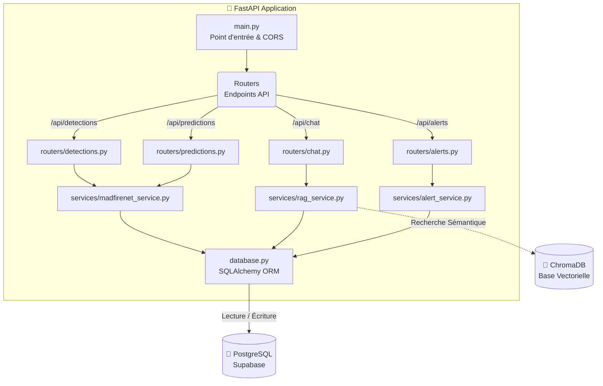
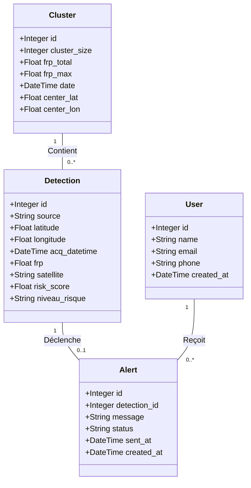
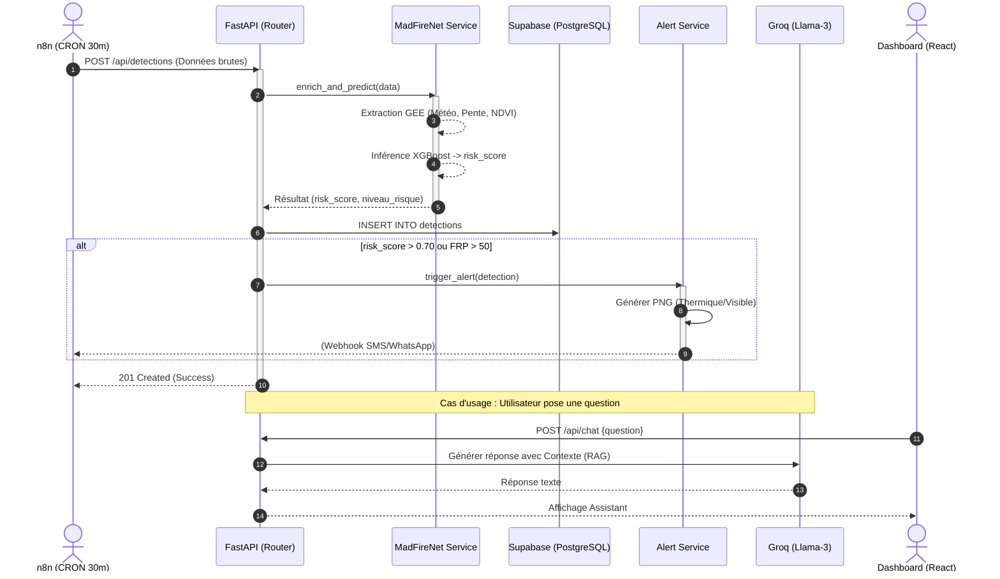

# 🏗️ Conception UML — Backend FastAPI
#JeryMotro #MemoireL3 #UML #FastAPI #Backend
[[Glossaire_Tags]] | [[00_INDEX]] | [[09_FastAPI_Backend]] | [[02_Architecture_Globale]]

---

> Ce document présente la modélisation UML simplifiée du backend **FastAPI** pour la plateforme JeryMotro. Il définit l'architecture des composants, les modèles de données, et le flux d'exécution.

---

## 1. Diagramme de Composants (Architecture en Couches)

Ce diagramme montre l'organisation interne de l'application FastAPI. Les requêtes entrent par les routeurs (`Routers`), sont traitées par la logique métier (`Services`), puis interagissent avec la base de données via l'ORM (`SQLAlchemy`).

---

## 2. Diagramme de Classes (Modèles BDD)

Ce diagramme UML représente les entités principales de la base de données PostgreSQL gérées par SQLAlchemy, ainsi que leurs relations.

---

## 3. Diagramme de Séquence (Flux d'Inférence & Alerte)

Ce diagramme illustre ce qui se passe dans le backend lorsqu'une nouvelle donnée FIRMS est reçue (généralement poussée par le workflow `n8n`).

---

*Fichier généré pour servir de base au développement du backend (Semaines 7-8).*
