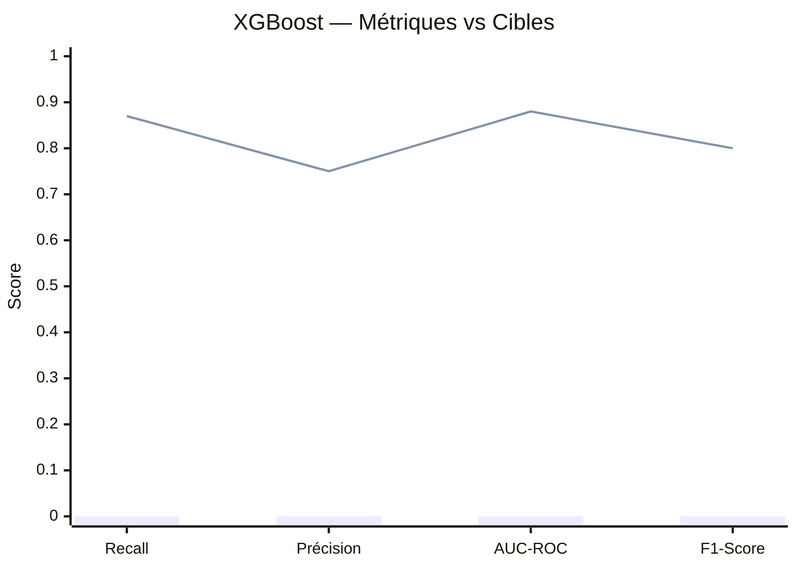
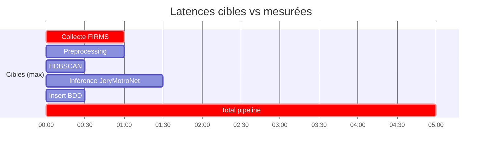

# 🎯 Métriques Cibles — JeryMotro Platform
#JeryMotro #MemoireL3 #ML #Avancement
[[Glossaire_Tags]] | [[00_INDEX]] | [[00_DASHBOARD]] | [[04_JeryMotroNet]]

> **Tableau de bord des métriques à atteindre pour la soutenance.**
> Mettre à jour après chaque mesure (S6, S9, S10).

---

## 🤖 JERYMOTRNET — XGBoost (Mesure S6)

> [!tip] Remplacer les `0` par les valeurs mesurées après entraînement

| Métrique | Cible | Mesurée S6 | Mesurée S10 | Statut |
|----------|-------|------------|-------------|--------|
| **Recall petits feux vs NASA brut** | **+25%** | — | — | ⬜ |
| Précision (feux) | ≥ 75% | — | — | ⬜ |
| AUC-ROC | ≥ 0.88 | — | — | ⬜ |
| F1-Score | ≥ 0.80 | — | — | ⬜ |
| `scale_pos_weight` utilisé | 15 | — | — | ⬜ |

**Baseline NASA brut (référence) :**
| Métrique | Valeur NASA brut | Amélioration JeryMotroNet |
|----------|-----------------|--------------------------|
| Recall petits feux | — | **+__ %** ← remplir |
| Précision | — | **__ %** |

---

## 🧠 JERYMOTRNET — ConvLSTM (Mesure S6)

| Métrique | Cible | Mesurée | Statut |
|----------|-------|---------|--------|
| MAE carte J+1 (prob absolue) | **< 0.15** | — | ⬜ |
| Précision zones risque > 0.7 | ≥ 70% | — | ⬜ |
| Recall zones effectivement brûlées J+1 | ≥ 65% | — | ⬜ |
| Loss finale entraînement | — | — | ⬜ |
| Epochs nécessaires | — | — | ⬜ |

---

## 🔵 HDBSCAN CLUSTERING (Mesure S4)

| Métrique | Cible | Mesurée | Statut |
|----------|-------|---------|--------|
| Silhouette score | **> 0.50** | — | ⬜ |
| Ratio bruit (points isolés) | **< 20%** | — | ⬜ |
| Nb clusters moyen / jour | Raisonnable | — | ⬜ |
| Taille moyenne cluster (points) | ≥ 5 | — | ⬜ |

---

## ⚡ PERFORMANCE PIPELINE (Mesure S9–S10)

| Étape | Cible | Mesurée | Statut |
|-------|-------|---------|--------|
| Collecte FIRMS (3 sources) | < 60s | — | ⬜ |
| Preprocessing Python | < 60s | — | ⬜ |
| HDBSCAN Clustering | < 30s | — | ⬜ |
| Inférence XGBoost | < 30s | — | ⬜ |
| Inférence ConvLSTM | < 60s | — | ⬜ |
| Insert PostgreSQL + ChromaDB | < 30s | — | ⬜ |
| **Pipeline total** | **< 5 min** | — | ⬜ |
| **Latence alerte post-FIRMS** | **< 30 min** | — | ⬜ |

---

## ⚡ PERFORMANCE FASTAPI (Mesure S7–S10)

| Endpoint | Cible | Mesurée | Statut |
|----------|-------|---------|--------|
| `GET /detections` | < 200ms | — | ⬜ |
| `GET /predictions` | < 200ms | — | ⬜ |
| `GET /clusters` | < 200ms | — | ⬜ |
| `GET /risk-map` | < 500ms | — | ⬜ |
| `POST /chat` (RAG + Groq) | < 3s | — | ⬜ |
| `GET /alerts` | < 200ms | — | ⬜ |

---

## 🧪 QUALITÉ CODE (Mesure S7–S10)

| Métrique | Cible | Mesurée | Statut |
|----------|-------|---------|--------|
| Coverage tests FastAPI (pytest-cov) | **≥ 60%** | — | ⬜ |
| Endpoints testés | Tous (6) | — | ⬜ |
| `docker-compose up` sans erreur | Oui | — | ⬜ |
| Swagger UI complet | Oui | — | ⬜ |

---

## 📊 DONNÉES (Mesure S3–S4)

| Métrique | Valeur | Source |
|----------|--------|--------|
| Nb détections total 2020–2025 | — | EDA S3 |
| Nb détections moyennes/jour | — | EDA S3 |
| % feux saison sèche (mois 4–10) | — | EDA S3 |
| Top région touchée | — | EDA S3 |
| Résolution VIIRS utilisée | 375m | Fixe |
| Résolution MODIS utilisée | ~1km | Fixe |
| Rayon HDBSCAN retenu | 750m | Fixe |
| Fenêtre temporelle HDBSCAN | 48h | Fixe |

---

## 🏆 SCORE SOUTENANCE (auto-évaluation finale)

> [!info] Remplir la semaine S12 avant la soutenance

| Critère | Poids | Score /10 | Commentaire |
|---------|-------|-----------|-------------|
| JeryMotroNet fonctionnel + métriques | 30% | — | |
| Pipeline complet Docker | 20% | — | |
| Frontend démontrable | 15% | — | |
| Alertes opérationnelles | 10% | — | |
| Qualité code + tests | 10% | — | |
| Mémoire + présentation | 15% | — | |
| **TOTAL** | 100% | **__/10** | |

---

*Dashboard → [[00_DASHBOARD]]*
*JeryMotroNet → [[04_JeryMotroNet]]*
*Plan de travail → [[03_Plan_Travail_3_Mois]]*
