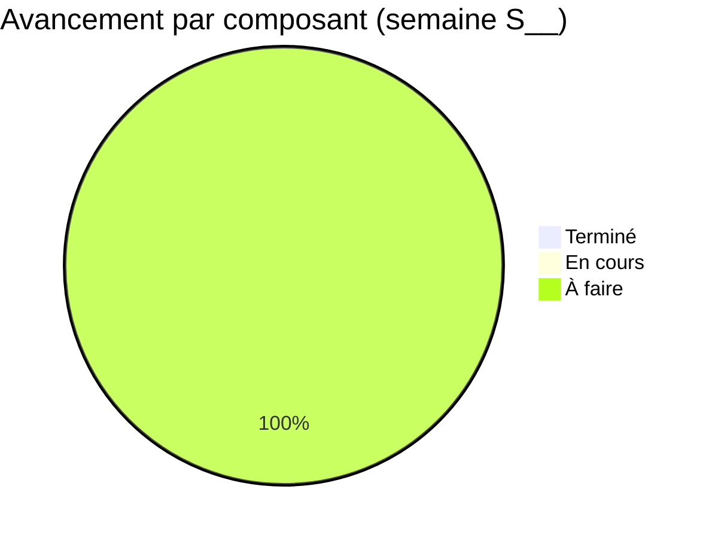

# 📊 Suivi Hebdomadaire — JeryMotro Platform
#JeryMotro #MemoireL3 #Avancement #DailyNote
[[Glossaire_Tags]] | [[00_INDEX]] | [[00_DASHBOARD]] | [[03_Plan_Travail_3_Mois]]

> **Template de suivi semaine par semaine.**
> Dupliquer ce fichier chaque lundi → renommer `SUIVI_S01.md`, `SUIVI_S02.md`, etc.

---

## 🗓️ SEMAINE S__ — `__/__/2026 → __/__/2026`

**Phase :** ⬜ Fondation / ⬜ Modélisation / ⬜ Finalisation
**Heures travaillées cette semaine :** `__ h`
**Commit GitHub :** `[ ] fait`

---

## ✅ TÂCHES DE LA SEMAINE

> Recopier les tâches de [[03_Plan_Travail_3_Mois]] pour cette semaine

- [ ] Tâche 1
- [ ] Tâche 2
- [ ] Tâche 3
- [ ] Tâche 4
- [ ] Tâche 5

**Taux de complétion :** `__ / __ tâches`
<progress value="0" max="5"></progress>

---

## 📊 MÉTRIQUES MESURÉES CETTE SEMAINE

| Composant | Métrique | Valeur mesurée | Cible | ✅/❌ |
|-----------|----------|----------------|-------|------|
| | | | | |
| | | | | |

> [!info] Reporter les valeurs dans [[METRIQUES_CIBLES]] si c'est une mesure définitive

---

## 🔴 BLOCKERS & PROBLÈMES

> [!danger] Problèmes rencontrés
> Si nouveau problème → créer `PROB-XXX.md` depuis le template [[Templates_Tous]]

| # | Problème | Impact | Solution appliquée | Statut |
|---|----------|--------|-------------------|--------|
| | | | | ⬜ |

---

## 💡 DÉCISIONS PRISES

| Décision | Justification | Impact |
|----------|---------------|--------|
| | | |

---

## 📈 PROGRESSION GLOBALE (mise à jour)

> Mettre à jour les % après chaque semaine

---

## 🔗 LIENS CRÉÉS CETTE SEMAINE

- Nouveaux fichiers : 
- Notebooks créés : 
- Scripts créés : 
- Commit GitHub : `git commit -m "S__ : ..."`

---

## 🚀 OBJECTIF SEMAINE PROCHAINE (S__)

> **Priorité absolue :**

- [ ] Tâche prioritaire 1
- [ ] Tâche prioritaire 2

---

## 📝 NOTES LIBRES

> Idées, observations, questions pour l'encadrante, etc.

---

*Mise à jour [[00_DASHBOARD]] faite : ⬜ Oui / ⬜ Non*
