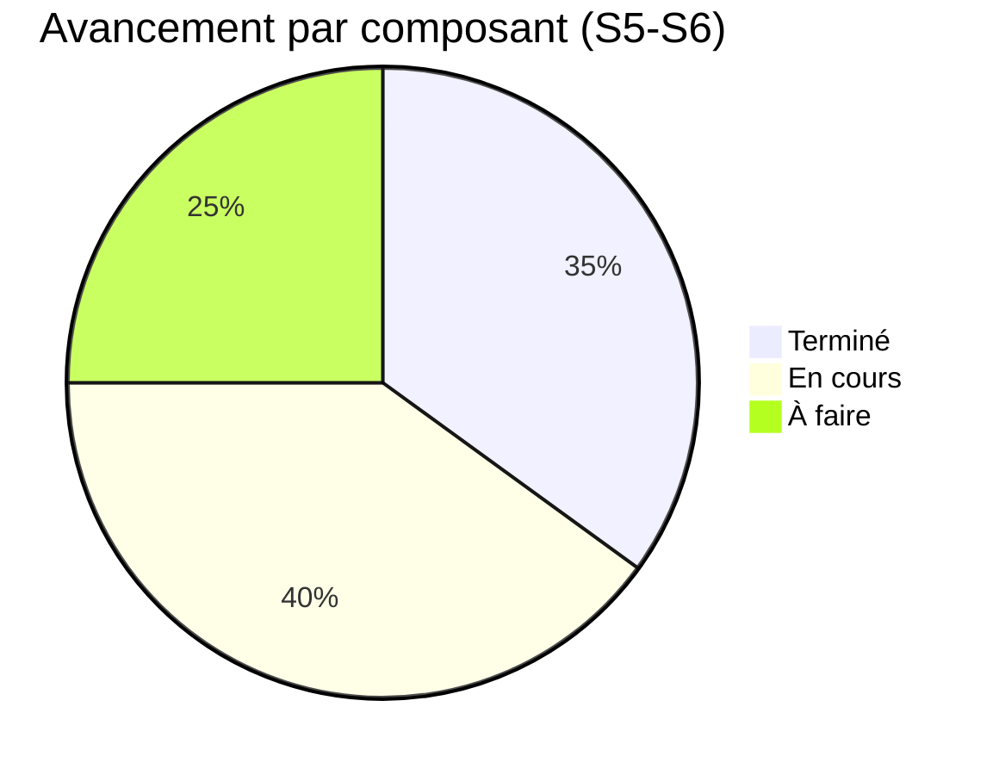

# 📊 Suivi Hebdomadaire — JeryMotro Platform
#JeryMotro #MemoireL3 #Avancement #DailyNote
[[Glossaire_Tags]] | [[00_INDEX]] | [[00_DASHBOARD]] | [[03_Plan_Travail_3_Mois]]

> **Template de suivi semaine par semaine.**
> Dupliquer chaque lundi → renommer `SUIVI_S05.md`, `SUIVI_S06.md`, etc.

---

## 🗓️ SEMAINE S05 — `23/03/2026 → 29/03/2026`

**Phase :** ✅ Fondation / 🔄 Modélisation / ⬜ Finalisation
**Heures travaillées cette semaine :** `__h`
**Commit GitHub :** `- [ ] fait`

---

## ✅ TÂCHES DE LA SEMAINE

> Recopier les tâches de [[03_Plan_Travail_3_Mois]] → S5-S6

- [x] Définir stratégie de données temporelles (2021-2024 train, 2025 val)
- [x] Mettre à jour `06_Feature_Engineering` avec GEE V2 (Landcover, Slope, NDVI)
- [x] Mettre à jour `04_MadFireNet` avec features V2 + data strategy
- [x] Mettre à jour `02_Architecture_Globale` avec pipeline Mermaid V2
- [ ] Créer `gee_enrichment.py` (extraction batch Landcover + Slope)
- [ ] `02_Feature_Engineering.ipynb` : pipeline features V2 complet avec GEE
- [ ] `03_XGBoost_Training.ipynb` : entraîner le modèle V2
- [ ] Sauvegarder `xgb_jerymotrnet_v2.pkl`

**Taux de complétion :** `4 / 8 tâches`
<progress value="4" max="8"></progress>

---

## 📊 MÉTRIQUES MESURÉES CETTE SEMAINE

| Composant | Métrique | Valeur mesurée | Cible | ✅/❌ |
|-----------|---------|----------------|-------|------|
| HDBSCAN | Silhouette Score | — | > 0.50 | ⬜ |
| XGBoost V2 | Recall feux vs NASA | — | +25% | ⬜ |
| XGBoost V2 | AUC-ROC | — | ≥ 0.88 | ⬜ |

> [!info] Reporter les valeurs dans [[METRIQUES_CIBLES]] si c'est une mesure définitive

---

## 🔴 BLOCKERS & PROBLÈMES

> [!warning] Problèmes en cours

| # | Problème | Impact | Solution appliquée | Statut |
|---|----------|--------|-------------------|--------|
| 1 | Compte GEE non activé | Bloque l'enrichissement Landcover/Slope | Créer compte acad. GEE | ⬜ |
| 2 | MAP_KEY en clair dans n8n JSON | Sécurité | Basculer vers `$env.FIRMS_MAP_KEY` | ⬜ |

---

## 💡 DÉCISIONS PRISES

| Décision | Justification | Impact |
|----------|---------------|--------|
| Stratégie 2021-2024 (train) + 2025 (val) | Meilleure qualité VIIRS, pertinence climatique | Ré-entraînement nécessaire |
| GEE V2 : Landcover + Slope + NDVI | Enrichissement contextuel sans analyse d'image | +3 features XGBoost |

---

## 📈 PROGRESSION GLOBALE

---

## 🔗 LIENS CRÉÉS CETTE SEMAINE

- Fichiers mis à jour : [[02_Architecture_Globale]], [[06_Feature_Engineering]], [[04_MadFireNet]], [[15_Dataset_ERA5_GEE]]
- Notebooks créés : —
- Scripts créés : `ml/preprocessing/gee_enrichment.py` *(à créer)*
- Commit GitHub : `git commit -m "S5 : Architecture V2 + GEE Enrichissement + stratégie données 2021-2026"`

---

## 🚀 OBJECTIF SEMAINE PROCHAINE (S06)

> **Priorité absolue :** Entraîner XGBoost V2 et obtenir les premières métriques

- [ ] Créer et tester `gee_enrichment.py` avec données réelles
- [ ] Régénérer dataset 2021-2024 avec colonnes Landcover/Slope/NDVI
- [ ] Lancer `03_XGBoost_Training.ipynb` sur Colab
- [ ] Mesurer Recall vs NASA brut → mettre à jour [[METRIQUES_CIBLES]]

---

## 📝 NOTES LIBRES

> Décisions architecturales V2 documentées. GEE account à créer en priorité pour débloquer l'enrichissement.
> Architecture Mermaid ajoutée dans [[02_Architecture_Globale]].

---

*Mise à jour [[00_DASHBOARD]] faite : ✅ Oui*
